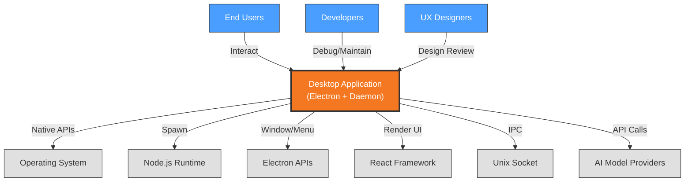

# Context View: Desktop Application

**Sub-System**: Desktop Application
**ADRs Referenced**: ADR-104, ADR-105, ADR-107
**Generated**: 2026-05-20

---

## 3.1 Context View

**Purpose**: Define system scope and external interactions for the Electron Desktop Application

### 3.1.1 System Scope

The Desktop Application sub-system provides a native OS experience through an Electron application with embedded Node.js daemon. The main process handles window management and system integration, while the renderer process presents the React-based UI. The embedded daemon operates as a separate process handling SQLite operations, agent scheduling, and background tasks. Communication between renderer and daemon uses JSON-RPC over Unix sockets for low-latency, type-safe IPC.

### 3.1.2 Stakeholders

| Stakeholder | Role | Key Concerns | Priority |
|-------------|------|--------------|----------|
| End Users | Application Users | Native feel, responsiveness, offline capability | Critical |
| Developers | Application Maintainers | Code organization, debugging, updates | High |
| UX Designers | Interface Design | OS integration, window management | Medium |
| Security Officers | Compliance | Process isolation, IPC security | High |
| Platform Architects | System Design | Architecture patterns, process model | Medium |

### 3.1.3 External Entities

| Entity | Type | Interaction Type | Data Exchanged | Protocols |
|--------|------|------------------|----------------|-----------|
| Operating System | External System | OS APIs | Window management, notifications | Native APIs |
| Node.js Runtime | External System | Process spawn | Daemon execution | Stdio |
| Electron APIs | External Library | JS APIs | Window, menu, dialog | Chromium APIs |
| React Framework | External Library | Component tree | UI rendering | VDOM |
| Unix Socket | External System | IPC | JSON-RPC messages | Local socket |
| AI Model APIs | External API | REST/gRPC | Agent completions | HTTPS |

### 3.1.3 Context Diagram

### 3.1.4 External Dependencies

| Dependency | Purpose | SLA Expectations | Fallback Strategy |
|------------|---------|------------------|-------------------|
| Operating System | Window management, notifications | Local availability | N/A |
| Node.js Runtime | Daemon execution | Bundled v24 | Update bundle |
| Electron APIs | Native integration | Stable APIs | Feature degradation |
| React Framework | UI rendering | Stable | N/A |
| Unix Socket | IPC transport | Local availability | Named pipes (Windows) |

---

## Perspective Considerations

### Security Considerations

- **Process Isolation**: Main, renderer, and daemon are separate processes
- **IPC Security**: Unix socket with file permissions
- **Context Isolation**: Renderer runs in isolated context
- **Secret Storage**: OS keychain via Electron safeStorage

_Source ADRs: ADR-104, ADR-105_

### Performance Considerations

- **Bundle Size**: Electron adds ~100MB overhead
- **Memory Usage**: Multi-process increases RAM usage
- **Startup Time**: <5s cold start target
- **IPC Latency**: <1ms for local socket

_Source ADRs: ADR-104, ADR-105_

### Development Resource Considerations

- **JavaScript/TypeScript**: Web technologies for desktop
- **Cross-Platform**: Single codebase for Win/Mac/Linux
- **Debugging**: Chrome DevTools for renderer, Node debugger for daemon
- **Update Mechanism**: Auto-updater for seamless updates

_Source ADRs: ADR-104, ADR-107_

---

**Validation Checklist**:

- [x] System appears as exactly ONE node
- [x] No internal databases shown
- [x] No internal services shown
- [x] All entities are either stakeholders OR external systems
- [x] All connections cross the system boundary
