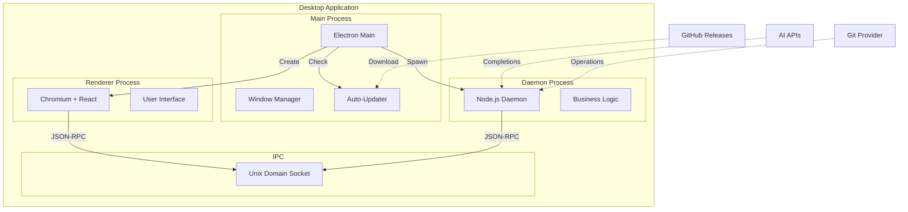

# Deployment View: Desktop Application

**Sub-System**: Desktop Application
**ADRs Referenced**: ADR-104, ADR-105, ADR-107
**Generated**: 2026-05-20
**Dependencies**: Context View, Functional View

---

## 3.6 Deployment View

**Purpose**: Physical environment - nodes, networks, storage

### 3.6.1 Runtime Environments

| Environment | Purpose | Infrastructure | Scale |
|-------------|---------|----------------|-------|
| macOS | Apple users | macOS 12+ | Universal binary |
| Windows | Windows users | Windows 10+ | x64/arm64 |
| Linux | Linux users | Ubuntu 20.04+ | AppImage/deb/rpm |

### 3.6.2 Network Topology

### 3.6.3 Hardware Requirements

**Minimum:**

| Component | Specification |
|-----------|--------------|
| OS | macOS 12+, Windows 10+, Ubuntu 20.04+ |
| CPU | 2 cores (x86_64 or ARM64) |
| Memory | 4GB RAM |
| Storage | 500MB available |
| Display | 1280x720 |

**Recommended:**

| Component | Specification |
|-----------|--------------|
| CPU | 4+ cores (Apple Silicon or modern x86) |
| Memory | 8GB+ RAM |
| Storage | SSD with 2GB+ free |
| Display | 1920x1080 or higher |
| Network | Broadband internet |

**Multi-process Memory (typical):**

| Process | Memory Usage |
|---------|-------------|
| Main Process | 100-200MB |
| Renderer | 200-400MB |
| Daemon | 150-300MB |
| **Total** | **450-900MB** |

### 3.6.4 Third-Party Services

| Service | Purpose | Provider | Tier |
|---------|---------|----------|------|
| Code Signing | macOS/Windows signing | Apple/Microsoft | Developer |
| Notarization | macOS security | Apple | Required |
| Update Hosting | Binary distribution | GitHub Releases | Free |
| Crash Analytics | Error tracking | Sentry | Pro |
| Usage Analytics | Telemetry | PostHog | Pro |

---

## Perspective Considerations

### Security Considerations

- **Code Signing**: Prevents binary tampering
- **Notarization**: macOS gatekeeper compliance
- **Sandboxing**: Renderer process isolated
- **Auto-Update**: Signed updates only
- **IPC Security**: Unix socket with permissions

_Source ADRs: ADR-104, ADR-105_

### Performance Considerations

- **Multi-process**: Utilize multiple CPU cores
- **Lazy Loading**: Load components on demand
- **Memory Management**: Process isolation
- **GPU Acceleration**: Hardware-accelerated UI

_Source ADRs: ADR-104, ADR-107_

### Availability Considerations

- **Offline Capability**: Core features work offline
- **Auto-Recovery**: Restart crashed processes
- **Graceful Degradation**: Handle missing network
- **State Persistence**: Restore on crash

_Source ADRs: ADR-104_

---

**ADR Traceability:**

| ADR | Decision | Impact on Deployment View |
|-----|----------|---------------------------|
| ADR-104 | Electron with Embedded Daemon | Multi-process architecture |
| ADR-105 | JSON-RPC over Unix Socket | IPC topology |
| ADR-107 | React 19 with Radix UI | Renderer technology |
