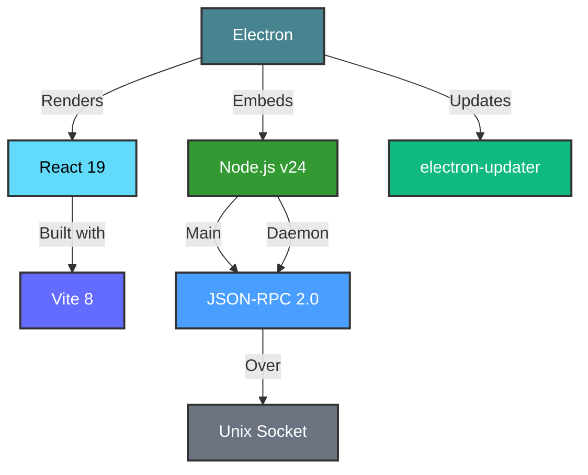
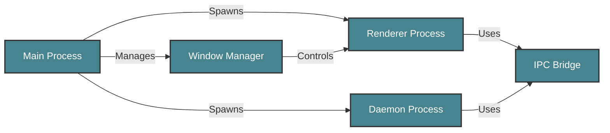

# Development View: Desktop Application

**Sub-System**: Desktop Application
**ADRs Referenced**: ADR-104, ADR-105, ADR-107
**Generated**: 2026-05-20
**Dependencies**: Functional View

---

## 3.5 Development View

**Purpose**: Constraints for developers - code organization, dependencies, CI/CD

### 3.5.1 Code Organization

```text
apps/desktop/
├── src/
│   ├── main/             # Main Process
│   ├── renderer/         # Renderer Process (React)
│   ├── daemon/           # Daemon Process
│   ├── ipc/              # IPC Bridge
│   ├── windows/          # Window Manager
│   ├── system/           # System Integration
│   └── update/           # Update Manager
├── resources/
│   ├── icons/
│   ├── tray/
│   └── preload/
├── build/
│   ├── electron-builder.yml
│   └── entitlements.plist
├── tests/
│   ├── unit/
│   ├── integration/
│   └── e2e/
└── package.json
```

### 3.5.2 Technology Stack Mapping

| Functional Role | Technology Choice | Version/Variant | ADR Reference |
|-----------------|-------------------|-----------------|---------------|
| Desktop Shell | Electron | v33+ | ADR-104 |
| Main Process | Node.js | v24 (bundled) | ADR-104 |
| Renderer | React + Vite | v19 / v8 | ADR-107 |
| Daemon Process | Node.js | v24 (bundled) | ADR-104 |
| IPC Protocol | JSON-RPC 2.0 | Custom | ADR-105 |
| IPC Transport | Unix Socket | Domain socket | ADR-105 |
| Auto-Update | electron-updater | v6.x | ADR-104 |
| Build Tool | electron-builder | v25.x | ADR-104 |

### 3.5.3 Technology Architecture



### 3.5.4 Module Dependencies

**Dependency Rules:**

- Main Process spawns Renderer and Daemon
- Renderer communicates with Daemon via IPC
- Daemon handles backend operations
- Window Manager controls Renderer windows
- System Integration connects to OS APIs



### 3.5.5 Build & CI/CD

- **Build System**: electron-builder for app packaging
- **CI Pipeline**: Lint → Test → Build Renderer → Package App → Sign → Release
- **Deployment Strategy**: Auto-updater with GitHub releases
- **Testing**: Vitest for unit, Playwright for E2E

### 3.5.6 Development Standards

- **Coding Standards**: TypeScript strict, Electron security best practices
- **Review Requirements**: 2 approvals, security review for IPC
- **Testing Requirements**: E2E tests for critical paths

---

## Perspective Considerations

### Security Considerations

- **Context Isolation**: Renderer isolated from Node.js
- **IPC Validation**: Validate all IPC messages
- **CSP**: Content Security Policy enforced
- **Update Signing**: Code signing for updates

_Source ADRs: ADR-104, ADR-105_

### Performance Considerations

- **Bundle Size**: Minimize bundle with tree-shaking
- **Memory Usage**: Monitor multi-process memory
- **Startup Time**: <5s cold start target
- **IPC Optimization**: Binary serialization

_Source ADRs: ADR-104, ADR-105_

### Development Resource Considerations

- **Cross-Platform**: Single codebase for Win/Mac/Linux
- **Web Technologies**: TypeScript/React throughout
- **Debugging**: Chrome DevTools for renderer
- **Documentation**: Electron + React patterns

_Source ADRs: ADR-104, ADR-107_

---

## Validation Checklist

- [x] **Technology Mapping**: All functional elements mapped
- [x] **ADR References**: All choices reference ADRs
- [x] **Diagram Parity**: Mirrors Functional View structure
- [x] **Code Alignment**: Organization matches stack
- [x] **Dependency Rules**: Clear layer dependencies

---

**ADR Traceability:**

| ADR | Decision | Impact on Development View |
|-----|----------|----------------------------|
| ADR-104 | Electron with Embedded Daemon | Electron, Node.js, multi-process |
| ADR-105 | JSON-RPC over Unix Socket | IPC, Unix Socket |
| ADR-107 | React 19 with Radix UI | React, Vite |
