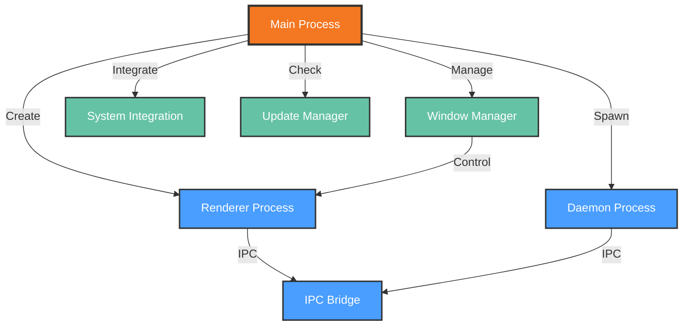

# Functional View: Desktop Application

**Sub-System**: Desktop Application
**ADRs Referenced**: ADR-104, ADR-105, ADR-107
**Generated**: 2026-05-20
**Dependencies**: Context View

---

## 3.2 Functional View

**Purpose**: Describe functional elements, responsibilities, and interactions for Electron Desktop Application

### 3.2.1 Functional Elements

| Element | Responsibility | Interfaces Provided | Dependencies |
|---------|----------------|---------------------|--------------|
| Main Process | Electron main process, window management | Create window, menu, dialog | Electron APIs |
| Renderer Process | React UI rendering in isolated context | Render components, handle events | React, Electron APIs |
| Daemon Process | Background Node.js process for tasks | Execute, schedule, store | Node.js runtime |
| IPC Bridge | JSON-RPC communication between processes | Send, receive, handle | Unix socket |
| Window Manager | Multi-window lifecycle and state | Open, close, focus, layout | Main Process |
| System Integration | OS-level integrations (notifications, etc.) | Notify, shortcut, dock | OS APIs |
| Update Manager | Automatic application updates | Check, download, install | Update server |

### 3.2.2 Element Interactions

### 3.2.3 Functional Boundaries

**What this system DOES:**

- Manage Electron main process for window and system integration
- Render React-based UI in isolated renderer process
- Run background daemon process for SQLite and scheduling
- Provide JSON-RPC IPC between all processes
- Handle multi-window management and layout
- Integrate with OS for notifications and shortcuts
- Support automatic application updates

**What this system does NOT do:**

- Execute AI agent tasks (delegated to System/Runner)
- Manage workspace containers (delegated to Workspaces)
- Store persistent data (delegated to Storage)
- Handle git operations (delegated to Git Integration)

---

## Perspective Considerations

### Security Considerations

- **Process Isolation**: Main, renderer, daemon are separate processes
- **Context Isolation**: Renderer runs in isolated Chromium context
- **IPC Security**: Unix socket with file permissions
- **Update Verification**: Signed updates verified before install

_Source ADRs: ADR-104, ADR-105_

### Performance Considerations

- **Multi-Process**: Leverages multiple CPU cores
- **Async IPC**: Non-blocking communication
- **Lazy Loading**: Windows and components loaded on demand
- **Memory Management**: Process isolation prevents leaks

_Source ADRs: ADR-104, ADR-105_

### Development Resource Considerations

- **Web Technologies**: JavaScript/TypeScript throughout
- **Cross-Platform**: Single codebase for all platforms
- **Debugging**: Chrome DevTools for renderer
- **Hot Reload**: Fast development iteration

_Source ADRs: ADR-104, ADR-107_

---

## Validation Checklist

- [x] **Technology Neutrality**: Elements described by role
- [x] **Diagram Consistency**: Nodes match element table
- [x] **Interface Abstraction**: Capabilities not implementations
- [x] **Complete Coverage**: All responsibilities represented
- [x] **Clear Boundaries**: Responsibilities clearly defined

---

**ADR Traceability:**

| ADR | Decision | Impact on Functional View |
|-----|----------|---------------------------|
| ADR-104 | Electron with Embedded Daemon | Main Process, Daemon Process elements |
| ADR-105 | JSON-RPC over Unix Socket | IPC Bridge element |
| ADR-107 | React 19 with Radix UI | Renderer Process element |
