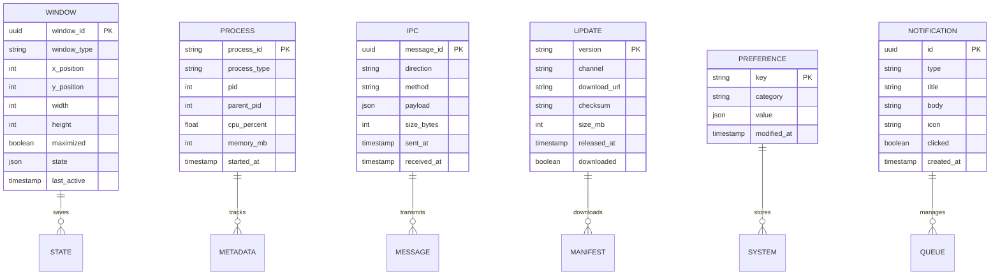

# Information View: Desktop Application

**Sub-System**: Desktop Application
**ADRs Referenced**: ADR-104, ADR-105, ADR-107
**Generated**: 2026-05-20
**Dependencies**: Functional View

---

## 3.3 Information View

**Purpose**: Describe data storage, management, and flow for Electron Desktop Application

### 3.3.1 Data Entities

| Entity | Storage Location | Owner Component | Lifecycle | Access Pattern |
|--------|------------------|-----------------|-----------|----------------|
| Window State | SQLite | Window Manager | Save-Restore | Read-heavy |
| IPC Message | Memory | IPC Bridge | Send-Receive-Log | Write-heavy |
| Process Metadata | Memory/OS | Main Process | Spawn-Monitor | Read-heavy |
| Update Manifest | Remote JSON | Update Manager | Fetch-Cache | Read-heavy |
| System Preferences | OS + SQLite | System Integration | Read-Write | Read-heavy |
| Renderer Cache | Memory | Renderer Process | Populate-Clear | Write-heavy |
| Notification State | Memory + SQLite | Notification Manager | Queue-Display | Write-heavy |

### 3.3.2 Data Model

### 3.3.3 Data Flow

**Key Data Flows:**

1. **Window Management**: User Action → Window Manager → State Update → SQLite
2. **IPC Communication**: Renderer → IPC Bridge → Unix Socket → Daemon → Response
3. **Process Monitoring**: Main Process → OS → Process Metadata → Health Checks
4. **Update Check**: Update Manager → Remote Server → Manifest → Download Queue
5. **Notification Flow**: Event → Notification Manager → Queue → OS Display

### 3.3.4 Data Quality & Integrity

- **Consistency Model**: Window state strong consistency, IPC best-effort
- **Validation Rules**: IPC messages validated against schema
- **Retention Policy**: IPC logs 7 days, notifications 1 day
- **Backup Strategy**: Window state in SQLite, processes ephemeral

---

## Perspective Considerations

### Security Considerations

- **Process Isolation**: Main, renderer, daemon isolated
- **IPC Encryption**: Unix socket file permissions
- **Context Isolation**: Renderer in isolated Chromium context
- **Update Verification**: Signed updates verified before install

_Source ADRs: ADR-104, ADR-105_

### Performance Considerations

- **Window State**: Minimal I/O, batched saves
- **IPC Optimization**: Binary serialization, compression
- **Memory Management**: Process isolation prevents leaks
- **Cache Strategy**: Renderer cache for static assets

_Source ADRs: ADR-104, ADR-105_

### Evolution Considerations

- **Electron Updates**: Major version upgrade path
- **State Migration**: Window state migration on updates
- **Preference Sync**: Cross-device preference sync (future)
- **Extension Support**: Plugin architecture for UI extensions

_Source ADRs: ADR-104, ADR-107_

---

**ADR Traceability:**

| ADR | Decision | Impact on Information View |
|-----|----------|----------------------------|
| ADR-104 | Electron with Embedded Daemon | Process, IPC entities |
| ADR-105 | JSON-RPC over Unix Socket | IPC Message entity |
| ADR-107 | React 19 with Radix UI | Renderer Cache entity |
