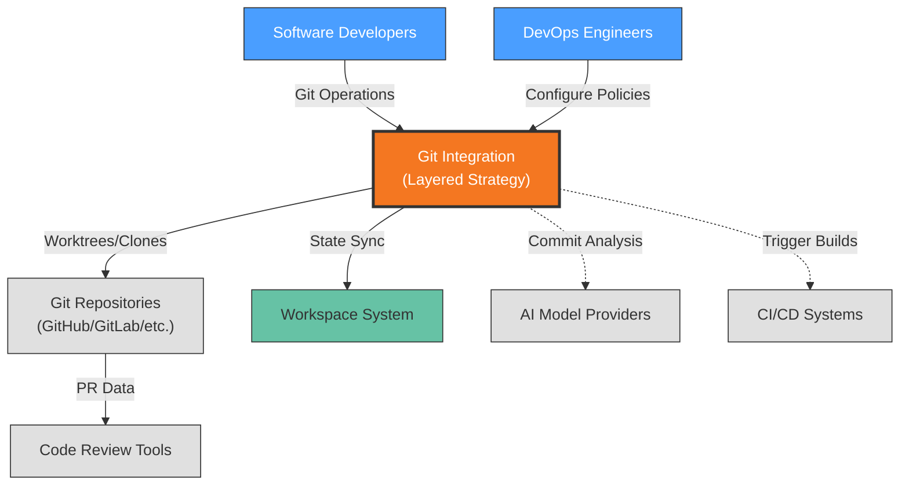

# Context View: Git Integration

**Sub-System**: Git Integration
**ADRs Referenced**: ADR-017
**Generated**: 2026-05-20

---

## 3.1 Context View

**Purpose**: Define system scope and external interactions for the Layered Git Strategy

### 3.1.1 System Scope

The Git Integration sub-system implements a layered strategy optimizing for both local and remote workspace workflows. For local workspaces, it uses git worktrees to provide immediate file visibility and fast iteration. For remote workspaces, it uses clone-based strategies to ensure proper isolation. The system manages workspace lifecycle through git operations, maintains spec and code in version control, and provides clear sync semantics for state handoff between workspaces.

### 3.1.2 Stakeholders

| Stakeholder | Role | Key Concerns | Priority |
|-------------|------|--------------|----------|
| Software Developers | Primary Users | Fast git operations, clear state visibility | Critical |
| DevOps Engineers | Operations | Repository management, access control | Medium |
| AI Agents | Automated Users | Reliable git operations, conflict resolution | High |
| Platform Architects | System Design | Strategy consistency, workflow optimization | Medium |

### 3.1.3 External Entities

| Entity | Type | Interaction Type | Data Exchanged | Protocols |
|--------|------|------------------|----------------|-----------|
| Git Repositories | External System | Git protocol | Specs, code, branches, commits | SSH/HTTPS |
| Workspace System | Internal System | API | Workspace state, file changes | Internal API |
| AI Model APIs | External API | REST/gRPC | Commit analysis, diff summarization | HTTPS |
| CI/CD Systems | External System | Webhooks/API | Build triggers, deployment events | HTTPS |
| Code Review Tools | External System | API | PR data, review comments | REST API |

### 3.1.3 Context Diagram

### 3.1.4 External Dependencies

| Dependency | Purpose | SLA Expectations | Fallback Strategy |
|------------|---------|------------------|-------------------|
| Git Provider | Source control hosting | 99.95% uptime | Local git operations only |
| Workspace System | Workspace state coordination | Internal SLA | Direct filesystem |
| AI Model APIs | Commit message generation | 99.9% uptime | Template-based messages |
| CI/CD Systems | Build/deployment pipeline | Varies | Manual trigger |

---

## Perspective Considerations

### Security Considerations

- **Authentication**: SSH keys or HTTPS tokens for git access
- **Repository Access**: Scoped permissions per workspace
- **Audit Trail**: All git operations logged
- **Secret Prevention**: Git hooks to prevent secret commits

_Source ADRs: ADR-017_

### Performance Considerations

- **Worktree Speed**: <1s for local branch switching
- **Clone Time**: Varies by repo size, optimized with shallow clones
- **Sync Semantics**: Explicit commit/push for state handoff
- **Local Caching**: Git objects cached locally

_Source ADRs: ADR-017_

### Evolution Considerations

- **Git Version Compatibility**: Support recent git versions
- **Provider Agnostic**: Works with GitHub, GitLab, Bitbucket, etc.
- **Workflow Evolution**: Supports various branching strategies

_Source ADRs: ADR-017_

---

**Validation Checklist**:

- [x] System appears as exactly ONE node
- [x] No internal databases shown
- [x] No internal services shown
- [x] All entities are either stakeholders OR external systems
- [x] All connections cross the system boundary
