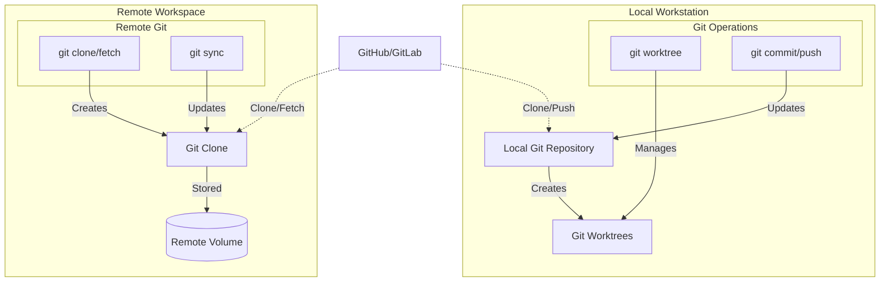

# Deployment View: Git Integration

**Sub-System**: Git Integration
**ADRs Referenced**: ADR-017
**Generated**: 2026-05-20
**Dependencies**: Context View, Functional View

---

## 3.6 Deployment View

**Purpose**: Physical environment - nodes, networks, storage

### 3.6.1 Runtime Environments

| Environment | Purpose | Infrastructure | Scale |
|-------------|---------|----------------|-------|
| Local | Developer workstations | Workstation filesystem | Per developer |
| Remote | Cloud workspaces | K8s volumes / object storage | Per workspace |
| CI/CD | Automated pipelines | Ephemeral containers | Per pipeline |

### 3.6.2 Network Topology

### 3.6.3 Hardware Requirements

**Local Mode:**

| Component | Storage | Notes |
|-----------|---------|-------|
| Git Repository | 1-10GB | Varies by project size |
| Worktrees | 100MB-1GB each | Shared git objects |
| Git Cache | 100MB-500MB | Pack files, refs |

**Remote Mode:**

| Component | Storage | Notes |
|-----------|---------|-------|
| Git Clone | 1-10GB | Full clone |
| Volume | 10-50GB | Working directory |
| Cache | 1GB | Git objects cache |

### 3.6.4 Third-Party Services

| Service | Purpose | Provider | Tier |
|---------|---------|----------|------|
| Git Hosting | Repository storage | GitHub/GitLab/Bitbucket | Enterprise |
| LFS Storage | Large file storage | GitHub/GitLab LFS | As needed |
| SSH Keys | Authentication | Self-managed | - |
| Git Hooks | CI triggers | Provider hooks | - |

---

## Perspective Considerations

### Security Considerations

- **Credential Storage**: SSH agent or HTTPS credentials
- **Repository Access**: Scoped deploy keys or tokens
- **Audit Trail**: Git provider logs all operations
- **GPG Signing**: Optional commit signing

_Source ADRs: ADR-017_

### Performance Considerations

- **Worktrees**: Near-instant branch switching
- **Shallow Clones**: Faster CI clones
- **Partial Clones**: Blob-less clones for large repos
- **CDN**: Git provider CDN for faster fetches

_Source ADRs: ADR-017_

### Location Considerations

- **Repository Location**: Choose region near users
- **Clone Geography**: Latency affects clone time
- **Data Residency**: Repo location affects compliance
- **Mirror Strategy**: Regional mirrors for large teams

_Source ADRs: ADR-017_

---

**ADR Traceability:**

| ADR | Decision | Impact on Deployment View |
|-----|----------|---------------------------|
| ADR-017 | Layered Git Strategy | Worktrees (local) vs Clones (remote) |
