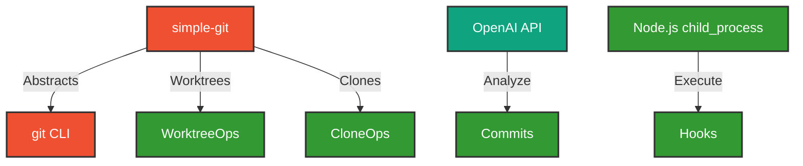
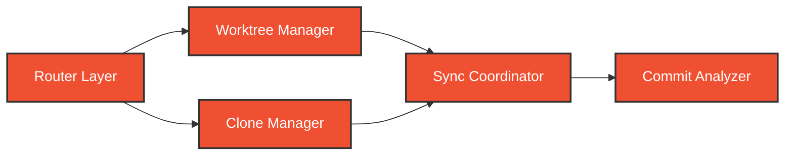

# Development View: Git Integration

**Sub-System**: Git Integration
**ADRs Referenced**: ADR-017
**Generated**: 2026-05-20
**Dependencies**: Functional View

---

## 3.5 Development View

**Purpose**: Constraints for developers - code organization, dependencies, CI/CD

### 3.5.1 Code Organization

```text
packages/git/
├── src/
│   ├── router/           # Strategy Router
│   ├── worktree/         # Worktree Manager
│   ├── clone/            # Clone Manager
│   ├── sync/             # Sync Coordinator
│   ├── analyzer/         # Commit Analyzer
│   ├── hooks/            # Hook Manager
│   └── refs/             # Ref Manager
├── hooks/
│   ├── pre-commit/       # Pre-commit hooks
│   ├── commit-msg/       # Commit message hooks
│   └── post-checkout/    # Post-checkout hooks
├── tests/
│   ├── unit/
│   ├── integration/
│   └── fixtures/
└── package.json
```

### 3.5.2 Technology Stack Mapping

| Functional Role | Technology Choice | Version/Variant | ADR Reference |
|-----------------|-------------------|-----------------|---------------|
| Git Operations | simple-git | v3.x | ADR-017 |
| Native Git | git CLI | v2.40+ | ADR-017 |
| Commit Analysis | OpenAI API | GPT-4 | ADR-017 |
| Hook Execution | Node.js child_process | Built-in | ADR-017 |
| Worktree Management | git worktree | Built-in | ADR-017 |
| Clone Optimization | git clone --depth | Shallow | ADR-017 |
| Ref Management | git for-each-ref | Built-in | ADR-017 |

### 3.5.3 Technology Architecture



### 3.5.4 Module Dependencies

**Dependency Rules:**

- Router selects Worktree or Clone manager
- Both managers use simple-git abstraction
- Sync Coordinator coordinates between managers
- Analyzer calls OpenAI API
- Hooks executed via Node.js child_process



### 3.5.5 Build & CI/CD

- **Build System**: tsup for package builds
- **CI Pipeline**: Lint → Test → Integration tests with git repos
- **Deployment Strategy**: npm publish
- **Testing**: Mock git repos for unit, real repos for integration

### 3.5.6 Development Standards

- **Coding Standards**: TypeScript strict, git best practices
- **Review Requirements**: 2 approvals
- **Testing Requirements**: Test against real git scenarios

---

## Perspective Considerations

### Security Considerations

- **Credential Storage**: Secure credential helpers
- **Hook Verification**: Signed hooks only
- **Repository Access**: Scoped credentials
- **Audit Logging**: All operations logged

_Source ADRs: ADR-017_

### Performance Considerations

- **Worktree Speed**: Leverage git's native worktree
- **Clone Optimization**: Shallow clones, partial clones
- **Parallel Operations**: Concurrent fetches where safe
- **Local Caching**: Git object caching

_Source ADRs: ADR-017_

### Evolution Considerations

- **Git Version Support**: Recent versions with graceful degradation
- **Provider Agnostic**: GitHub, GitLab, Bitbucket support
- **Protocol Evolution**: Support new git protocols

_Source ADRs: ADR-017_

---

## Validation Checklist

- [x] **Technology Mapping**: All functional elements mapped
- [x] **ADR References**: All choices reference ADRs
- [x] **Diagram Parity**: Mirrors Functional View structure
- [x] **Code Alignment**: Organization matches stack
- [x] **Dependency Rules**: Clear layer dependencies

---

**ADR Traceability:**

| ADR | Decision | Impact on Development View |
|-----|----------|----------------------------|
| ADR-017 | Layered Git Strategy | simple-git, native git CLI, worktrees |
