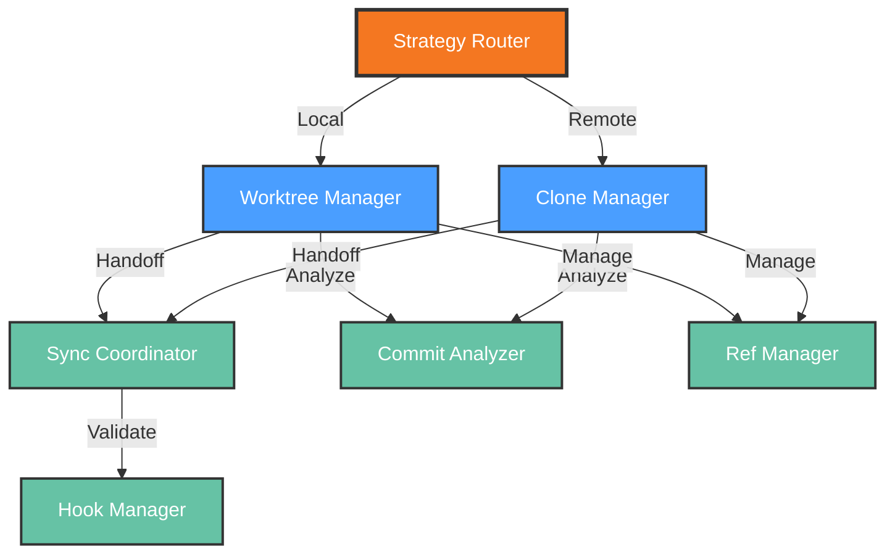

# Functional View: Git Integration

**Sub-System**: Git Integration
**ADRs Referenced**: ADR-017
**Generated**: 2026-05-20
**Dependencies**: Context View

---

## 3.2 Functional View

**Purpose**: Describe functional elements, responsibilities, and interactions for Layered Git Strategy

### 3.2.1 Functional Elements

| Element | Responsibility | Interfaces Provided | Dependencies |
|---------|----------------|---------------------|--------------|
| Strategy Router | Selects worktree or clone based on workspace type | Route operations | Workspace metadata |
| Worktree Manager | Local worktree-based git operations | Branch, checkout, status | Local filesystem |
| Clone Manager | Remote clone-based git operations | Clone, fetch, push | Git repositories |
| Sync Coordinator | Manages state handoff between workspaces | Sync, merge, resolve | Worktree Manager, Clone Manager |
| Commit Analyzer | AI-powered commit message and diff analysis | Analyze, suggest | AI Model APIs |
| Hook Manager | Git hooks for validation and automation | Install, trigger | Git repositories |
| Ref Manager | Branch and tag lifecycle management | Create, delete, list | Git repositories |

### 3.2.2 Element Interactions

### 3.2.3 Functional Boundaries

**What this system DOES:**

- Automatically select optimal git strategy (worktree vs clone) per workspace
- Manage worktrees for fast local iteration with immediate file visibility
- Manage clones for remote workspace isolation
- Coordinate state handoff between local and remote workspaces
- Provide AI-powered commit analysis and suggestions
- Enforce git hooks for validation and compliance
- Handle branch and tag lifecycle operations

**What this system does NOT do:**

- Host git repositories (delegated to Git providers)
- Manage workspace containers (delegated to Workspaces)
- Execute CI/CD pipelines (delegated to external systems)
- Store repository data long-term (delegated to Git providers)

---

## Perspective Considerations

### Security Considerations

- **Credential Management**: SSH keys and HTTPS tokens securely stored
- **Repository Access**: Scoped permissions per workspace
- **Audit Logging**: All git operations logged with metadata
- **Hook Security**: Hooks signed and verified before execution

_Source ADRs: ADR-017_

### Performance Considerations

- **Worktree Speed**: <1s branch switching vs 10s+ for clone
- **Clone Optimization**: Shallow clones, partial clones for large repos
- **Parallel Operations**: Multiple git operations where safe
- **Local Caching**: Git objects cached per workspace

_Source ADRs: ADR-017_

### Evolution Considerations

- **Git Version Support**: Recent git versions, graceful degradation
- **Provider Agnostic**: Works with GitHub, GitLab, Bitbucket, etc.
- **Workflow Flexibility**: Supports various branching strategies
- **Strategy Evolution**: Can add new strategies as git evolves

_Source ADRs: ADR-017_

---

## Validation Checklist

- [x] **Technology Neutrality**: Elements described by role
- [x] **Diagram Consistency**: Nodes match element table
- [x] **Interface Abstraction**: Capabilities not implementations
- [x] **Complete Coverage**: All responsibilities represented
- [x] **Clear Boundaries**: Responsibilities clearly defined

---

**ADR Traceability:**

| ADR | Decision | Impact on Functional View |
|-----|----------|---------------------------|
| ADR-017 | Layered Git Strategy | All elements: Router, Managers, Coordinator |
