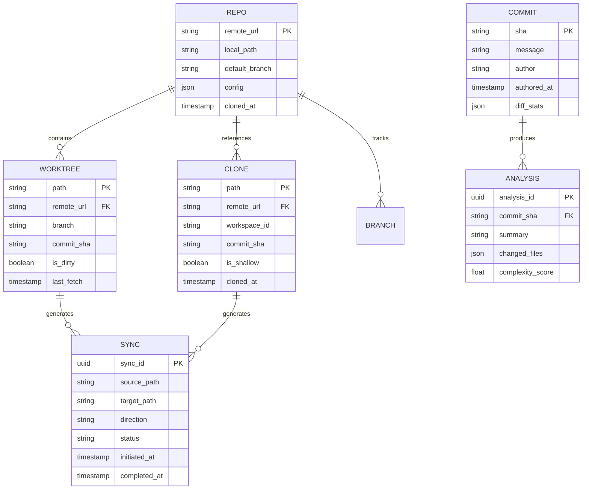

# Information View: Git Integration

**Sub-System**: Git Integration
**ADRs Referenced**: ADR-017
**Generated**: 2026-05-20
**Dependencies**: Functional View

---

## 3.3 Information View

**Purpose**: Describe data storage, management, and flow for Layered Git Strategy

### 3.3.1 Data Entities

| Entity | Storage Location | Owner Component | Lifecycle | Access Pattern |
|--------|------------------|-----------------|-----------|----------------|
| Repository Config | SQLite | Strategy Router | Create-Update | Read-heavy |
| Worktree Entry | Git + Filesystem | Worktree Manager | Create-Sync-Delete | Write-heavy |
| Clone Reference | Git | Clone Manager | Clone-Sync-Purge | Write-heavy |
| Sync State | SQLite | Sync Coordinator | Update-Track | Write-heavy |
| Commit Metadata | Git | Commit Analyzer | Create-Query | Read-heavy |
| Hook Configuration | Git | Hook Manager | Install-Execute | Read-heavy |
| Branch Tracking | Git + SQLite | Ref Manager | Create-Update | Write-heavy |

### 3.3.2 Data Model

### 3.3.3 Data Flow

**Key Data Flows:**

1. **Worktree Creation**: Repo Config → Worktree Manager → Git Worktree → Filesystem
2. **Clone Creation**: Repo Config → Clone Manager → Git Clone → Remote Storage
3. **State Handoff**: Local Worktree → Sync Coordinator → Remote Clone
4. **Commit Analysis**: Git History → Commit Analyzer → AI Processing → Metadata
5. **Hook Execution**: Git Operation → Hook Manager → Validation → Result

### 3.3.4 Data Quality & Integrity

- **Consistency Model**: Git provides strong consistency, SQLite for sync state
- **Validation Rules**: Commit messages validated against conventions
- **Retention Policy**: Git history retained indefinitely, sync logs 30 days
- **Backup Strategy**: Git remotes are backup, local garbage collection managed

---

## Perspective Considerations

### Security Considerations

- **Credential Storage**: SSH keys and tokens in secure storage
- **Repository Access**: Scoped credentials per workspace
- **Commit Signing**: Optional GPG signing for verified commits
- **Audit Trail**: All git operations logged with metadata

_Source ADRs: ADR-017_

### Performance Considerations

- **Worktree Efficiency**: Reference same git objects, minimal storage
- **Clone Optimization**: Shallow clones for CI, full clones for dev
- **Fetch Strategy**: Delta fetches, prefetch common branches
- **Index Performance**: Sparse index for monorepos

_Source ADRs: ADR-017_

### Evolution Considerations

- **Git Version Support**: Recent versions with graceful fallback
- **Provider Compatibility**: GitHub, GitLab, Bitbucket abstractions
- **Workflow Flexibility**: Supports various branching strategies

_Source ADRs: ADR-017_

---

**ADR Traceability:**

| ADR | Decision | Impact on Information View |
|-----|----------|----------------------------|
| ADR-017 | Layered Git Strategy | All entities: Worktree, Clone, Sync |
