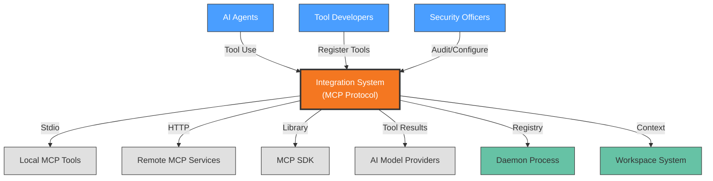

# Context View: Integration

**Sub-System**: Integration
**ADRs Referenced**: ADR-108
**Generated**: 2026-05-20

---

## 3.1 Context View

**Purpose**: Define system scope and external interactions for the MCP Integration system

### 3.1.1 System Scope

The Integration sub-system provides standardized tool access through the Model Context Protocol (MCP). It implements both stdio transport for local tools and HTTP transport for remote tools, maintaining a tool registry in the daemon. The system enables AI agents to discover and invoke external capabilities (file operations, API calls, database queries) through a vendor-neutral interface, supporting ecosystem compatibility and extensible tool chains.

### 3.1.2 Stakeholders

| Stakeholder | Role | Key Concerns | Priority |
|-------------|------|--------------|----------|
| AI Agents | Primary Users | Tool discovery, reliable invocation | Critical |
| Tool Developers | Integration Partners | Protocol compliance, registration | High |
| Platform Architects | System Design | Protocol abstraction, transport layer | High |
| End Users | Consumers | Tool availability, capability expansion | Medium |
| Security Officers | Compliance | Tool sandboxing, permission scopes | Critical |

### 3.1.3 External Entities

| Entity | Type | Interaction Type | Data Exchanged | Protocols |
|--------|------|------------------|----------------|-----------|
| Local MCP Tools | External System | Stdio transport | Tool definitions, execution | JSON-RPC |
| Remote MCP Services | External API | HTTP/WebSocket | Tool operations | HTTPS/WSS |
| MCP SDK | External Library | Library API | Protocol implementation | Native |
| AI Model Providers | External API | REST/gRPC | Tool-augmented completions | HTTPS |
| Daemon Process | Internal System | Internal API | Tool registry, routing | Internal |
| Workspace System | Internal System | API | Tool execution context | Internal API |

### 3.1.3 Context Diagram

### 3.1.4 External Dependencies

| Dependency | Purpose | SLA Expectations | Fallback Strategy |
|------------|---------|------------------|-------------------|
| Local Tools | File system, git, etc. | Local availability | Direct execution |
| Remote Services | Cloud APIs, databases | 99.9% typical | Cached results, retry |
| MCP SDK | Protocol handling | Library stability | Protocol implementation |
| AI Models | Tool selection | 99.9% uptime | Deterministic routing |

---

## Perspective Considerations

### Security Considerations

- **Tool Sandboxing**: Local tools run in workspace context
- **Permission Scopes**: Tools have limited access rights
- **Audit Logging**: All tool invocations logged
- **Input Validation**: Tool parameters validated before execution

_Source ADRs: ADR-108, ADR-009_

### Performance Considerations

- **Local Tool Latency**: <100ms typical for file operations
- **Remote Tool Latency**: Network dependent, 100ms-5s
- **Tool Discovery**: Registry cached, <10ms lookup
- **Parallel Execution**: Multiple tools can execute concurrently

_Source ADRs: ADR-108_

### Evolution Considerations

- **Protocol Versioning**: MCP spec evolving, backward compatibility
- **Tool Registry**: Dynamic tool registration/deregistration
- **Ecosystem Growth**: Vendor-neutral enables broad adoption

_Source ADRs: ADR-108_

---

**Validation Checklist**:

- [x] System appears as exactly ONE node
- [x] No internal databases shown
- [x] No internal services shown
- [x] All entities are either stakeholders OR external systems
- [x] All connections cross the system boundary
