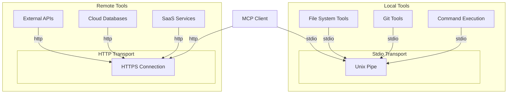

# Deployment View: Integration

**Sub-System**: Integration
**ADRs Referenced**: ADR-108
**Generated**: 2026-05-20
**Dependencies**: Context View, Functional View

---

## 3.6 Deployment View

**Purpose**: Physical environment - nodes, networks, storage

### 3.6.1 Runtime Environments

| Environment | Purpose | Infrastructure | Scale |
|-------------|---------|----------------|-------|
| Desktop | Local tool integration | User workstation | Per workspace |
| Remote | Cloud tool services | Kubernetes | Auto-scaling |
| Hybrid | Mixed local/remote | Combined | As needed |

### 3.6.2 Network Topology

### 3.6.3 Hardware Requirements

**For local tools (per workspace):**

| Component | CPU | Memory | Network |
|-----------|-----|--------|---------|
| File operations | Negligible | 10MB | None |
| Git operations | Low | 50MB | Medium |
| Command execution | Variable | Variable | Optional |

**For remote tools:**

| Component | Latency | Bandwidth |
|-----------|---------|-----------|
| API calls | 50-500ms | Low |
| Database queries | 10-100ms | Medium |
| File uploads | - | High |

### 3.6.4 Third-Party Services

| Service | Purpose | Provider | Notes |
|---------|---------|----------|-------|
| File system | Local file access | OS | Native access |
| Git CLI | Version control | git-scm.com | Bundled or system |
| APIs | External services | Various | HTTPS only |
| Databases | Data storage | Various | Connection strings |

---

## Perspective Considerations

### Security Considerations

- **Tool Sandboxing**: Execute in workspace context
- **Network Isolation**: Restrict egress from tools
- **Input Validation**: Validate all parameters
- **Audit Logging**: Log all tool invocations

_Source ADRs: ADR-108, ADR-009_

### Performance Considerations

- **Local Tool Speed**: <100ms for file operations
- **Connection Pooling**: Reuse HTTP connections
- **Caching**: Cache tool definitions
- **Timeout Handling**: Appropriate timeouts per tool

_Source ADRs: ADR-108_

### Availability Considerations

- **Local Tools**: Available offline
- **Remote Tools**: Depend on service availability
- **Fallback**: Degrade gracefully on tool failure
- **Retries**: Exponential backoff for transient failures

_Source ADRs: ADR-108_

---

**ADR Traceability:**

| ADR | Decision | Impact on Deployment View |
|-----|----------|---------------------------|
| ADR-108 | Model Context Protocol | Stdio + HTTP transports |
