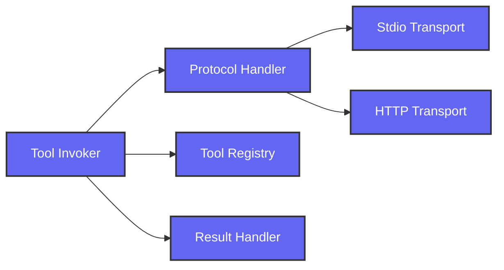

# Development View: Integration

**Sub-System**: Integration
**ADRs Referenced**: ADR-108
**Generated**: 2026-05-20
**Dependencies**: Functional View

---

## 3.5 Development View

**Purpose**: Constraints for developers - code organization, dependencies, CI/CD

### 3.5.1 Code Organization

```text
packages/integration/
├── src/
│   ├── protocol/         # MCP Protocol Handler
│   ├── registry/         # Tool Registry
│   ├── transport/
│   │   ├── stdio/        # Stdio Transport
│   │   └── http/         # HTTP Transport
│   ├── invoker/          # Tool Invoker
│   ├── results/          # Result Handler
│   └── capabilities/     # Capability Negotiator
├── tools/
│   ├── builtin/          # Built-in tool definitions
│   └── schemas/          # JSON schemas
├── tests/
│   ├── unit/
│   ├── integration/
│   └── fixtures/
└── package.json
```

### 3.5.2 Technology Stack Mapping

| Functional Role | Technology Choice | Version/Variant | ADR Reference |
|-----------------|-------------------|-----------------|---------------|
| MCP Protocol | @modelcontextprotocol/sdk | v1.x | ADR-108 |
| Stdio Transport | Node.js child_process | Built-in | ADR-108 |
| HTTP Transport | Node.js fetch | Built-in | ADR-108 |
| JSON-RPC | jsonrpc-lite | v2.x | ADR-108 |
| Schema Validation | Zod | v3.x | ADR-108 |
| Tool Registry | SQLite + Memory | better-sqlite3 | ADR-106 |
| Streaming | Node.js streams | Built-in | ADR-108 |

### 3.5.3 Technology Architecture

```mermaid
graph TD
    MCPSDK[@modelcontextprotocol/sdk]:::mcp
    ChildProcess[Node.js child_process]:::node
    FetchAPI[Node.js fetch]:::node
    JSONRPC[jsonrpc-lite]:::rpc
    Zod[Zod]:::validate
    SQLite[(SQLite)]:::db
    
    MCPSDK -->|Stdio| ChildProcess
    MCPSDK -->|HTTP| FetchAPI
    JSONRPC -->|Protocol| MCPSDK
    Zod -->|Validate| MCPSDK
    SQLite -->|Registry| MCPSDK
    
    classDef mcp fill:#6366f1,stroke:#333,stroke-width:2px,color:#fff
    classDef node fill:#339933,stroke:#333,stroke-width:2px,color:#fff
    classDef rpc fill:#4a9eff,stroke:#333,stroke-width:2px,color:#fff
    classDef validate fill:#e67e22,stroke:#333,stroke-width:2px,color:#fff
    classDef db fill:#336791,stroke:#333,stroke-width:2px,color:#fff
```

### 3.5.4 Module Dependencies

**Dependency Rules:**

- Protocol Handler uses MCP SDK
- Transports depend on Protocol Handler
- Tool Registry tracks available tools
- Invoker uses Registry and Protocol
- Results Handler processes outputs



### 3.5.5 Build & CI/CD

- **Build System**: tsup for package builds
- **CI Pipeline**: Lint → Test → Integration tests with mock MCP servers
- **Deployment Strategy**: npm publish
- **Testing**: Mock MCP tools for unit, real tools for integration

### 3.5.6 Development Standards

- **Coding Standards**: TypeScript strict, MCP spec compliance
- **Review Requirements**: 2 approvals
- **Testing Requirements**: Protocol compliance tests

---

## Perspective Considerations

### Security Considerations

- **Tool Sandboxing**: Execute in workspace context
- **Input Validation**: Zod schema validation
- **Transport Security**: HTTPS for remote, permissions for local
- **Audit Logging**: All invocations logged

_Source ADRs: ADR-108, ADR-009_

### Performance Considerations

- **Connection Pooling**: Reuse HTTP connections
- **Streaming**: Progressive results
- **Caching**: Cache tool definitions
- **Lazy Loading**: Load tools on demand

_Source ADRs: ADR-108_

### Evolution Considerations

- **Protocol Versioning**: MCP spec version negotiation
- **Transport Extensibility**: New transports via interface
- **Tool Registration**: Dynamic without restart
- **Schema Evolution**: Backward compatibility

_Source ADRs: ADR-108_

---

## Validation Checklist

- [x] **Technology Mapping**: All functional elements mapped
- [x] **ADR References**: All choices reference ADRs
- [x] **Diagram Parity**: Mirrors Functional View structure
- [x] **Code Alignment**: Organization matches stack
- [x] **Dependency Rules**: Clear layer dependencies

---

**ADR Traceability:**

| ADR | Decision | Impact on Development View |
|-----|----------|----------------------------|
| ADR-108 | Model Context Protocol | @modelcontextprotocol/sdk, transports |
