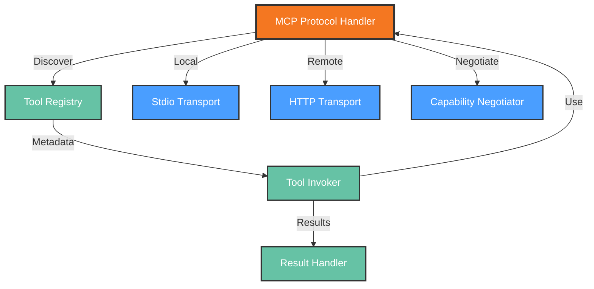

# Functional View: Integration

**Sub-System**: Integration
**ADRs Referenced**: ADR-108
**Generated**: 2026-05-20
**Dependencies**: Context View

---

## 3.2 Functional View

**Purpose**: Describe functional elements, responsibilities, and interactions for MCP Integration

### 3.2.1 Functional Elements

| Element | Responsibility | Interfaces Provided | Dependencies |
|---------|----------------|---------------------|--------------|
| MCP Protocol Handler | Core MCP protocol implementation | Connect, invoke, stream | MCP SDK |
| Tool Registry | Discovery and metadata for available tools | Register, discover, query | Storage |
| Stdio Transport | Local tool communication via stdio | Spawn, communicate | Local processes |
| HTTP Transport | Remote tool communication via HTTP | Request, response, stream | HTTP client |
| Tool Invoker | Execute tools with parameter validation | Invoke, validate, timeout | Protocol Handler |
| Result Handler | Process and format tool execution results | Format, stream, cache | Tool Invoker |
| Capability Negotiator | Discover and negotiate tool capabilities | Negotiate, advertise | MCP Protocol |

### 3.2.2 Element Interactions

### 3.2.3 Functional Boundaries

**What this system DOES:**

- Implement Model Context Protocol for tool integration
- Discover and register available tools
- Communicate with local tools via stdio transport
- Communicate with remote tools via HTTP transport
- Invoke tools with parameter validation
- Process and format tool execution results
- Negotiate capabilities between agents and tools

**What this system does NOT do:**

- Implement tool functionality (delegated to external tools)
- Store tool state (delegated to Storage)
- Manage tool lifecycle (delegated to Workspaces)
- Execute AI agent logic (delegated to AI Model APIs)

---

## Perspective Considerations

### Security Considerations

- **Tool Sandboxing**: Local tools run in workspace context
- **Permission Scopes**: Tools have limited access rights
- **Input Validation**: All tool parameters validated
- **Execution Auditing**: All invocations logged

_Source ADRs: ADR-108, ADR-009_

### Performance Considerations

- **Local Tool Latency**: <100ms for file operations
- **Remote Tool Latency**: Network dependent
- **Connection Pooling**: Reuse HTTP connections
- **Result Streaming**: Progressive result delivery

_Source ADRs: ADR-108_

### Evolution Considerations

- **Protocol Versioning**: MCP spec backward compatibility
- **Tool Registration**: Dynamic add/remove without restart
- **Transport Extensibility**: New transports can be added
- **Ecosystem Growth**: Vendor-neutral design

_Source ADRs: ADR-108_

---

## Validation Checklist

- [x] **Technology Neutrality**: Elements described by role
- [x] **Diagram Consistency**: Nodes match element table
- [x] **Interface Abstraction**: Capabilities not implementations
- [x] **Complete Coverage**: All responsibilities represented
- [x] **Clear Boundaries**: Responsibilities clearly defined

---

**ADR Traceability:**

| ADR | Decision | Impact on Functional View |
|-----|----------|---------------------------|
| ADR-108 | Model Context Protocol | All elements: Protocol, Registry, Transports |
