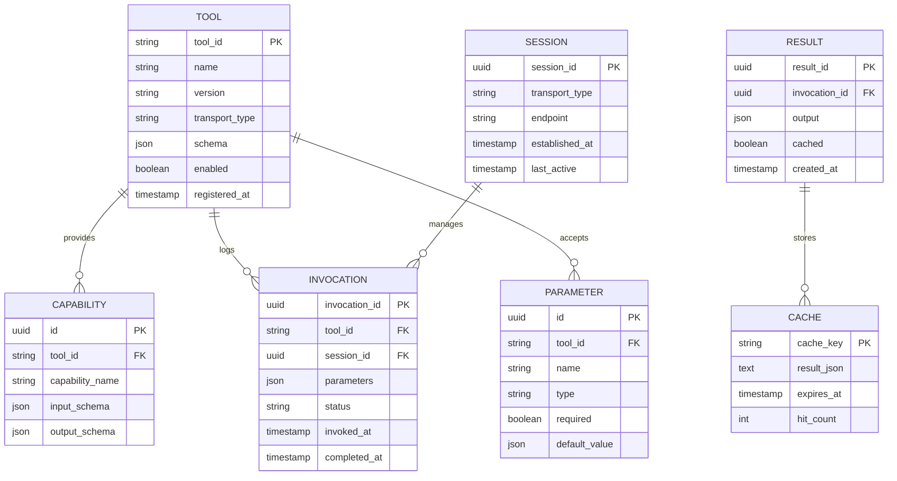

# Information View: Integration

**Sub-System**: Integration
**ADRs Referenced**: ADR-108
**Generated**: 2026-05-20
**Dependencies**: Functional View

---

## 3.3 Information View

**Purpose**: Describe data storage, management, and flow for MCP Integration

### 3.3.1 Data Entities

| Entity | Storage Location | Owner Component | Lifecycle | Access Pattern |
|--------|------------------|-----------------|-----------|----------------|
| Tool Definition | SQLite + Memory | Tool Registry | Register-Update-Remove | Read-heavy |
| Capability Schema | SQLite | Capability Negotiator | Version-Update | Read-heavy |
| Transport Session | Memory | Protocol Handler | Create-Use-Destroy | Write-heavy |
| Invocation Log | SQLite | Tool Invoker | Append-Audit | Write-heavy |
| Result Cache | Memory + SQLite | Result Handler | Cache-Invalidate | Read-heavy |
| Tool Parameters | Memory | Tool Invoker | Validate-Execute | Read-heavy |
| MCP Manifest | JSON + SQLite | Protocol Handler | Load-Cache | Read-heavy |

### 3.3.2 Data Model

### 3.3.3 Data Flow

**Key Data Flows:**

1. **Tool Registration**: Tool Manifest → Protocol Handler → Tool Registry → SQLite
2. **Capability Discovery**: Tool Registry → Capability Negotiator → Schema Cache
3. **Tool Invocation**: Request → Tool Invoker → Parameter Validation → Transport → Result
4. **Result Caching**: Tool Output → Result Handler → Cache Layer → Storage
5. **Session Management**: Connection Request → Protocol Handler → Session → Transport

### 3.3.4 Data Quality & Integrity

- **Consistency Model**: Eventual consistency for tool registry, strong for invocations
- **Validation Rules**: Tool schemas validated against MCP spec
- **Retention Policy**: Invocation logs 90 days, cache TTL configurable
- **Backup Strategy**: Tool registry backed up, sessions ephemeral

---

## Perspective Considerations

### Security Considerations

- **Tool Sandboxing**: Tools execute in workspace context
- **Parameter Validation**: All inputs validated against schema
- **Invocation Auditing**: Complete audit trail of tool use
- **Transport Security**: HTTPS for remote, Unix permissions for local

_Source ADRs: ADR-108, ADR-009_

### Performance Considerations

- **Registry Caching**: Tool definitions cached in memory
- **Connection Pooling**: Reuse transport connections
- **Result Caching**: Cache expensive tool results
- **Lazy Loading**: Tool details loaded on demand

_Source ADRs: ADR-108_

### Evolution Considerations

- **Protocol Versioning**: MCP spec version negotiation
- **Tool Updates**: Dynamic registration without restart
- **Schema Evolution**: Backward compatible schema changes
- **Transport Extensibility**: New transports added via registry

_Source ADRs: ADR-108_

---

**ADR Traceability:**

| ADR | Decision | Impact on Information View |
|-----|----------|----------------------------|
| ADR-108 | Model Context Protocol | All entities: Tool, Capability, Invocation, Session |
