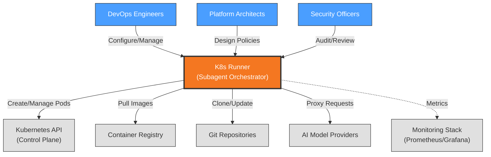

# Context View: Runner

**Sub-System**: Runner
**ADRs Referenced**: ADR-006
**Generated**: 2026-05-20

---

## 3.1 Context View

**Purpose**: Define system scope and external interactions for the K8s Runner subagent pattern

### 3.1.1 System Scope

The Runner sub-system provides Kubernetes-based orchestration for remote AI agent execution. It implements the K8s Subagent Pattern where each remote workspace operates as an isolated pod with resource constraints. The Runner handles pod lifecycle management, resource quota enforcement, scheduling of agent tasks, and auto-scaling capabilities for multi-agent workloads.

### 3.1.2 Stakeholders

| Stakeholder | Role | Key Concerns | Priority |
|-------------|------|--------------|----------|
| DevOps Engineers | Infrastructure Operators | Resource quotas, pod monitoring, cluster health | Critical |
| Platform Architects | System Designers | Isolation guarantees, scaling strategy | High |
| Security Officers | Compliance | Container security, network policies | Critical |
| AI Agents | Automated Users | Task scheduling, resource availability | High |
| End Users | Indirect Users | Workspace startup time, task completion speed | Medium |

### 3.1.3 External Entities

| Entity | Type | Interaction Type | Data Exchanged | Protocols |
|--------|------|------------------|----------------|-----------|
| Kubernetes API | External System | REST API | Pod specs, resource metrics, logs | HTTPS/TLS |
| Container Registry | External System | Docker Registry | Workspace container images | HTTPS |
| Git Repositories | External System | Git protocol | Workspace state, specifications | SSH/HTTPS |
| AI Model APIs | External API | REST/gRPC | Agent prompts, completions | HTTPS |
| Monitoring Stack | External System | Metrics API | Pod metrics, health status | HTTPS/Prometheus |

### 3.1.3 Context Diagram

### 3.1.4 External Dependencies

| Dependency | Purpose | SLA Expectations | Fallback Strategy |
|------------|---------|------------------|-------------------|
| Kubernetes API | Pod orchestration | 99.5% uptime | Local Docker mode |
| Container Registry | Image distribution | 99.9% uptime | Cached images on nodes |
| Git Provider | Workspace state | 99.95% uptime | Local git cache |
| AI Model APIs | Agent execution | 99.9% uptime | Retry with backoff |
| Monitoring Stack | Observability | 99.5% uptime | Local logging |

---

## Perspective Considerations

### Security Considerations

- **Container Isolation**: Each workspace in dedicated pod with security contexts
- **Network Policies**: Pod-to-pod communication restricted
- **Resource Quotas**: Prevent resource exhaustion attacks
- **Image Scanning**: Container images scanned before deployment

_Source ADRs: ADR-006, ADR-012_

### Performance Considerations

- **Cold Start Time**: ~60s for new pod creation (vs 30s local)
- **Resource Overhead**: Higher than Docker due to K8s abstraction
- **Auto-scaling**: Horizontal pod autoscaler for concurrent workloads
- **Parallel Execution**: Multiple pods for parallel agent tasks

_Source ADRs: ADR-006_

### Availability Considerations

- **Pod Restart**: Automatic restart on failure
- **Node Failover**: Workloads migrate to healthy nodes
- **Resource Limits**: Prevent cascade failures
- **Health Checks**: Liveness and readiness probes

_Source ADRs: ADR-006_

---

**Validation Checklist**:

- [x] System appears as exactly ONE node
- [x] No internal databases shown
- [x] No internal services shown
- [x] All entities are either stakeholders OR external systems
- [x] All connections cross the system boundary
