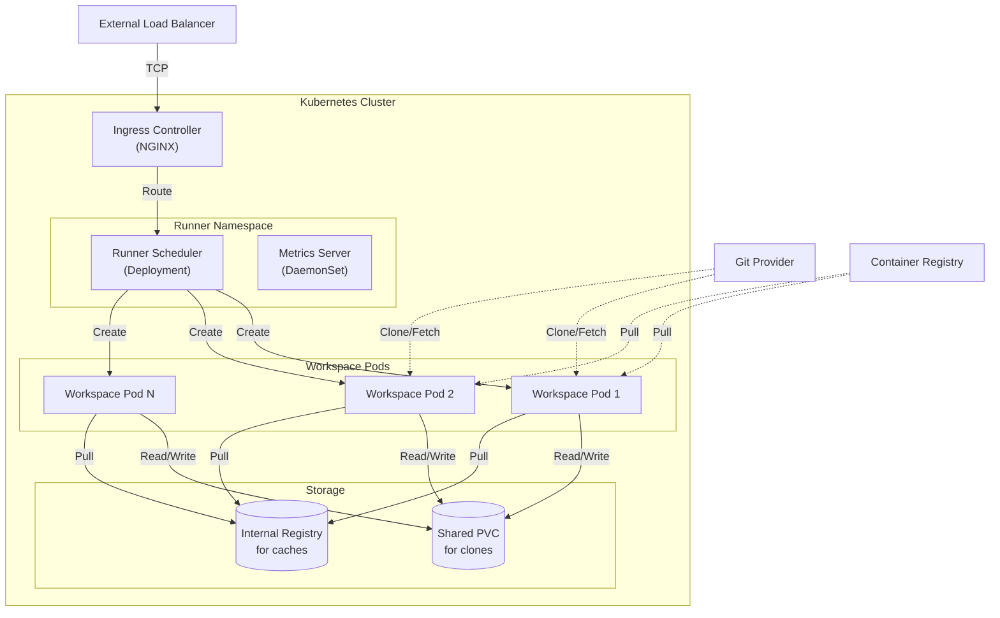

# Deployment View: Runner

**Sub-System**: Runner
**ADRs Referenced**: ADR-006
**Generated**: 2026-05-20
**Dependencies**: Context View, Functional View

---

## 3.6 Deployment View

**Purpose**: Physical environment - nodes, networks, storage

### 3.6.1 Runtime Environments

| Environment | Purpose | Infrastructure | Scale |
|-------------|---------|----------------|-------|
| Production | Remote workspace pods | Kubernetes (EKS/GKE) | Auto-scaling 5-100 nodes |
| Staging | Testing pod lifecycle | Kubernetes | 2-3 nodes |
| Development | kind/minikube | Local K8s | 1 node |

### 3.6.2 Network Topology

### 3.6.3 Hardware Requirements

| Component | CPU | Memory | Storage |
|-----------|-----|--------|---------|
| Runner Scheduler | 1 core | 2GB | 10GB |
| Workspace Pod (Small) | 0.5 cores | 1GB | 5GB |
| Workspace Pod (Medium) | 1 core | 2GB | 10GB |
| Workspace Pod (Large) | 2 cores | 4GB | 20GB |
| Metrics Collector | 0.5 cores | 512MB | 5GB |

### 3.6.4 Third-Party Services

| Service | Purpose | Provider | Tier |
|---------|---------|----------|------|
| Kubernetes | Container orchestration | AWS EKS / GKE | Managed |
| Container Registry | Base images | Docker Hub / ECR | Pro |
| Git Provider | Repository access | GitHub / GitLab | Enterprise |
| Prometheus | Metrics storage | Self-hosted / Managed | - |

---

## Perspective Considerations

### Security Considerations

- **Network Policies**: Pods can only egress to allowed endpoints
- **Pod Security Standards**: Restricted profile enforced
- **Service Accounts**: Scoped permissions per workspace
- **Image Scanning**: Trivy scans all images

_Source ADRs: ADR-006, ADR-012_

### Performance Considerations

- **Cluster Autoscaler**: Scale nodes based on pending pods
- **HPA**: Scale runner replicas based on queue depth
- **Image Pull Policy**: IfNotPresent for faster startup
- **Locality Awareness**: Schedule near PVCs

_Source ADRs: ADR-006_

### Availability Considerations

- **Pod Anti-affinity**: Spread across nodes
- **Pod Disruption Budgets**: Minimize disruption during updates
- **Health Probes**: Proper readiness/liveness
- **Graceful Shutdown**: 30s termination grace period

_Source ADRs: ADR-006_

---

**ADR Traceability:**

| ADR | Decision | Impact on Deployment View |
|-----|----------|---------------------------|
| ADR-006 | K8s Subagent Pattern | All topology, K8s as infrastructure |
