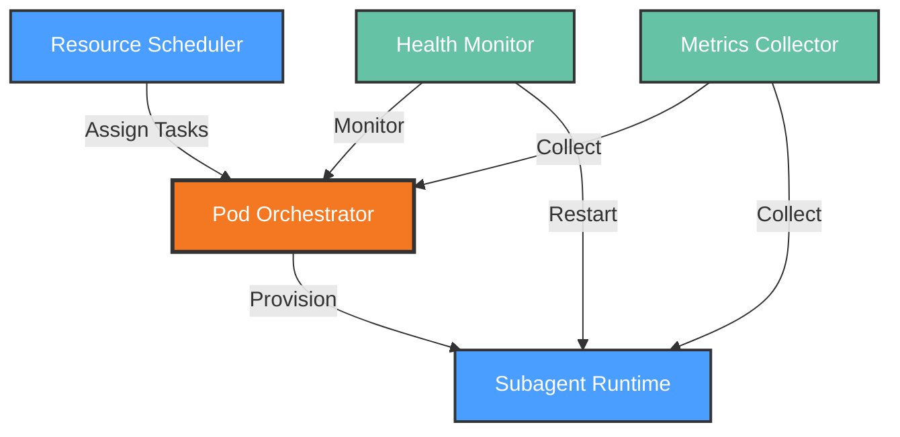

# Functional View: Runner

**Sub-System**: Runner
**ADRs Referenced**: ADR-006
**Generated**: 2026-05-20
**Dependencies**: Context View

---

## 3.2 Functional View

**Purpose**: Describe functional elements, responsibilities, and interactions for the K8s Runner

### 3.2.1 Functional Elements

| Element | Responsibility | Interfaces Provided | Dependencies |
|---------|----------------|---------------------|--------------|
| Pod Orchestrator | Kubernetes pod lifecycle management | Create, destroy, scale pods | Kubernetes API |
| Resource Scheduler | Task-to-pod assignment and resource allocation | Schedule, reschedule, migrate | Pod Orchestrator, Metrics |
| Subagent Runtime | Container execution environment for agents | Execute, monitor, collect results | Pod instances |
| Health Monitor | Pod health tracking and auto-recovery | Health checks, restart policies | Kubernetes API, Metrics |
| Metrics Collector | Resource usage and performance metrics | Metrics API, alerts | Pod Orchestrator, Monitoring stack |

### 3.2.2 Element Interactions

### 3.2.3 Functional Boundaries

**What this system DOES:**

- Create and manage Kubernetes pods for remote workspaces
- Schedule agent tasks to appropriate pods based on resource requirements
- Execute agent code within isolated container environments
- Monitor pod health and automatically recover from failures
- Collect resource metrics for scaling decisions

**What this system does NOT do:**

- Manage local Docker containers (handled by Workspaces)
- Execute tasks directly (delegated to Subagent Runtime within pods)
- Store persistent state (delegated to Storage)
- Handle user authentication (delegated to System)

---

## Perspective Considerations

### Security Considerations

- **Pod Security Contexts**: Non-root containers, read-only filesystems
- **Network Policies**: Restrict inter-pod communication
- **Resource Quotas**: Prevent resource exhaustion
- **Image Scanning**: Container images verified before deployment

_Source ADRs: ADR-006, ADR-012_

### Performance Considerations

- **Cold Start Optimization**: Pre-warmed pod pools for <60s startup
- **Resource Bins**: Pod sizes matched to workload requirements
- **Horizontal Scaling**: Auto-scaler based on queue depth and CPU
- **Locality Awareness**: Schedule near data when possible

_Source ADRs: ADR-006_

### Availability Considerations

- **Pod Disruption Budgets**: Graceful handling of node maintenance
- **Multi-zone Scheduling**: Pods spread across availability zones
- **Health Probes**: Liveness and readiness checks
- **Circuit Breakers**: Fail fast on persistent pod failures

_Source ADRs: ADR-006_

---

## Validation Checklist

- [x] **Technology Neutrality**: Elements described by role
- [x] **Diagram Consistency**: Nodes match element table
- [x] **Interface Abstraction**: Capabilities not implementations
- [x] **Complete Coverage**: All responsibilities represented
- [x] **Clear Boundaries**: Responsibilities clearly defined

---

**ADR Traceability:**

| ADR | Decision | Impact on Functional View |
|-----|----------|---------------------------|
| ADR-006 | K8s Subagent Pattern | All elements: Pod Orchestrator, Scheduler, Runtime, Monitor |
