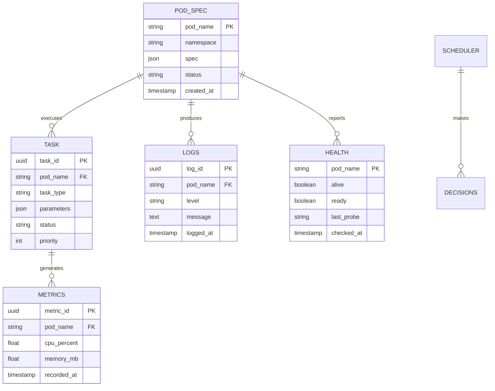

# Information View: Runner

**Sub-System**: Runner
**ADRs Referenced**: ADR-006
**Generated**: 2026-05-20
**Dependencies**: Functional View

---

## 3.3 Information View

**Purpose**: Describe data storage, management, and flow for the K8s Runner

### 3.3.1 Data Entities

| Entity | Storage Location | Owner Component | Lifecycle | Access Pattern |
|--------|------------------|-----------------|-----------|----------------|
| Pod Specification | K8s etcd | Pod Orchestrator | Create-Destroy | Write-heavy |
| Task Queue | SQLite/Redis | Resource Scheduler | Enqueue-Dequeue | Write-heavy |
| Resource Metrics | Prometheus | Metrics Collector | Stream-Archive | Write-heavy |
| Pod Logs | K8s/Fluentd | Subagent Runtime | Stream-Archive | Read-heavy |
| Health Status | K8s API | Health Monitor | Update-Poll | Read-heavy |
| Scheduling Decisions | SQLite | Resource Scheduler | Create-Audit | Read-heavy |

### 3.3.2 Data Model

### 3.3.3 Data Flow

**Key Data Flows:**

1. **Pod Creation**: Task Queue → Scheduler → Pod Spec → K8s API → etcd
2. **Metrics Collection**: Pod → Metrics Server → Prometheus → Time-series DB
3. **Log Aggregation**: Container → Fluentd → Log Storage → Query Interface
4. **Health Monitoring**: Kubelet → Health Checks → Status Updates → API
5. **Task Scheduling**: Request → Queue → Scheduler Decision → Pod Assignment

### 3.3.4 Data Quality & Integrity

- **Consistency Model**: Eventual consistency for metrics, strong for pod state
- **Validation Rules**: Pod specs validated against K8s schema
- **Retention Policy**: Metrics 30 days, logs 7 days, audit 1 year
- **Backup Strategy**: K8s etcd backups, Prometheus snapshot

---

## Perspective Considerations

### Security Considerations

- **Data Classification**: Pod specs may contain sensitive env vars
- **Encryption**: Secrets in pod specs use K8s secrets
- **Access Controls**: RBAC for K8s API access
- **Audit Trail**: All pod operations logged

_Source ADRs: ADR-006_

### Performance Considerations

- **Metrics Volume**: High cardinality time-series data
- **Log Volume**: GBs per day for busy clusters
- **Query Patterns**: Recent data queried frequently
- **Archival Strategy**: Cold storage for old metrics/logs

_Source ADRs: ADR-006_

### Availability Considerations

- **Data Redundancy**: etcd replication for pod state
- **Metrics Redundancy**: Prometheus HA pairs
- **Log Durability**: Multi-replica log storage
- **Disaster Recovery**: Regular etcd backups

_Source ADRs: ADR-006_

---

**ADR Traceability:**

| ADR | Decision | Impact on Information View |
|-----|----------|----------------------------|
| ADR-006 | K8s Subagent Pattern | All entities: Pod Spec, Task, Metrics, Logs |
