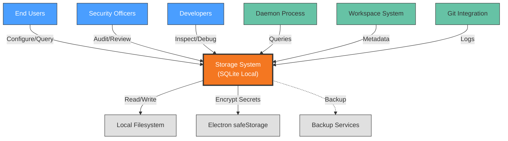

# Context View: Storage

**Sub-System**: Storage
**ADRs Referenced**: ADR-106
**Generated**: 2026-05-20

---

## 3.1 Context View

**Purpose**: Define system scope and external interactions for the Local Storage system

### 3.1.1 System Scope

The Storage sub-system provides persistent local data management for the Agentic SDLC platform. It implements SQLite with WAL mode for ACID transactions, using better-sqlite3 for synchronous API access. The system handles workspace metadata, user preferences, extension registry, operation logs, and audit trails. Data is stored locally with encrypted secrets via Electron safeStorage, supporting single-file backup and migration workflows.

### 3.1.2 Stakeholders

| Stakeholder | Role | Key Concerns | Priority |
|-------------|------|--------------|----------|
| End Users | Data Owners | Data persistence, backup/recovery | Critical |
| Security Officers | Compliance | Data encryption, access controls | Critical |
| Developers | Debug/Analysis | Queryability, data inspection | Medium |
| Platform Architects | Data Design | Schema evolution, migration | High |
| AI Agents | Automated Users | Reliable reads/writes | High |

### 3.1.3 External Entities

| Entity | Type | Interaction Type | Data Exchanged | Protocols |
|--------|------|------------------|----------------|-----------|
| Filesystem | External System | OS File API | SQLite database files | Local FS |
| Electron safeStorage | External System | OS APIs | Encrypted secrets | Platform-specific |
| Daemon Process | Internal System | Internal API | Data queries, updates | Internal |
| Workspace System | Internal System | API | Workspace metadata | Internal API |
| Git Integration | Internal System | API | Operation logs, audit trails | Internal API |
| Backup Services | External System | File sync | Database backups | Cloud sync |

### 3.1.3 Context Diagram

### 3.1.4 External Dependencies

| Dependency | Purpose | SLA Expectations | Fallback Strategy |
|------------|---------|------------------|-------------------|
| Local Filesystem | Database storage | Local availability | N/A |
| Electron safeStorage | Secret encryption | OS-dependent | Manual encryption |
| Backup Services | Data protection | Varies | Manual file copy |

---

## Perspective Considerations

### Security Considerations

- **Encryption at Rest**: SQLite database on encrypted filesystem
- **Secret Encryption**: Electron safeStorage for sensitive data
- **Access Control**: File system permissions
- **Audit Logging**: Complete operation history

_Source ADRs: ADR-106, ADR-009_

### Performance Considerations

- **Synchronous API**: better-sqlite3 for immediate results
- **WAL Mode**: Concurrent read/write performance
- **Local Access**: <10ms for typical queries
- **Connection Pooling**: Single connection per process

_Source ADRs: ADR-106_

### Evolution Considerations

- **Schema Migrations**: Versioned migration scripts
- **Foreign Keys**: Enforced referential integrity
- **Backward Compatibility**: Migration path for schema changes

_Source ADRs: ADR-106_

---

**Validation Checklist**:

- [x] System appears as exactly ONE node
- [x] No internal databases shown
- [x] No internal services shown
- [x] All entities are either stakeholders OR external systems
- [x] All connections cross the system boundary
