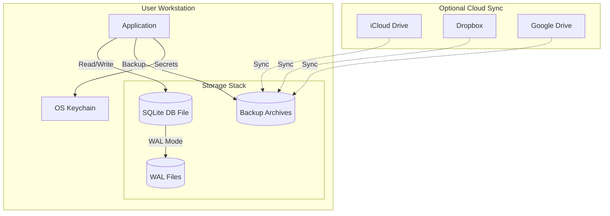

# Deployment View: Storage

**Sub-System**: Storage
**ADRs Referenced**: ADR-106
**Generated**: 2026-05-20
**Dependencies**: Context View, Functional View

---

## 3.6 Deployment View

**Purpose**: Physical environment - nodes, networks, storage

### 3.6.1 Runtime Environments

| Environment | Purpose | Infrastructure | Scale |
|-------------|---------|----------------|-------|
| Desktop | Local app data | User's filesystem | Per installation |
| Backup | Data protection | Cloud sync / Local | User configured |
| Migration | Schema upgrades | In-place | Per upgrade |

### 3.6.2 Network Topology

### 3.6.3 Hardware Requirements

**Storage:**

| Component | Size | Notes |
|-----------|------|-------|
| SQLite Database | 10-100MB | Grows with usage |
| WAL Files | 2-10MB | Temporary, auto-cleaned |
| Backups | 50-500MB | 7 versions retained |
| Total Required | 500MB | Minimum free space |

**Performance:**

| Metric | Target |
|--------|--------|
| Query Latency | <10ms |
| Write Throughput | 1000+ TPS |
| Backup Time | <5s |
| Restore Time | <3s |

### 3.6.4 Third-Party Services

| Service | Purpose | Provider | Notes |
|---------|---------|----------|-------|
| OS Keychain | Secret storage | Platform native | macOS/Windows/Linux |
| Cloud Sync | Backup sync | User choice | iCloud/Dropbox/etc. |
| File System | Data storage | Local | Encrypted recommended |

---

## Perspective Considerations

### Security Considerations

- **Encryption at Rest**: SQLite on encrypted disk
- **Secret Storage**: OS keychain integration
- **Backup Encryption**: Encrypted backup archives
- **File Permissions**: Restrictive permissions

_Source ADRs: ADR-106, ADR-009_

### Performance Considerations

- **SSD Recommended**: Faster I/O for SQLite
- **WAL Mode**: Concurrent reads during writes
- **Auto-vacuum**: Periodic optimization
- **Connection Pooling**: Single persistent connection

_Source ADRs: ADR-106_

### Availability Considerations

- **Local Storage**: No network dependency
- **Backup Strategy**: Automatic daily backups
- **Recovery**: Point-in-time restore capability
- **Migration**: Automatic schema migrations

_Source ADRs: ADR-106_

---

**ADR Traceability:**

| ADR | Decision | Impact on Deployment View |
|-----|----------|---------------------------|
| ADR-106 | SQLite for Local Data | Local file-based deployment |
