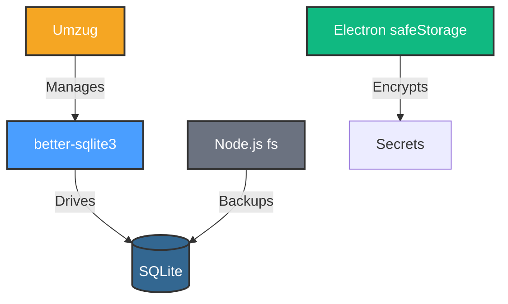
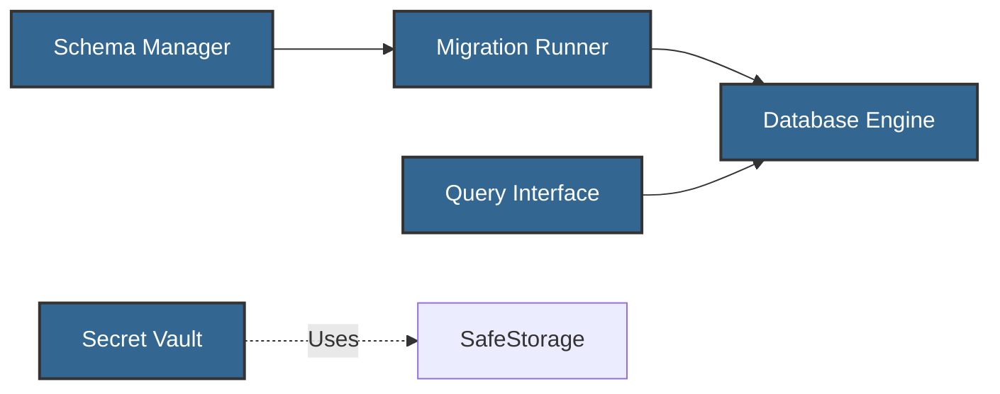

# Development View: Storage

**Sub-System**: Storage
**ADRs Referenced**: ADR-106
**Generated**: 2026-05-20
**Dependencies**: Functional View

---

## 3.5 Development View

**Purpose**: Constraints for developers - code organization, dependencies, CI/CD

### 3.5.1 Code Organization

```text
packages/storage/
├── src/
│   ├── engine/           # Database Engine
│   ├── schema/           # Schema Manager
│   ├── query/            # Query Interface
│   ├── vault/            # Secret Vault
│   ├── migration/        # Migration Runner
│   ├── backup/           # Backup Manager
│   └── pool/             # Connection Pool
├── migrations/
│   ├── 001_initial.sql
│   ├── 002_add_indexes.sql
│   └── ...
├── tests/
│   ├── unit/
│   ├── integration/
│   └── fixtures/
└── package.json
```

### 3.5.2 Technology Stack Mapping

| Functional Role | Technology Choice | Version/Variant | ADR Reference |
|-----------------|-------------------|-----------------|---------------|
| Database | SQLite | v3.45+ | ADR-106 |
| Node.js Driver | better-sqlite3 | v9.x | ADR-106 |
| Schema Management | Umzug | v3.x | ADR-106 |
| Migrations | SQL + JavaScript | Custom | ADR-106 |
| Secret Encryption | Electron safeStorage | Built-in | ADR-106 |
| Backup | Node.js fs | Built-in | ADR-106 |
| WAL Mode | SQLite PRAGMA | Enabled | ADR-106 |

### 3.5.3 Technology Architecture



### 3.5.4 Module Dependencies

**Dependency Rules:**

- Engine manages SQLite via better-sqlite3
- Schema Manager handles migrations via Umzug
- Query Interface uses Engine
- Secret Vault uses Electron safeStorage
- Backup Manager uses Node.js fs



### 3.5.5 Build & CI/CD

- **Build System**: tsup for package builds
- **CI Pipeline**: Lint → Test → Migration Tests → Build
- **Deployment Strategy**: npm publish
- **Testing**: In-memory SQLite for unit, file-based for integration

### 3.5.6 Development Standards

- **Coding Standards**: TypeScript strict, SQL best practices
- **Review Requirements**: 2 approvals, review migration safety
- **Testing Requirements**: Migration rollback tests

---

## Perspective Considerations

### Security Considerations

- **SQL Injection**: Parameterized queries only
- **Secret Storage**: OS keychain integration
- **File Permissions**: Restrictive permissions on DB file
- **Backup Encryption**: Encrypted backups

_Source ADRs: ADR-106, ADR-009_

### Performance Considerations

- **WAL Mode**: Concurrent reads/writes
- **Indexing**: Strategic indexes for queries
- **Prepared Statements**: Query plan caching
- **Connection Reuse**: Single persistent connection

_Source ADRs: ADR-106_

### Evolution Considerations

- **Schema Versioning**: Linear migrations with rollback
- **Migration Testing**: Test migrations against production copy
- **Foreign Keys**: Referential integrity
- **Deprecation**: Soft deletes with grace period

_Source ADRs: ADR-106_

---

## Validation Checklist

- [x] **Technology Mapping**: All functional elements mapped
- [x] **ADR References**: All choices reference ADRs
- [x] **Diagram Parity**: Mirrors Functional View structure
- [x] **Code Alignment**: Organization matches stack
- [x] **Dependency Rules**: Clear layer dependencies

---

**ADR Traceability:**

| ADR | Decision | Impact on Development View |
|-----|----------|----------------------------|
| ADR-106 | SQLite for Local Data | All technologies: SQLite, better-sqlite3, etc. |
