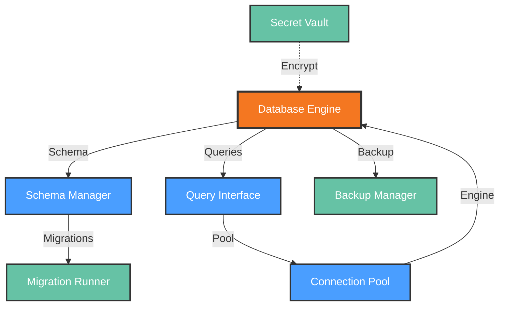

# Functional View: Storage

**Sub-System**: Storage
**ADRs Referenced**: ADR-106
**Generated**: 2026-05-20
**Dependencies**: Context View

---

## 3.2 Functional View

**Purpose**: Describe functional elements, responsibilities, and interactions for Local Storage

### 3.2.1 Functional Elements

| Element | Responsibility | Interfaces Provided | Dependencies |
|---------|----------------|---------------------|--------------|
| Database Engine | SQLite database management with WAL mode | Query, transaction, migration | Local filesystem |
| Schema Manager | Database schema versioning and migrations | Migrate, validate, rollback | Database Engine |
| Query Interface | Synchronous SQL query execution | Execute, prepare, batch | Database Engine |
| Secret Vault | Encrypted storage for sensitive data | Store, retrieve, rotate | Electron safeStorage |
| Migration Runner | Schema migration execution | Run, verify, revert | Schema Manager |
| Backup Manager | Database backup and restore | Backup, restore, verify | Local filesystem |
| Connection Pool | Database connection lifecycle | Acquire, release, monitor | Database Engine |

### 3.2.2 Element Interactions

### 3.2.3 Functional Boundaries

**What this system DOES:**

- Store workspace metadata and configuration
- Manage user preferences and settings
- Maintain extension registry and state
- Log operations for audit trails
- Encrypt sensitive data via OS keychain
- Execute schema migrations for upgrades
- Provide backup and restore capabilities

**What this system does NOT do:**

- Store source code (delegated to Git repositories)
- Store large binary files (delegated to external storage)
- Replicate data across devices (delegated to sync services)
- Execute business logic (delegated to application layers)

---

## Perspective Considerations

### Security Considerations

- **Encryption at Rest**: SQLite on encrypted filesystem
- **Secret Encryption**: OS keychain via Electron safeStorage
- **Access Control**: File system permissions
- **Audit Logging**: Complete operation history

_Source ADRs: ADR-106, ADR-009_

### Performance Considerations

- **Synchronous API**: better-sqlite3 for immediate results
- **WAL Mode**: Concurrent read/write without locking
- **Local Access**: <10ms for typical queries
- **Connection Reuse**: Single persistent connection

_Source ADRs: ADR-106_

### Evolution Considerations

- **Schema Versioning**: Migration scripts for each version
- **Backward Compatibility**: Read old schemas, write new
- **Foreign Keys**: Enforced referential integrity
- **Index Management**: Performance-optimized indexes

_Source ADRs: ADR-106_

---

## Validation Checklist

- [x] **Technology Neutrality**: Elements described by role
- [x] **Diagram Consistency**: Nodes match element table
- [x] **Interface Abstraction**: Capabilities not implementations
- [x] **Complete Coverage**: All responsibilities represented
- [x] **Clear Boundaries**: Responsibilities clearly defined

---

**ADR Traceability:**

| ADR | Decision | Impact on Functional View |
|-----|----------|---------------------------|
| ADR-106 | SQLite for Local Data | All elements: Engine, Schema, Query, Vault |
