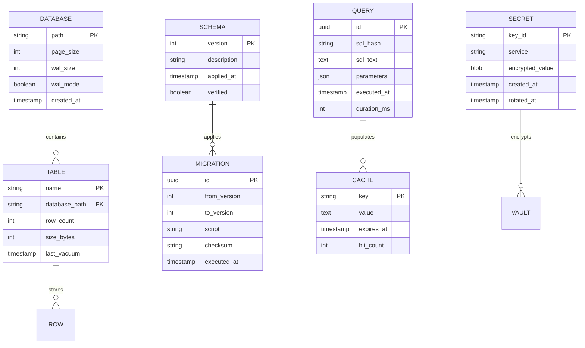

# Information View: Storage

**Sub-System**: Storage
**ADRs Referenced**: ADR-106
**Generated**: 2026-05-20
**Dependencies**: Functional View

---

## 3.3 Information View

**Purpose**: Describe data storage, management, and flow for Local Storage

### 3.3.1 Data Entities

| Entity | Storage Location | Owner Component | Lifecycle | Access Pattern |
|--------|------------------|-----------------|-----------|----------------|
| SQLite Database | Local Filesystem | Database Engine | Create-Migrate-Backup | Read/Write-heavy |
| Schema Version | SQLite | Schema Manager | Update-Track | Read-heavy |
| Query Cache | Memory + SQLite | Query Interface | Populate-Invalidate | Read-heavy |
| Encrypted Secret | OS Keychain | Secret Vault | Store-Retrieve-Rotate | Write-heavy |
| Migration Record | SQLite | Migration Runner | Create-Verify | Read-heavy |
| Backup Archive | Filesystem | Backup Manager | Create-Restore | Write-heavy |
| Connection State | Memory | Connection Pool | Acquire-Release | Read-heavy |

### 3.3.2 Data Model

### 3.3.3 Data Flow

**Key Data Flows:**

1. **Schema Migration**: Migration Scripts → Schema Manager → SQLite → Schema Version
2. **Query Execution**: Application → Query Interface → Connection Pool → SQLite → Results
3. **Secret Storage**: Application → Secret Vault → OS Keychain → Encrypted Storage
4. **Backup Creation**: Database File → Backup Manager → Archive → Storage
5. **Cache Population**: Query Results → Cache Layer → Memory/SQLite → Subsequent Queries

### 3.3.4 Data Quality & Integrity

- **Consistency Model**: ACID transactions with WAL mode
- **Validation Rules**: Schema migrations validated before execution
- **Retention Policy**: Query logs 30 days, backups 7 versions
- **Backup Strategy**: Automated daily backups with integrity checks

---

## Perspective Considerations

### Security Considerations

- **Encryption at Rest**: Database on encrypted filesystem
- **Secret Encryption**: OS keychain integration (macOS Keychain, Windows DPAPI, Linux Keyring)
- **Access Control**: File permissions on database file
- **Backup Encryption**: Backup archives encrypted

_Source ADRs: ADR-106, ADR-009_

### Performance Considerations

- **WAL Mode**: Concurrent reads during writes
- **Index Strategy**: Indexed columns for frequent queries
- **Query Optimization**: Prepared statements, parameter binding
- **Cache Strategy**: LRU cache for frequent queries

_Source ADRs: ADR-106_

### Evolution Considerations

- **Schema Versioning**: Linear versioning with rollback support
- **Migration Testing**: Migrations tested against copy of production
- **Foreign Keys**: Referential integrity enforced
- **Deprecation Strategy**: Soft deletes with grace period

_Source ADRs: ADR-106_

---

**ADR Traceability:**

| ADR | Decision | Impact on Information View |
|-----|----------|----------------------------|
| ADR-106 | SQLite for Local Data | All entities: Database, Schema, Query, Secret |
