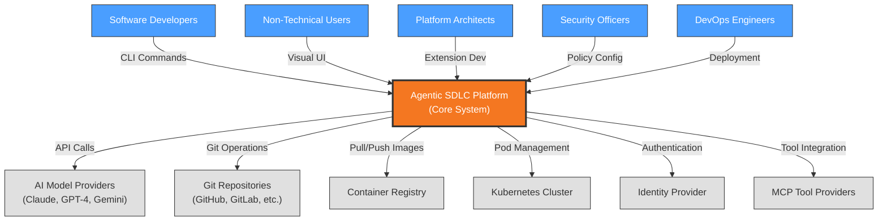

# Context View: System

**Sub-System**: System
**ADRs Referenced**: ADR-004, ADR-005, ADR-008, ADR-009, ADR-010, ADR-011
**Generated**: 2026-05-20

---

## 3.1 Context View

**Purpose**: Define system scope and external interactions for the Agentic SDLC platform

### 3.1.1 System Scope

The Agentic SDLC System provides the foundational architecture for AI-driven software development lifecycle management. It implements a unified abstraction layer enabling multiple AI agents (Claude, GPT-4, Gemini) to work through a standardized command interface. The system establishes extension-based architecture allowing teams to customize integrations, manages context engineering for limited token windows, enforces safety through schema-level constraints, and implements three-level work decomposition (Milestone/Slice/Task).

### 3.1.2 Stakeholders

| Stakeholder | Role | Key Concerns | Priority |
|-------------|------|--------------|----------|
| Software Developers | Primary Users | CLI efficiency, workflow automation, agent reliability | High |
| Non-Technical Team Members | Secondary Users | Visual UI simplicity, task visibility, collaboration | High |
| Platform Architects | System Designers | Extension architecture, multi-agent support, safety constraints | Critical |
| Security Officers | Compliance | Data protection, audit trails, constraint enforcement | Critical |
| DevOps Engineers | Operations | Workspace provisioning, deployment automation, monitoring | Medium |
| AI Agent Vendors | Integration Partners | Adapter compatibility, API stability, feature parity | Medium |

### 3.1.3 External Entities

| Entity | Type | Interaction Type | Data Exchanged | Protocols |
|--------|------|------------------|----------------|-----------|
| AI Model Providers | External API | REST/gRPC API | Prompts, completions, embeddings | HTTPS, API Keys |
| Git Repositories | External System | Git protocol | Specs, code, configuration | SSH/HTTPS |
| Container Registry | External System | Docker API | Container images | HTTPS |
| Kubernetes Cluster | External System | K8s API | Pod scheduling, resource management | HTTPS/TLS |
| Identity Provider | External Service | OAuth2/OIDC | Authentication tokens | HTTPS |
| MCP Tool Providers | External API | Stdio/HTTP | Tool definitions, execution results | Various |

### 3.1.3 Context Diagram

### 3.1.4 External Dependencies

| Dependency | Purpose | SLA Expectations | Fallback Strategy |
|------------|---------|------------------|-------------------|
| AI Model APIs | Code generation, analysis | 99.9% uptime | Local model fallback, degraded mode |
| Git Provider | Source control, specs | 99.95% uptime | Local git cache, offline mode |
| Container Registry | Workspace images | 99.9% uptime | Local image cache |
| Kubernetes API | Remote workspace orchestration | 99.5% uptime | Local Docker fallback |
| Identity Provider | Authentication | 99.99% uptime | Cached tokens, local auth |

---

## Perspective Considerations

### Security Considerations

The System Context establishes the primary security boundaries:
- **External Trust Zones**: AI model providers operate in untrusted zones requiring output validation
- **Entry Points**: CLI and Visual UI are main entry points requiring authentication
- **Authentication Boundaries**: OAuth2/OIDC integration with Identity Provider
- **Data Classification**: Specs and code cross trust boundaries to AI providers

_Source ADRs: ADR-004, ADR-009_

### Performance Considerations

- **AI API Latency**: 500ms-5s typical for completions, requires async handling
- **Context Window Limits**: 32K-200K tokens constrain spec size
- **Git Operations**: Local caching for <100ms reads
- **Parallel Execution**: Max 4 concurrent agents per constitution

_Source ADRs: ADR-008, ADR-010_

### Location Considerations

- **Multi-Region Support**: Local (Docker) vs Remote (K8s) workspace deployment
- **Data Residency**: Git repositories may have geo-restrictions
- **AI Provider Regions**: Different providers have regional endpoints

_Source ADRs: ADR-006, ADR-007_

### Regulation Considerations

- **Audit Requirements**: Complete operation logging for compliance
- **Data Sovereignty**: Git repo location affects data residency
- **AI Usage Policies**: Provider terms of service constraints

_Source ADRs: ADR-009, ADR-011_

---

**Validation Checklist**:

- [x] System appears as exactly ONE node
- [x] No internal databases shown
- [x] No internal services shown
- [x] All entities are either stakeholders OR external systems
- [x] All connections cross the system boundary
