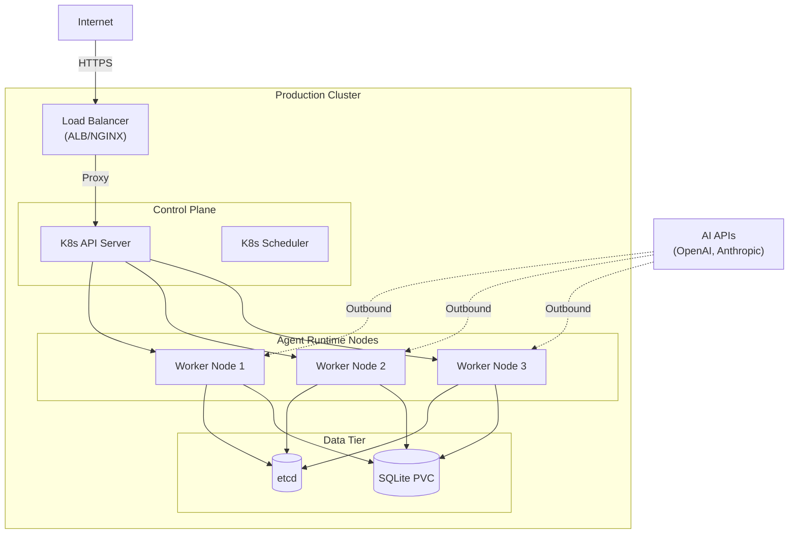

# Deployment View: System

**Sub-System**: System
**ADRs Referenced**: ADR-004, ADR-005, ADR-008, ADR-009, ADR-010, ADR-011
**Generated**: 2026-05-20
**Dependencies**: Context View, Functional View

---

## 3.6 Deployment View

**Purpose**: Physical environment - nodes, networks, storage

### 3.6.1 Runtime Environments

| Environment | Purpose | Infrastructure | Scale |
|-------------|---------|----------------|-------|
| Production | Live user workspaces | Kubernetes (EKS/GKE) | 10-50 nodes |
| Staging | Pre-release testing | Kubernetes (smaller) | 3-5 nodes |
| Development | Local development | Docker Desktop | 1 node |

### 3.6.2 Network Topology

### 3.6.3 Hardware Requirements

| Component | CPU | Memory | Storage |
|-----------|-----|--------|---------|
| Control Plane | 2 cores | 4GB | 20GB SSD |
| Worker Node | 4 cores | 16GB | 100GB SSD |
| Load Balancer | 1 core | 2GB | 10GB |
| etcd | 2 cores | 8GB | 50GB SSD |

### 3.6.4 Third-Party Services

| Service | Purpose | Provider | Tier |
|---------|---------|----------|------|
| AI Models | Code generation | OpenAI/Anthropic | Enterprise |
| Container Registry | Image hosting | GitHub/Docker Hub | Pro |
| Git Hosting | Repository storage | GitHub/GitLab | Enterprise |
| Monitoring | Metrics/logs | Datadog/Grafana Cloud | Pro |

---

## Perspective Considerations

### Security Considerations

- **Network Policies**: Default-deny between namespaces
- **Pod Security**: Non-root containers, read-only root filesystem
- **Secrets Management**: External Secrets Operator for cloud secrets
- **Ingress TLS**: Terminate TLS at load balancer

_Source ADRs: ADR-009_

### Performance Considerations

- **HPA**: Auto-scale agent pods based on queue depth
- **Resource Quotas**: Prevent noisy neighbor issues
- **Node Affinity**: GPU nodes for AI workloads (if applicable)
- **Caching Layer**: Redis for frequent adapter configs

_Source ADRs: ADR-008_

### Availability Considerations

- **Multi-zone**: Pods spread across AZs
- **Pod Disruption Budgets**: Graceful pod termination
- ** etcd Backup**: Hourly backups to S3/GCS
- **Circuit Breakers**: Fail fast on AI API errors

_Source ADRs: ADR-009_

---

**ADR Traceability:**

| ADR | Decision | Impact on Deployment View |
|-----|----------|---------------------------|
| ADR-004 | Multi-Agent Abstraction | External AI API dependencies |
| ADR-009 | Safety Through Constraints | Network policies, pod security |
