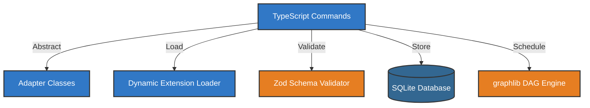
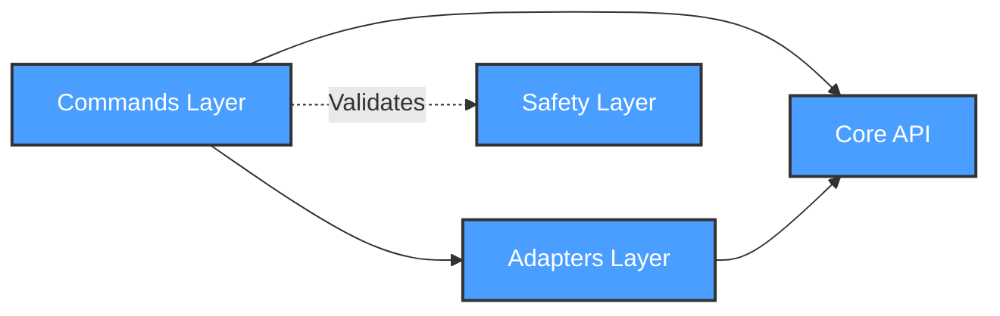

# Development View: System

**Sub-System**: System
**ADRs Referenced**: ADR-004, ADR-005, ADR-008, ADR-009, ADR-010, ADR-011
**Generated**: 2026-05-20
**Dependencies**: Functional View

---

## 3.5 Development View

**Purpose**: Constraints for developers - code organization, dependencies, CI/CD

### 3.5.1 Code Organization

```text
packages/core/
├── src/
│   ├── commands/         # Command abstraction layer
│   ├── adapters/         # AI vendor adapters (Claude, GPT-4, Gemini)
│   ├── extensions/       # Extension engine and loader
│   ├── context/          # Context compaction service
│   ├── safety/           # Safety schema validator
│   ├── work/             # Work decomposition engine
│   └── directives/       # Team directives manager
├── tests/
│   ├── unit/
│   ├── integration/
│   └── fixtures/
└── package.json
```

### 3.5.2 Technology Stack Mapping

| Functional Role | Technology Choice | Version/Variant | ADR Reference |
|-----------------|-------------------|-----------------|---------------|
| Command Interface | TypeScript Interfaces | 6.x strict mode | ADR-102 |
| Adapter Pattern | Abstract Base Classes | ES2022 | ADR-004 |
| Extension Loader | Dynamic import() | ESM | ADR-005 |
| Context Storage | SQLite + Memory | better-sqlite3 | ADR-106 |
| Schema Validation | Zod | v3.x | ADR-009 |
| DAG Engine | graphlib | v2.x | ADR-010 |
| Directive Parser | YAML + Markdown | YAML 1.2 | ADR-011 |

### 3.5.3 Technology Architecture



### 3.5.4 Module Dependencies

**Dependency Rules:**

- Commands layer depends on Adapters layer
- Adapters depend on Abstract Interfaces
- Extensions depend on Core API
- Safety layer validates all inputs
- No circular dependencies allowed



### 3.5.5 Build & CI/CD

- **Build System**: tsup for fast package builds
- **CI Pipeline**: Lint → Type Check → Test → Build → Publish
- **Deployment Strategy**: npm publish to private registry
- **Testing**: Vitest for unit tests, 80% coverage required

### 3.5.6 Development Standards

- **Coding Standards**: ESLint + Prettier, strict TypeScript
- **Review Requirements**: 2 approvals for core changes
- **Testing Requirements**: Unit tests for all public APIs

---

## Perspective Considerations

### Security Considerations

- **Dependency Scanning**: npm audit on every build
- **Secure Coding**: TypeScript strict mode prevents common errors
- **Secret Management**: No secrets in code, use environment

_Source ADRs: ADR-102, ADR-009_

### Performance Considerations

- **Build Performance**: tsup for <2s package builds
- **Test Performance**: Vitest parallel execution
- **Bundle Size**: Tree-shaking for minimal bundles

_Source ADRs: ADR-109_

### Evolution Considerations

- **Interface Stability**: Abstract base classes for adapters
- **Extension API**: Versioned API for extensions
- **Migration Path**: Deprecation notices before breaking changes

_Source ADRs: ADR-005_

### Development Resource Considerations

- **Team Skills**: TypeScript expertise required
- **Documentation**: TSDoc for all public APIs
- **Onboarding**: Example adapters and extensions

_Source ADRs: ADR-102_

---

## Validation Checklist

- [x] **Technology Mapping**: All functional elements mapped
- [x] **ADR References**: All choices reference ADRs
- [x] **Diagram Parity**: Mirrors Functional View structure
- [x] **Code Alignment**: Organization matches stack
- [x] **Dependency Rules**: Clear layer dependencies

---

**ADR Traceability:**

| ADR | Decision | Impact on Development View |
|-----|----------|----------------------------|
| ADR-004 | Multi-Agent Abstraction | Adapter Classes technology |
| ADR-005 | Extension-Based | Dynamic Extension Loader |
| ADR-009 | Safety Through Constraints | Zod Schema Validator |
| ADR-010 | Three-Level Work Decomposition | graphlib DAG Engine |
| ADR-102 | TypeScript-First | TypeScript strict mode |
| ADR-109 | Vite + tsup Build | tsup build system |
