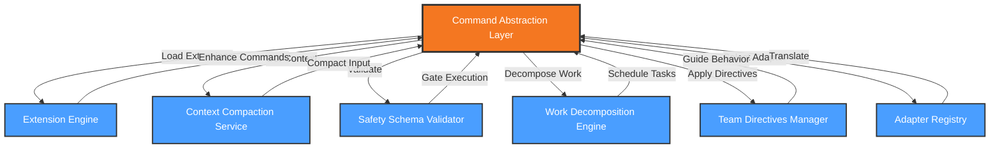

# Functional View: System

**Sub-System**: System
**ADRs Referenced**: ADR-004, ADR-005, ADR-008, ADR-009, ADR-010, ADR-011
**Generated**: 2026-05-20
**Dependencies**: Context View

---

## 3.2 Functional View

**Purpose**: Describe functional elements, responsibilities, and interactions for the core Agentic SDLC System

### 3.2.1 Functional Elements

| Element | Responsibility | Interfaces Provided | Dependencies |
|---------|----------------|---------------------|--------------|
| Command Abstraction Layer | Unified agent command interface with adapter pattern | Agent commands (specify, plan, implement) | Adapter implementations |
| Extension Engine | Dynamic loading and lifecycle management of extensions | Extension API, Hook system | Extension registry, Manifest parser |
| Context Compaction Service | Graduated context management and token optimization | Context retrieval, compaction levels | Storage, Cache |
| Safety Schema Validator | Multi-layer safety validation and constraint enforcement | Validation API, Policy checks | Policy engine, Audit logger |
| Work Decomposition Engine | Milestone/Slice/Task hierarchy management with DAG | Task creation, dependency tracking | Scheduler, Runner |
| Team Directives Manager | Version-controlled AI behavior guidance | Directive loading, rule enforcement | Git integration, Storage |
| Adapter Registry | Vendor-specific agent adapter management | Adapter registration, translation | External AI APIs |

### 3.2.2 Element Interactions

### 3.2.3 Functional Boundaries

**What this system DOES:**

- Abstract multiple AI agents behind unified command interface
- Load and manage extensions dynamically at runtime
- Optimize context for limited token windows through graduated compaction
- Enforce safety through schema validation and policy constraints
- Decompose work into Milestone/Slice/Task hierarchy with DAG dependencies
- Apply team-specific AI directives and coding standards
- Translate between vendor-specific agent APIs

**What this system does NOT do:**

- Execute tasks directly (delegated to Runner)
- Store workspace state (delegated to Storage)
- Manage git operations (delegated to Git Integration)
- Render UI (delegated to User Interface)
- Provision infrastructure (delegated to Workspaces)

---

## Perspective Considerations

### Security Considerations

- **Adapter Isolation**: Each vendor adapter runs in isolated context
- **Extension Sandboxing**: Extensions have limited access to core APIs
- **Validation Layers**: Schema, policy, and audit layers provide defense in depth
- **Directive Enforcement**: Team rules are mandatory, not advisory

_Source ADRs: ADR-004, ADR-005, ADR-009_

### Performance Considerations

- **Context Compaction**: Reduces token usage by 60-80% for large specs
- **Adapter Caching**: Frequently used adapters cached in memory
- **Extension Lazy Loading**: Extensions loaded on first use
- **Parallel Validation**: Safety checks run concurrently where possible

_Source ADRs: ADR-004, ADR-008_

### Evolution Considerations

- **Extension API Stability**: Backward compatibility for extensions
- **Adapter Versioning**: Support multiple adapter versions
- **Directive Versioning**: Semantic versioning for team directives
- **Command Evolution**: New commands added without breaking existing

_Source ADRs: ADR-005, ADR-011_

### Usability Considerations

- **Command Consistency**: Same interface across all agents
- **Error Context**: Validation errors include directive references
- **Progress Visibility**: Work decomposition provides clear progress tracking
- **Learning Path**: CLI shows UI equivalents for skill building

_Source ADRs: ADR-004, ADR-010_

---

## Validation Checklist

- [x] **Technology Neutrality**: Elements described by architectural role
- [x] **Diagram Consistency**: Mermaid nodes match element table
- [x] **Interface Abstraction**: Interfaces describe capabilities
- [x] **Complete Coverage**: All major responsibilities represented
- [x] **Clear Boundaries**: System responsibilities clearly defined

---

**ADR Traceability:**

| ADR | Decision | Impact on Functional View |
|-----|----------|---------------------------|
| ADR-004 | Multi-Agent Abstraction | Command Abstraction Layer, Adapter Registry |
| ADR-005 | Extension-Based Architecture | Extension Engine element |
| ADR-008 | Context Engineering | Context Compaction Service element |
| ADR-009 | Safety Through Constraints | Safety Schema Validator element |
| ADR-010 | Three-Level Work Decomposition | Work Decomposition Engine element |
| ADR-011 | Team AI Directives | Team Directives Manager element |
