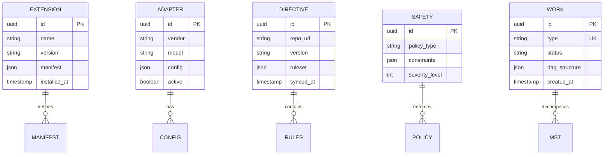

# Information View: System

**Sub-System**: System
**ADRs Referenced**: ADR-004, ADR-005, ADR-008, ADR-009, ADR-010, ADR-011
**Generated**: 2026-05-20
**Dependencies**: Functional View

---

## 3.3 Information View

**Purpose**: Describe data storage, management, and flow for the System sub-system

### 3.3.1 Data Entities

| Entity | Storage Location | Owner Component | Lifecycle | Access Pattern |
|--------|------------------|-----------------|-----------|----------------|
| Extension Manifest | SQLite/JSON | Extension Engine | Create-Update-Delete | Read-heavy |
| Adapter Configuration | SQLite | Adapter Registry | Create-Update | Read-heavy |
| Directive Rules | Git + SQLite | Team Directives Manager | Version-controlled | Read-heavy |
| Safety Policy | SQLite | Safety Schema Validator | Create-Update | Read-heavy |
| Work Decomposition | SQLite | Work Decomposition Engine | Create-Update-Archive | Write-heavy |
| Context Cache | Memory + SQLite | Context Compaction Service | Transient | Read-heavy |
| Command History | SQLite | Command Abstraction Layer | Append-only | Read-heavy |

### 3.3.2 Data Model

### 3.3.3 Data Flow

**Key Data Flows:**

1. **Extension Loading**: Registry → Manifest → Extension Engine → Runtime
2. **Command Processing**: CLI → Adapter Config → Command Abstraction → Context Cache
3. **Work Decomposition**: Spec → MST Hierarchy → Work Decomposition Engine → Storage
4. **Safety Validation**: Input → Policy Rules → Safety Validator → Audit Log
5. **Directive Sync**: Git Repo → Ruleset → Directives Manager → SQLite Cache

### 3.3.4 Data Quality & Integrity

- **Consistency Model**: ACID transactions via SQLite
- **Validation Rules**: Schema validation at entry points
- **Retention Policy**: Command history 90 days, audit logs 1 year
- **Backup Strategy**: SQLite file backup with Git state

---

## Perspective Considerations

### Security Considerations

- **Data Classification**: Adapter configs are sensitive, encrypted at rest
- **Access Controls**: Role-based access to directive rules
- **PII Handling**: No PII in system data
- **Audit Trail**: All policy decisions logged

_Source ADRs: ADR-009_

### Performance Considerations

- **Query Optimization**: Indexed lookups for extension manifests
- **Caching Strategy**: Context cache in memory with SQLite backing
- **Batch Operations**: Bulk inserts for work decomposition
- **Connection Pooling**: Single SQLite connection per process

_Source ADRs: ADR-008_

### Regulation Considerations

- **Data Governance**: Directive rules version-controlled
- **Retention Compliance**: Configurable retention policies
- **Audit Requirements**: Complete command history retained

_Source ADRs: ADR-011_

### Evolution Considerations

- **Schema Migration**: Versioned migrations for SQLite schema
- **Config Evolution**: Adapter configs versioned independently
- **Policy Updates**: Safety policies update without restart

_Source ADRs: ADR-005_

---

**ADR Traceability:**

| ADR | Decision | Impact on Information View |
|-----|----------|----------------------------|
| ADR-004 | Multi-Agent Abstraction | Adapter Configuration entity |
| ADR-005 | Extension-Based | Extension Manifest entity |
| ADR-008 | Context Engineering | Context Cache entity |
| ADR-009 | Safety Constraints | Safety Policy entity |
| ADR-010 | Work Decomposition | Work Decomposition entity |
| ADR-011 | Team Directives | Directive Rules entity |
