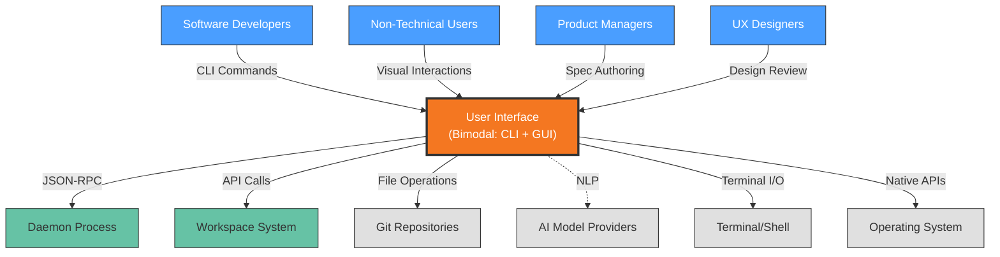

# Context View: User Interface

**Sub-System**: User Interface
**ADRs Referenced**: ADR-018, ADR-020
**Generated**: 2026-05-20

---

## 3.1 Context View

**Purpose**: Define system scope and external interactions for the Bimodal User Interface

### 3.1.1 System Scope

The User Interface sub-system implements a bimodal design serving both developers (CLI) and non-developers (Visual UI) as equal first-class citizens. The CLI provides power-user efficiency with command-line workflows, while the Visual UI offers intuitive graphical interactions for non-technical users. Both interfaces share a single YAML/Markdown spec format with 100% round-trip fidelity, enabling progressive skill building from UI to CLI.

### 3.1.2 Stakeholders

| Stakeholder | Role | Key Concerns | Priority |
|-------------|------|--------------|----------|
| Software Developers | CLI Users | Command efficiency, scriptability, terminal integration | Critical |
| Non-Technical Users | GUI Users | Visual clarity, task guidance, reduced complexity | Critical |
| Product Managers | Specification Authors | Spec creation, requirement documentation | High |
| UX Designers | Interface Design | Consistency, accessibility, user flows | Medium |
| Platform Architects | Integration | Shared core logic, feature parity | High |

### 3.1.3 External Entities

| Entity | Type | Interaction Type | Data Exchanged | Protocols |
|--------|------|------------------|----------------|-----------|
| Daemon Process | Internal System | JSON-RPC over Unix Socket | Commands, events, state | Unix Socket |
| Workspace System | Internal System | API | Workspace status, file access | Internal API |
| Git Repositories | External System | Git protocol | Spec files, project state | SSH/HTTPS |
| AI Model APIs | External API | REST/gRPC | Natural language processing | HTTPS |
| Terminal/Shell | External System | Stdio | CLI commands, output | ANSI/TTY |
| Operating System | External System | OS APIs | Window management, shortcuts | Native APIs |

### 3.1.3 Context Diagram

### 3.1.4 External Dependencies

| Dependency | Purpose | SLA Expectations | Fallback Strategy |
|------------|---------|------------------|-------------------|
| Daemon Process | Core functionality backend | Local availability | Error messaging |
| Workspace System | Workspace operations | Internal SLA | Status indication |
| Git Provider | Spec storage | 99.95% uptime | Local file editing |
| AI Models | Natural language help | 99.9% uptime | Static help text |
| Operating System | UI rendering | Local | N/A |

---

## Perspective Considerations

### Security Considerations

- **IPC Security**: Unix socket permissions for daemon communication
- **UI State**: Sensitive data not displayed in UI logs
- **Authentication**: Delegated to daemon for security operations

_Source ADRs: ADR-018, ADR-020_

### Performance Considerations

- **CLI Response**: <100ms for local commands
- **GUI Rendering**: 60fps for smooth interactions
- **Spec Loading**: Lazy loading for large specifications
- **AI Integration**: Async suggestions to avoid blocking

_Source ADRs: ADR-018_

### Usability Considerations

- **Progressive Disclosure**: Simple UI, advanced CLI
- **Learning Path**: UI shows CLI equivalents
- **Accessibility**: WCAG 2.1 AA compliance for GUI
- **Consistency**: Same terminology across both modes

_Source ADRs: ADR-018_

### Evolution Considerations

- **UI Framework Updates**: React 19 with future upgrade path
- **Feature Parity**: >90% feature overlap target
- **Extension Support**: UI extensible via plugins

_Source ADRs: ADR-018, ADR-020_

---

**Validation Checklist**:

- [x] System appears as exactly ONE node
- [x] No internal databases shown
- [x] No internal services shown
- [x] All entities are either stakeholders OR external systems
- [x] All connections cross the system boundary
