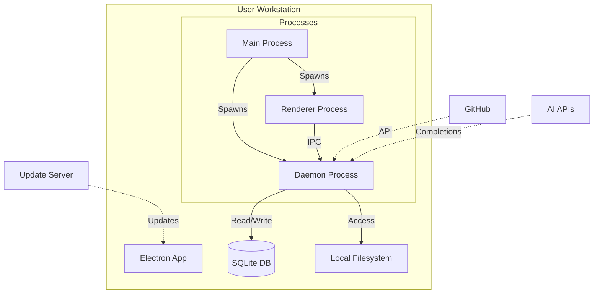

# Deployment View: User Interface

**Sub-System**: User Interface
**ADRs Referenced**: ADR-018, ADR-020
**Generated**: 2026-05-20
**Dependencies**: Context View, Functional View

---

## 3.6 Deployment View

**Purpose**: Physical environment - nodes, networks, storage

### 3.6.1 Runtime Environments

| Environment | Purpose | Infrastructure | Scale |
|-------------|---------|----------------|-------|
| Desktop | End user application | macOS/Windows/Linux | Per user install |
| Development | UI development | Local dev server | localhost |
| Web (future) | Browser-based UI | CDN + API | Global |

### 3.6.2 Network Topology

### 3.6.3 Hardware Requirements

**Minimum:**

| Component | Specification |
|-----------|--------------|
| OS | macOS 12+, Windows 10+, Ubuntu 20.04+ |
| CPU | 2 cores (Apple Silicon or x86_64) |
| Memory | 4GB RAM |
| Storage | 500MB for app + data |
| Network | Internet for AI APIs |

**Recommended:**

| Component | Specification |
|-----------|--------------|
| CPU | 4+ cores |
| Memory | 8GB+ RAM |
| Storage | SSD with 2GB+ free |
| Display | 1920x1080 or higher |

### 3.6.4 Third-Party Services

| Service | Purpose | Provider | Tier |
|---------|---------|----------|------|
| Code Signing | App signing | Apple / Microsoft | Developer certs |
| Update Hosting | App updates | GitHub Releases | Free |
| Error Reporting | Crash analytics | Sentry | Pro |
| Analytics | Usage metrics | PostHog / Amplitude | Pro |

---

## Perspective Considerations

### Security Considerations

- **Code Signing**: Signed binaries prevent tampering
- **Auto-Updates**: Verified updates only
- **Local Storage**: Data stays on user machine
- **IPC Security**: Unix socket permissions

_Source ADRs: ADR-018, ADR-020_

### Performance Considerations

- **Bundle Size**: Minimized for faster download
- **Startup Time**: <5s cold start
- **Memory Usage**: <500MB typical usage
- **GPU Acceleration**: Hardware-accelerated UI

_Source ADRs: ADR-020_

### Usability Considerations

- **Offline Capability**: Core features work offline
- **Auto-Update**: Seamless updates
- **Cross-Platform**: Consistent experience
- **Accessibility**: Screen reader support

_Source ADRs: ADR-018_

---

**ADR Traceability:**

| ADR | Decision | Impact on Deployment View |
|-----|----------|---------------------------|
| ADR-018 | Bimodal Interface | Desktop app with CLI |
| ADR-020 | Desktop Application | Electron multi-process |
