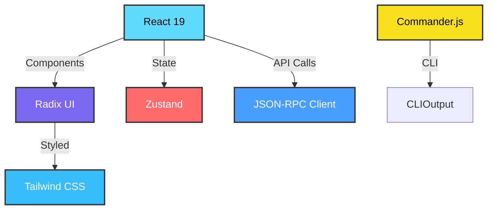
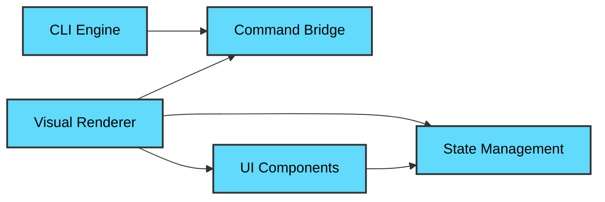

# Development View: User Interface

**Sub-System**: User Interface
**ADRs Referenced**: ADR-018, ADR-020
**Generated**: 2026-05-20
**Dependencies**: Functional View

---

## 3.5 Development View

**Purpose**: Constraints for developers - code organization, dependencies, CI/CD

### 3.5.1 Code Organization

```text
packages/ui/
├── src/
│   ├── cli/              # CLI Engine
│   ├── renderer/         # Visual Renderer (React)
│   ├── spec-editor/      # Spec Editor
│   ├── bridge/           # Command Bridge
│   ├── progress/         # Progress Monitor
│   ├── help/             # Help System
│   └── notifications/    # Notification Manager
├── components/
│   ├── common/           # Shared components
│   ├── forms/            # Form components
│   └── views/            # View components
├── styles/
│   ├── tailwind.config.js
│   └── globals.css
├── tests/
│   ├── unit/
│   ├── integration/
│   └── e2e/
└── package.json
```

### 3.5.2 Technology Stack Mapping

| Functional Role | Technology Choice | Version/Variant | ADR Reference |
|-----------------|-------------------|-----------------|---------------|
| CLI Framework | Commander.js | v12.x | ADR-018 |
| UI Framework | React | v19.x | ADR-107 |
| Component Library | Radix UI | v1.x | ADR-107 |
| Styling | Tailwind CSS | v3.4 | ADR-107 |
| Theme | shadcn/ui | New York | ADR-107 |
| Font | Geist | Variable | ADR-107 |
| State Management | Zustand | v4.x | ADR-018 |
| IPC Client | JSON-RPC 2.0 | Custom | ADR-105 |

### 3.5.3 Technology Architecture



### 3.5.4 Module Dependencies

**Dependency Rules:**

- CLI Engine is standalone
- Renderer depends on React + Radix + Tailwind
- Command Bridge connects CLI and Renderer
- Progress Monitor uses state management
- All UI components use shared component library



### 3.5.5 Build & CI/CD

- **Build System**: Vite for dev + production
- **CI Pipeline**: Lint → Type Check → Unit Tests → Build → E2E Tests
- **Deployment Strategy**: Bundled with Electron app
- **Testing**: Vitest for unit, Playwright for E2E

### 3.5.6 Development Standards

- **Coding Standards**: ESLint + Prettier, React hooks rules
- **Review Requirements**: 2 approvals, accessibility review
- **Testing Requirements**: Component tests, 80% coverage

---

## Perspective Considerations

### Security Considerations

- **XSS Prevention**: React's built-in escaping
- **IPC Security**: Validate all IPC messages
- **No Inline Scripts**: CSP-compliant
- **Dependency Audit**: npm audit for frontend deps

_Source ADRs: ADR-018, ADR-020_

### Performance Considerations

- **Bundle Splitting**: Code splitting by route
- **Lazy Loading**: Components loaded on demand
- **Memoization**: React.memo for expensive renders
- **Virtual Scrolling**: For large lists

_Source ADRs: ADR-107_

### Usability Considerations

- **Accessibility**: Radix UI provides a11y primitives
- **Responsive Design**: Tailwind breakpoints
- **Dark Mode**: Built-in theme switching
- **Keyboard Navigation**: Full keyboard support

_Source ADRs: ADR-018, ADR-107_

### Evolution Considerations

- **React Updates**: Future React versions
- **Component Library**: Radix UI maintained
- **Design System**: shadcn/ui customizable
- **Extension Support**: Plugin architecture planned

_Source ADRs: ADR-018, ADR-107_

---

## Validation Checklist

- [x] **Technology Mapping**: All functional elements mapped
- [x] **ADR References**: All choices reference ADRs
- [x] **Diagram Parity**: Mirrors Functional View structure
- [x] **Code Alignment**: Organization matches stack
- [x] **Dependency Rules**: Clear layer dependencies

---

**ADR Traceability:**

| ADR | Decision | Impact on Development View |
|-----|----------|----------------------------|
| ADR-018 | Bimodal Interface | Commander.js, React, Command Bridge |
| ADR-020 | Desktop Application | Electron integration |
| ADR-107 | React 19 with Radix UI | All UI technologies |
