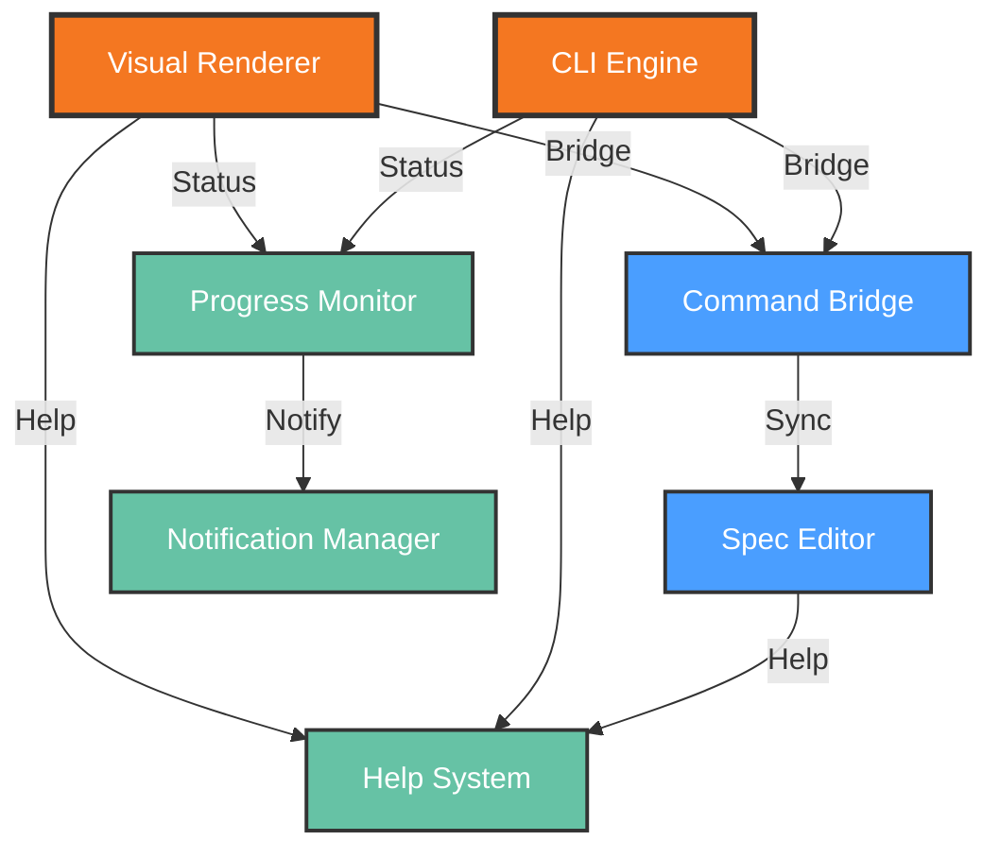

# Functional View: User Interface

**Sub-System**: User Interface
**ADRs Referenced**: ADR-018, ADR-020
**Generated**: 2026-05-20
**Dependencies**: Context View

---

## 3.2 Functional View

**Purpose**: Describe functional elements, responsibilities, and interactions for Bimodal User Interface

### 3.2.1 Functional Elements

| Element | Responsibility | Interfaces Provided | Dependencies |
|---------|----------------|---------------------|--------------|
| CLI Engine | Command-line interface parsing and execution | Commands, flags, help | Daemon JSON-RPC |
| Visual Renderer | React-based GUI component rendering | Components, forms, views | Electron APIs |
| Spec Editor | YAML/Markdown specification editing | Edit, validate, preview | Parser, Validator |
| Command Bridge | Translates between CLI and GUI representations | Convert, sync | CLI Engine, Visual Renderer |
| Progress Monitor | Task execution progress visualization | Status, logs, results | Daemon events |
| Help System | Contextual help and learning resources | Docs, tutorials, examples | Knowledge base |
| Notification Manager | User alerts and system notifications | Alert, toast, badge | OS APIs |

### 3.2.2 Element Interactions

### 3.2.3 Functional Boundaries

**What this system DOES:**

- Provide command-line interface for power users
- Provide visual GUI for non-technical users
- Enable seamless switching between CLI and GUI
- Edit YAML/Markdown specifications with validation
- Display real-time task progress and logs
- Offer contextual help and learning resources
- Send system notifications and alerts

**What this system does NOT do:**

- Execute commands directly (delegated to Daemon)
- Store persistent data (delegated to Storage)
- Manage workspaces (delegated to Workspaces)
- Execute git operations (delegated to Git Integration)

---

## Perspective Considerations

### Security Considerations

- **IPC Security**: JSON-RPC over authenticated Unix socket
- **Input Validation**: All user input validated before processing
- **UI State Protection**: Sensitive data not logged in UI
- **Authentication Flow**: Delegated to System, UI only displays

_Source ADRs: ADR-018, ADR-020_

### Performance Considerations

- **CLI Response**: <100ms for local commands
- **GUI Rendering**: 60fps for smooth interactions
- **Lazy Loading**: Heavy components loaded on demand
- **Debounced Input**: Real-time validation debounced

_Source ADRs: ADR-018_

### Usability Considerations

- **Progressive Disclosure**: Simple UI, advanced CLI
- **Learning Path**: UI shows CLI equivalents
- **Round-trip Fidelity**: 100% spec format compatibility
- **Accessibility**: WCAG 2.1 AA compliance for GUI

_Source ADRs: ADR-018_

### Evolution Considerations

- **UI Framework Updates**: React 19 with upgrade path
- **Feature Parity**: >90% overlap maintained
- **Extension Support**: UI extensible via plugins
- **CLI Stability**: Commands versioned for backward compatibility

_Source ADRs: ADR-018, ADR-020_

---

## Validation Checklist

- [x] **Technology Neutrality**: Elements described by role
- [x] **Diagram Consistency**: Nodes match element table
- [x] **Interface Abstraction**: Capabilities not implementations
- [x] **Complete Coverage**: All responsibilities represented
- [x] **Clear Boundaries**: Responsibilities clearly defined

---

**ADR Traceability:**

| ADR | Decision | Impact on Functional View |
|-----|----------|---------------------------|
| ADR-018 | Bimodal Interface | CLI Engine, Visual Renderer, Command Bridge elements |
| ADR-020 | Desktop Application | Visual Renderer, Notification Manager elements |
