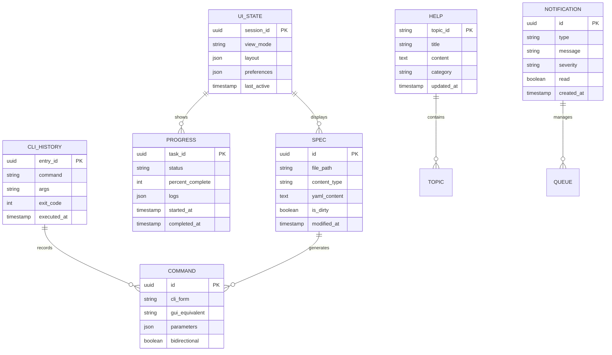

# Information View: User Interface

**Sub-System**: User Interface
**ADRs Referenced**: ADR-018, ADR-020
**Generated**: 2026-05-20
**Dependencies**: Functional View

---

## 3.3 Information View

**Purpose**: Describe data storage, management, and flow for Bimodal User Interface

### 3.3.1 Data Entities

| Entity | Storage Location | Owner Component | Lifecycle | Access Pattern |
|--------|------------------|-----------------|-----------|----------------|
| UI State | SQLite + Memory | Visual Renderer | Update-Restore | Read-heavy |
| CLI History | SQLite | CLI Engine | Append-Query | Read-heavy |
| Spec Document | Git + Memory | Spec Editor | Edit-Save-Load | Write-heavy |
| Command Mapping | JSON + SQLite | Command Bridge | Sync-Lookup | Read-heavy |
| Progress Events | Memory + Log | Progress Monitor | Stream-Archive | Write-heavy |
| Help Content | Bundled + Remote | Help System | Cache-Update | Read-heavy |
| Notification Queue | Memory | Notification Manager | Enqueue-Display | Write-heavy |

### 3.3.2 Data Model

### 3.3.3 Data Flow

**Key Data Flows:**

1. **UI State Persistence**: Session → State Changes → SQLite → Restore on Launch
2. **Spec Editing**: File System → Spec Editor → Validation → Git Save
3. **CLI Execution**: Command → History → Daemon RPC → Results → Display
4. **Progress Streaming**: Daemon Events → Progress Monitor → UI Updates
5. **Command Sync**: CLI Form ↔ Command Bridge ↔ GUI Form (bidirectional)

### 3.3.4 Data Quality & Integrity

- **Consistency Model**: UI state eventual consistency, specs strong consistency
- **Validation Rules**: Spec YAML validated against schema
- **Retention Policy**: CLI history 90 days, notifications 7 days
- **Backup Strategy**: Specs in git, UI state in SQLite with backup

---

## Perspective Considerations

### Security Considerations

- **UI State Encryption**: Sensitive preferences encrypted
- **Spec Access**: Follows git repository permissions
- **Input Sanitization**: All user input validated and escaped
- **No Secrets in UI**: Secrets never displayed in interface

_Source ADRs: ADR-018, ADR-020_

### Performance Considerations

- **Virtual Scrolling**: Large specs rendered efficiently
- **Debounced Input**: Real-time validation debounced
- **Lazy Help Loading**: Help content loaded on demand
- **State Compression**: UI state compressed for storage

_Source ADRs: ADR-018_

### Usability Considerations

- **State Restoration**: UI restores to previous state
- **Undo History**: Multi-level undo for spec editing
- **Command Discovery**: CLI history for quick recall
- **Progress Preservation**: Task progress survives refresh

_Source ADRs: ADR-018_

---

**ADR Traceability:**

| ADR | Decision | Impact on Information View |
|-----|----------|----------------------------|
| ADR-018 | Bimodal Interface | Command Mapping, UI State entities |
| ADR-020 | Desktop Application | UI State persistence, Notification Queue |
