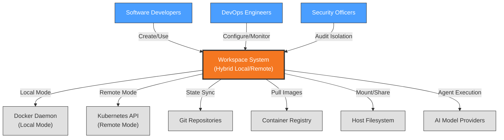

# Context View: Workspaces

**Sub-System**: Workspaces
**ADRs Referenced**: ADR-012, ADR-013, ADR-014, ADR-016
**Generated**: 2026-05-20

---

## 3.1 Context View

**Purpose**: Define system scope and external interactions for the Hybrid Workspace system

### 3.1.1 System Scope

The Workspaces sub-system provides isolated development environments for AI agent execution. It implements a hybrid provisioning strategy supporting both Local (Docker dev containers, <30s) and Remote (K8s pods, <60s) workspace types. Workspaces are git-native with worktree-based local workflows and clone-based remote workflows. Tool provisioning follows Dev Container specification with pre-installed, version-pinned tooling. Each workspace maintains complete isolation while providing consistent developer experience across both modes.

### 3.1.2 Stakeholders

| Stakeholder | Role | Key Concerns | Priority |
|-------------|------|--------------|----------|
| Software Developers | Primary Users | Fast provisioning, familiar tools, file visibility | Critical |
| DevOps Engineers | Infrastructure | Resource management, workspace monitoring | High |
| Security Officers | Compliance | Isolation guarantees, data protection | Critical |
| AI Agents | Automated Users | Reliable environment, tool availability | High |
| Platform Architects | System Design | Hybrid abstraction, feature parity | Medium |

### 3.1.3 External Entities

| Entity | Type | Interaction Type | Data Exchanged | Protocols |
|--------|------|------------------|----------------|-----------|
| Docker Daemon | External System | Docker API | Container lifecycle, volume mounts | Unix Socket/HTTP |
| Kubernetes API | External System | REST API | Pod creation, resource management | HTTPS |
| Git Repositories | External System | Git protocol | Workspace state, worktrees, clones | SSH/HTTPS |
| Container Registry | External System | Docker Registry | Dev container images | HTTPS |
| Host Filesystem | External System | Volume Mount | Source code, shared files | Local FS |
| AI Model APIs | External API | REST/gRPC | Agent execution within workspace | HTTPS |

### 3.1.3 Context Diagram

### 3.1.4 External Dependencies

| Dependency | Purpose | SLA Expectations | Fallback Strategy |
|------------|---------|------------------|-------------------|
| Docker Daemon | Local container management | Local availability | N/A - local only |
| Kubernetes API | Remote pod orchestration | 99.5% uptime | Switch to local mode |
| Git Provider | Workspace state storage | 99.95% uptime | Local git operations |
| Container Registry | Dev container images | 99.9% uptime | Cached base images |
| Host Filesystem | Source code access | Local availability | N/A |

---

## Perspective Considerations

### Security Considerations

- **Isolation Levels**: Local (weaker) vs Remote (stronger K8s isolation)
- **Volume Mounts**: Host filesystem access in local mode
- **Container Security**: Non-root containers, read-only filesystems where possible
- **Secret Management**: Workspace-scoped secrets, not shared

_Source ADRs: ADR-012, ADR-016_

### Performance Considerations

- **Provisioning Time**: Local <30s, Remote <60s
- **File Visibility**: Immediate in local mode (worktrees), clone-based for remote
- **Resource Constraints**: CPU/memory limits per workspace
- **Storage**: Ephemeral workspace storage, persistent via git

_Source ADRs: ADR-014, ADR-016_

### Evolution Considerations

- **Dev Container Spec**: Industry standard, evolving specification
- **Tool Versions**: Pinned in container definitions
- **Workspace Templates**: Extensible via Dev Container features

_Source ADRs: ADR-014_

---

**Validation Checklist**:

- [x] System appears as exactly ONE node
- [x] No internal databases shown
- [x] No internal services shown
- [x] All entities are either stakeholders OR external systems
- [x] All connections cross the system boundary
