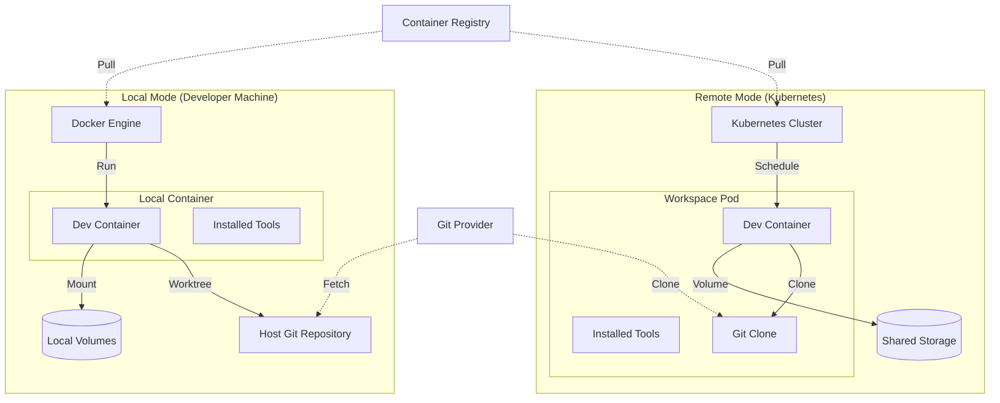

# Deployment View: Workspaces

**Sub-System**: Workspaces
**ADRs Referenced**: ADR-012, ADR-013, ADR-014, ADR-016
**Generated**: 2026-05-20
**Dependencies**: Context View, Functional View

---

## 3.6 Deployment View

**Purpose**: Physical environment - nodes, networks, storage

### 3.6.1 Runtime Environments

| Environment | Purpose | Infrastructure | Scale |
|-------------|---------|----------------|-------|
| Local Mode | Developer laptops | Docker Desktop / Podman | Per developer |
| Remote Mode | Cloud workspaces | Kubernetes | Auto-scaling |
| Hybrid | Seamless local/remote | Docker + K8s | Mixed |

### 3.6.2 Network Topology

### 3.6.3 Hardware Requirements

**Local Mode (per developer):**

| Component | CPU | Memory | Storage |
|-----------|-----|--------|---------|
| Docker Engine | 2 cores | 4GB | 20GB |
| Per Workspace | 1 core | 2GB | 10GB |
| Recommended | 4+ cores | 16GB | 100GB SSD |

**Remote Mode (per workspace pod):**

| Component | CPU | Memory | Storage |
|-----------|-----|--------|---------|
| Small Workspace | 0.5 cores | 1GB | 5GB |
| Medium Workspace | 1 core | 2GB | 10GB |
| Large Workspace | 2 cores | 4GB | 20GB |

### 3.6.4 Third-Party Services

| Service | Purpose | Provider | Tier |
|---------|---------|----------|------|
| Docker Desktop | Local container runtime | Docker | Free/Pro |
| Container Registry | Dev container images | GitHub/Docker Hub | Pro |
| Git Provider | Repository hosting | GitHub/GitLab | Enterprise |
| K8s Cluster | Remote workspace hosting | EKS/GKE/AKS | Managed |

---

## Perspective Considerations

### Security Considerations

- **Local Mode**: Host filesystem access, user responsibility
- **Remote Mode**: Network policies, non-root containers
- **Volume Security**: Encrypted volumes for sensitive data
- **Secret Injection**: Runtime secret mounting

_Source ADRs: ADR-012, ADR-016_

### Performance Considerations

- **Local Mode**: Fast I/O via bind mounts
- **Remote Mode**: Shared storage for common layers
- **Image Caching**: Layer caching local and in registry
- **Lazy Loading**: Tools on first use

_Source ADRs: ADR-014, ADR-016_

### Location Considerations

- **Local Mode**: Data stays on developer machine
- **Remote Mode**: Data in cloud region
- **Git Sync**: Explicit push/pull for handoff
- **Compliance**: Choose mode based on data residency

_Source ADRs: ADR-016_

---

**ADR Traceability:**

| ADR | Decision | Impact on Deployment View |
|-----|----------|---------------------------|
| ADR-012 | Per-Workspace Pod | Remote mode topology |
| ADR-013 | Git-Based Lifecycle | Git integration in both modes |
| ADR-014 | Dev Container Tools | Container-based deployment |
| ADR-016 | Hybrid Provisioning | Dual topology (local + remote) |
