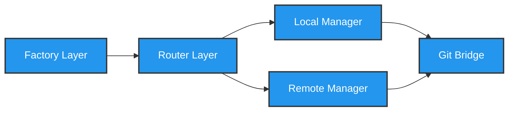

# Development View: Workspaces

**Sub-System**: Workspaces
**ADRs Referenced**: ADR-012, ADR-013, ADR-014, ADR-016
**Generated**: 2026-05-20
**Dependencies**: Functional View

---

## 3.5 Development View

**Purpose**: Constraints for developers - code organization, dependencies, CI/CD

### 3.5.1 Code Organization

```text
packages/workspaces/
├── src/
│   ├── factory/          # Workspace Factory
│   ├── local/            # Local Workspace Manager
│   ├── remote/           # Remote Workspace Manager
│   ├── git/              # Git Bridge
│   ├── tools/            # Tool Provisioner
│   ├── registry/         # Workspace Registry
│   └── router/           # Hybrid Router
├── devcontainers/
│   ├── base/             # Base container definitions
│   ├── features/         # Dev Container features
│   └── templates/        # Workspace templates
├── tests/
│   ├── unit/
│   ├── integration/
│   └── fixtures/
└── package.json
```

### 3.5.2 Technology Stack Mapping

| Functional Role | Technology Choice | Version/Variant | ADR Reference |
|-----------------|-------------------|-----------------|---------------|
| Docker API | dockerode | v4.x | ADR-007 |
| K8s Client | @kubernetes/client-node | v1.x | ADR-012 |
| Git Operations | simple-git | v3.x | ADR-013 |
| Dev Container CLI | @devcontainers/cli | v0.x | ADR-014 |
| Container Images | Docker | v25+ | ADR-014 |
| Workspace State | SQLite | better-sqlite3 | ADR-106 |
| Volume Management | Docker Volumes | Bind mounts | ADR-016 |

### 3.5.3 Technology Architecture

```mermaid
graph TD
    DockerAPI[dockerode]:::docker
    K8sClient[@kubernetes/client-node]:::k8s
    SimpleGit[simple-git]:::git
    DevContainerCLI[@devcontainers/cli]:::devcon
    SQLite[(SQLite)]:::db
    
    DockerAPI -->|Local Mode| VolumeMounts
    K8sClient -->|Remote Mode| Pods
    SimpleGit -->|Sync| Worktrees
    SimpleGit -->|Sync| Clones
    DevContainerCLI -->|Provision| DockerAPI
    SQLite -->|Track| Registry
    
    classDef docker fill:#2496ed,stroke:#333,stroke-width:2px,color:#fff
    classDef k8s fill:#326ce5,stroke:#333,stroke-width:2px,color:#fff
    classDef git fill:#f05032,stroke:#333,stroke-width:2px,color:#fff
    classDef devcon fill:#7b68ee,stroke:#333,stroke-width:2px,color:#fff
    classDef db fill:#336791,stroke:#333,stroke-width:2px,color:#fff
```

### 3.5.4 Module Dependencies

**Dependency Rules:**

- Factory creates Local or Remote managers
- Git Bridge used by both managers
- Tool Provisioner uses Dev Container CLI
- Registry tracks all workspaces
- Router delegates to appropriate manager



### 3.5.5 Build & CI/CD

- **Build System**: tsup for package, Docker for images
- **CI Pipeline**: Lint → Test → Build Package → Build Images → Push
- **Deployment Strategy**: Multi-arch images (amd64, arm64)
- **Testing**: Docker-in-Docker tests for local, kind for remote

### 3.5.6 Development Standards

- **Coding Standards**: TypeScript strict, async/await patterns
- **Review Requirements**: 2 approvals, security review for volume mounts
- **Testing Requirements**: E2E tests for both local and remote modes

---

## Perspective Considerations

### Security Considerations

- **Volume Mounts**: Review all bind mounts for security
- **Container Security**: Non-root containers, minimal images
- **Git Credentials**: Secure credential storage
- **Workspace Isolation**: Proper network/file isolation

_Source ADRs: ADR-012, ADR-016_

### Performance Considerations

- **Image Layer Caching**: Optimize Dockerfile layers
- **Parallel Pulls**: Concurrent image pulls
- **Lazy Loading**: Tools on demand
- **Registry Mirror**: Local registry for speed

_Source ADRs: ADR-014, ADR-016_

### Evolution Considerations

- **Dev Container Spec**: Track spec updates
- **Image Versioning**: Semantic versioning for images
- **Migration Path**: Local to remote conversion

_Source ADRs: ADR-014_

---

## Validation Checklist

- [x] **Technology Mapping**: All functional elements mapped
- [x] **ADR References**: All choices reference ADRs
- [x] **Diagram Parity**: Mirrors Functional View structure
- [x] **Code Alignment**: Organization matches stack
- [x] **Dependency Rules**: Clear layer dependencies

---

**ADR Traceability:**

| ADR | Decision | Impact on Development View |
|-----|----------|----------------------------|
| ADR-007 | Docker-Based Server | dockerode for local mode |
| ADR-012 | Per-Workspace Pod | K8s client for remote mode |
| ADR-013 | Git-Based Lifecycle | simple-git for operations |
| ADR-014 | Dev Container Tools | @devcontainers/cli |
| ADR-016 | Hybrid Provisioning | Factory and Router pattern |
