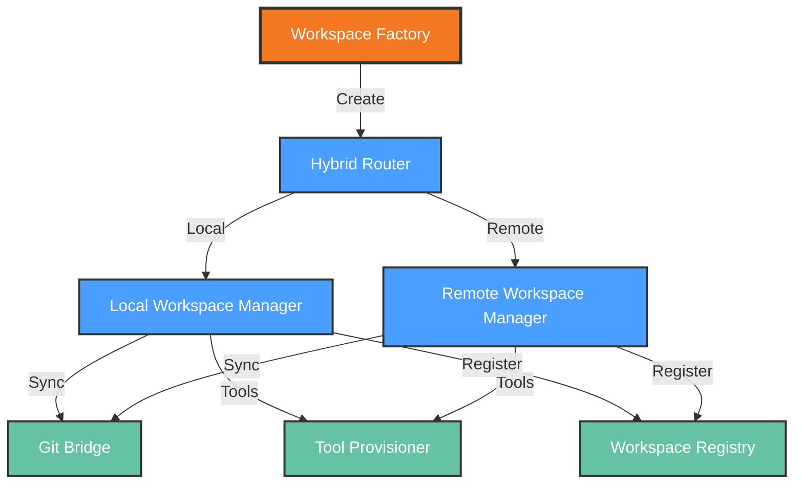

# Functional View: Workspaces

**Sub-System**: Workspaces
**ADRs Referenced**: ADR-012, ADR-013, ADR-014, ADR-016
**Generated**: 2026-05-20
**Dependencies**: Context View

---

## 3.2 Functional View

**Purpose**: Describe functional elements, responsibilities, and interactions for Hybrid Workspaces

### 3.2.1 Functional Elements

| Element | Responsibility | Interfaces Provided | Dependencies |
|---------|----------------|---------------------|--------------|
| Workspace Factory | Creates local or remote workspaces based on context | Create, provision, configure | Docker Engine, K8s API |
| Local Workspace Manager | Docker dev container lifecycle for local mode | Start, stop, sync, mount | Docker Daemon, Host FS |
| Remote Workspace Manager | K8s pod-based workspace for remote mode | Create, destroy, proxy | K8s API, Runner |
| Git Bridge | Workspace-to-git synchronization | Clone, worktree, commit, push | Git repositories |
| Tool Provisioner | Dev Container spec-based tool installation | Install, update tools | Container images, Package repos |
| Workspace Registry | Workspace metadata and state tracking | Register, query, update | Storage |
| Hybrid Router | Routes operations to appropriate workspace type | Route, fallback | Local Manager, Remote Manager |

### 3.2.2 Element Interactions

### 3.2.3 Functional Boundaries

**What this system DOES:**

- Provision both local (Docker) and remote (K8s) workspaces
- Manage workspace lifecycle from creation to destruction
- Synchronize workspace state with git repositories
- Install and configure development tools per Dev Container spec
- Route operations to appropriate workspace type automatically
- Maintain workspace registry for discovery and management

**What this system does NOT do:**

- Execute agent tasks (delegated to Runner/Agents)
- Manage git repository hosting (delegated to Git providers)
- Build container images (delegated to CI/build systems)
- Store persistent workspace data (delegated to Git Integration)

---

## Perspective Considerations

### Security Considerations

- **Isolation Levels**: Local (container) vs Remote (K8s pod) security boundaries
- **Volume Mounts**: Controlled host filesystem access in local mode
- **Secret Injection**: Workspace-scoped secrets, never shared
- **Network Isolation**: Workspace-specific network policies

_Source ADRs: ADR-012, ADR-016_

### Performance Considerations

- **Provisioning Time**: Local <30s, Remote <60s targets
- **Lazy Loading**: Tools installed on-demand
- **Image Caching**: Base images cached locally and in registry
- **Git Optimization**: Shallow clones, sparse checkouts where possible

_Source ADRs: ADR-014, ADR-016_

### Evolution Considerations

- **Dev Container Spec**: Follows evolving industry standard
- **Tool Versioning**: Pinned versions in container definitions
- **Workspace Templates**: Extensible base configurations
- **Migration Paths**: Local to remote workspace conversion

_Source ADRs: ADR-014_

### Usability Considerations

- **Auto-selection**: Context-aware workspace type selection
- **Manual Override**: User can force local or remote
- **Feature Parity**: >90% feature overlap between modes
- **Transparent Routing**: Users don't manage routing logic

_Source ADRs: ADR-016_

---

## Validation Checklist

- [x] **Technology Neutrality**: Elements described by role
- [x] **Diagram Consistency**: Nodes match element table
- [x] **Interface Abstraction**: Capabilities not implementations
- [x] **Complete Coverage**: All responsibilities represented
- [x] **Clear Boundaries**: Responsibilities clearly defined

---

**ADR Traceability:**

| ADR | Decision | Impact on Functional View |
|-----|----------|---------------------------|
| ADR-012 | Per-Workspace Pod | Remote Workspace Manager element |
| ADR-013 | Git-Based Lifecycle | Git Bridge element |
| ADR-014 | Dev Container Tools | Tool Provisioner element |
| ADR-016 | Hybrid Provisioning | Workspace Factory, Hybrid Router elements |
