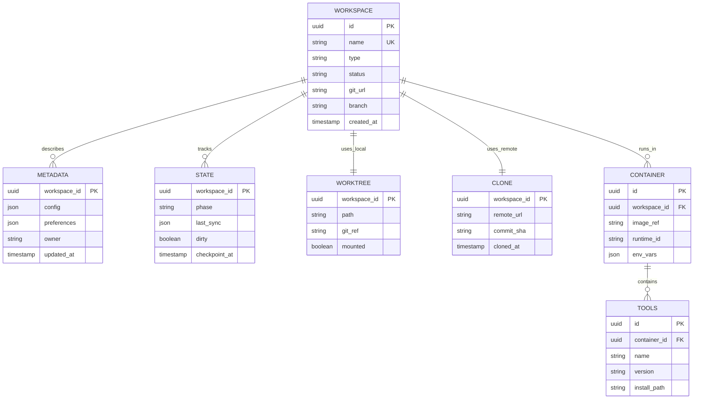

# Information View: Workspaces

**Sub-System**: Workspaces
**ADRs Referenced**: ADR-012, ADR-013, ADR-014, ADR-016
**Generated**: 2026-05-20
**Dependencies**: Functional View

---

## 3.3 Information View

**Purpose**: Describe data storage, management, and flow for Hybrid Workspaces

### 3.3.1 Data Entities

| Entity | Storage Location | Owner Component | Lifecycle | Access Pattern |
|--------|------------------|-----------------|-----------|----------------|
| Workspace Metadata | SQLite | Workspace Registry | Create-Destroy | Read-heavy |
| Container Image | Registry/Local | Tool Provisioner | Pull-Cache | Read-heavy |
| Git Worktree | Filesystem | Worktree Manager | Create-Sync-Delete | Write-heavy |
| Git Clone | Remote Storage | Clone Manager | Clone-Sync-Purge | Write-heavy |
| Dev Container Config | Git/JSON | Tool Provisioner | Version-controlled | Read-heavy |
| Workspace State | SQLite + Git | Hybrid Router | Update-Sync | Write-heavy |
| Tool Manifest | Container Image | Tool Provisioner | Immutable | Read-heavy |

### 3.3.2 Data Model

### 3.3.3 Data Flow

**Key Data Flows:**

1. **Workspace Creation**: Request → Registry Entry → Container Pull → Git Setup
2. **Local Workflow**: Workspace → Worktree → Host FS → Git Operations → Sync
3. **Remote Workflow**: Workspace → Clone → Pod → Git Operations → Sync
4. **Tool Provisioning**: Dev Container Config → Image Build → Tool Install → Cache
5. **State Handoff**: Local Worktree → Commit → Push → Remote Clone → Pull

### 3.3.4 Data Quality & Integrity

- **Consistency Model**: Git provides strong consistency for code, SQLite for metadata
- **Validation Rules**: Dev Container spec validated against schema
- **Retention Policy**: Workspaces auto-destroy after inactivity
- **Backup Strategy**: Git is source of truth, SQLite backed up

---

## Perspective Considerations

### Security Considerations

- **Data Classification**: Workspace metadata includes potentially sensitive paths
- **Isolation**: Local worktrees have host access, remote clones isolated
- **Secret Handling**: Secrets injected at runtime, not stored in images
- **Access Controls**: Workspace ownership and sharing permissions

_Source ADRs: ADR-012, ADR-016_

### Performance Considerations

- **Image Layer Caching**: Common layers cached locally
- **Git Optimization**: Shallow clones, sparse checkouts for large repos
- **Lazy Loading**: Tools installed on first use
- **Sync Efficiency**: Delta sync for worktree updates

_Source ADRs: ADR-014, ADR-016_

### Evolution Considerations

- **Dev Container Spec**: Schema evolution handled via versioning
- **Workspace Migration**: Local to remote conversion path
- **Tool Updates**: Version pinning with update notifications

_Source ADRs: ADR-014_

---

**ADR Traceability:**

| ADR | Decision | Impact on Information View |
|-----|----------|----------------------------|
| ADR-012 | Per-Workspace Pod | Container, Clone entities |
| ADR-013 | Git-Based Lifecycle | Worktree, Clone entities |
| ADR-014 | Dev Container Tools | Dev Container Config, Tools entities |
| ADR-016 | Hybrid Provisioning | Workspace State, Hybrid routing logic |
