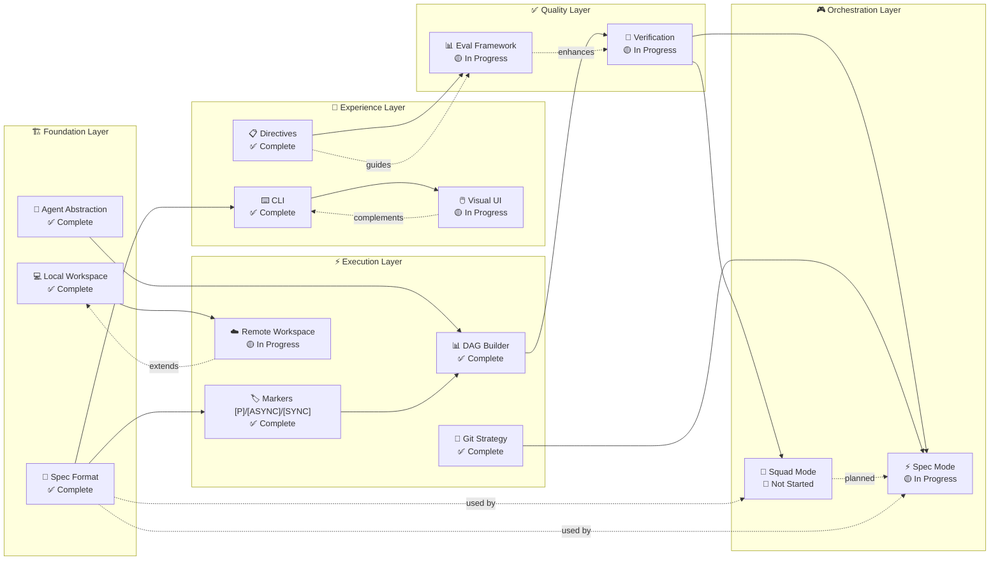

# Feature Dependencies

## Overview

This diagram shows the dependency relationships between features in the Agentic SDLC Ecosystem.



## Dependency Matrix

| Feature | Hard Depends On | Soft Depends On | Blocks |
|---------|----------------|-----------------|--------|
| **Markers** | Spec Format | - | DAG Builder |
| **DAG Builder** | Markers | - | Verification, Squad Mode, Spec Mode |
| **Remote Workspace** | Local Workspace | - | - |
| **Visual UI** | CLI | - | - |
| **Verification** | DAG Builder | Eval Framework | Squad Mode, Spec Mode |
| **Squad Mode** | Verification, Spec Format | Spec Mode | - |
| **Spec Mode** | Verification, Git Strategy | Squad Mode | - |

## Critical Path

The critical path for full ecosystem functionality:

```
Spec Format → Markers → DAG Builder → Verification → Squad Mode
                                                    ↘
                                              Git Strategy → Spec Mode
```

**Critical Path Duration**: Q2-Q4 2026 (6-8 months)

## Risk Areas

### High Risk Dependencies

| Risk | Impact | Mitigation |
|------|--------|------------|
| **Remote Workspace delayed** | Blocks enterprise adoption | Local-first fallback; enterprise on-prem option |
| **Verification accuracy low** | Blocks autonomous execution | Human-in-the-loop fallback; continuous model improvement |
| **Visual UI delayed** | Blocks non-developer adoption | CLI-first with training program |

### Dependency Cycles

No circular dependencies detected. DAG is valid.

## Legend

| Arrow | Meaning |
|-------|---------|
| `-->` | Hard dependency (must complete first) |
| `-.->` | Soft dependency (can proceed in parallel) |
| `-.->\|planned\|` | Future planned dependency |

## Navigation

- [← Back to PRD](../../../../../PRD.md)
- [Feature Hierarchy ←](./feature-hierarchy.md)
- [User Flows →](./user-flows.md)
- [State Machine →](./state-machine.md)

---

*Generated: 2026-05-19 | Source: PDR-078 to PDR-088*
