# Feature Hierarchy

## Overview

This diagram shows the hierarchical relationship between features in the Agentic SDLC Ecosystem.

```mermaid
flowchart TD
    subgraph Ecosystem["🎯 Agentic SDLC Ecosystem"]
        direction TB
        
        subgraph Workspace["💻 Workspace Layer"]
            direction LR
            WS_001["🔧 Local Workspace<br/>✅ Complete<br/><small>&lt;30s provisioning</small>"]
            WS_002["☁️ Remote Workspace<br/>🟡 In Progress<br/><small>&lt;60s provisioning</small>"]
            WS_003["🔄 State Handoff<br/>✅ Complete<br/><small>&lt;30s cycle</small>"]
        end
        
        subgraph Git["📁 Git Strategy Layer"]
            direction LR
            GIT_001["🌳 Worktrees<br/>✅ Complete<br/><small>&lt;5s startup</small>"]
            GIT_002["📦 Clones<br/>🟡 In Progress<br/><small>&lt;15s startup</small>"]
        end
        
        subgraph UX["🖥️ UX Layer"]
            direction LR
            UX_001["⌨️ CLI<br/>✅ Complete<br/><small>&lt;30s tasks</small>"]
            UX_002["🖱️ Visual UI<br/>🟡 In Progress<br/><small>&gt;80% completion</small>"]
            UX_003["📄 Shared Spec<br/>✅ Complete<br/><small>100% fidelity</small>"]
        end
        
        subgraph Agent["🤖 Agent Layer"]
            direction LR
            AG_001["🔌 Multi-Agent Support<br/>✅ Complete<br/><small>20+ agents</small>"]
            AG_002["⚡ Adapter Pattern<br/>✅ Complete<br/><small>&lt;1hr swap</small>"]
            AG_003["🔒 Security Layer<br/>✅ Complete<br/><small>100% audit</small>"]
        end
        
        subgraph Orchestration["⚙️ Orchestration Layer"]
            direction LR
            ORCH_001["🏷️ Markers [P]/[ASYNC]/[SYNC]<br/>✅ Complete"]
            ORCH_002["📊 DAG Builder<br/>✅ Complete<br/><small>&lt;2s build</small>"]
            ORCH_003["🔄 Parallel Execution<br/>✅ Complete<br/><small>Max 4 agents</small>"]
        end
        
        subgraph Quality["✅ Quality Layer"]
            direction LR
            Q_001["/goal Verification<br/>🟡 In Progress<br/><small>&lt;2s latency</small>"]
            Q_002["📊 Eval-Driven Dev<br/>🟡 In Progress<br/><small>100-point framework</small>"]
            Q_003["🧪 Three-Layer Eval<br/>🟡 In Progress"]
        end
        
        subgraph Methodology["📚 Methodology Layer"]
            direction LR
            METH_001["📝 Spec-Driven<br/>✅ Complete<br/><small>100% coverage</small>"]
            METH_002["🔄 Dual Execution<br/>✅ Complete<br/><small>SYNC/ASYNC</small>"]
            METH_003["📋 Directives as Code<br/>✅ Complete<br/><small>v1.0.0</small>"]
        end
        
        subgraph Modes["🎮 Mode Layer"]
            direction LR
            MODE_001["👥 Squad Mode<br/>🔴 Not Started<br/><small>Outer Loop</small>"]
            MODE_002["⚡ Spec Mode<br/>🟡 In Progress<br/><small>Inner Loop</small>"]
        end
    end
    
    %% Relationships
    Workspace --> Git
    Git --> UX
    UX --> Agent
    Agent --> Orchestration
    Orchestration --> Quality
    Quality --> Methodology
    Methodology --> Modes
    
    %% Feature parity connections
    WS_001 -.->|feature parity| WS_002
    GIT_001 -.->|alternative| GIT_002
    UX_001 -.->|round-trip| UX_002
    MODE_001 -.->|handoff| MODE_002
```

## Legend

| Symbol | Meaning |
|--------|---------|
| ✅ | Complete - Feature is production-ready |
| 🟡 | In Progress - Active development |
| 🔴 | Not Started - Planned for future |
| ⬜ | Planned - Backlog item |

## Navigation

- [← Back to PRD](../../../../../PRD.md)
- [Feature Dependencies →](./feature-deps.md)
- [User Flows →](./user-flows.md)
- [State Machine →](./state-machine.md)

---

*Generated: 2026-05-19 | Source: PDR-078 to PDR-088*
