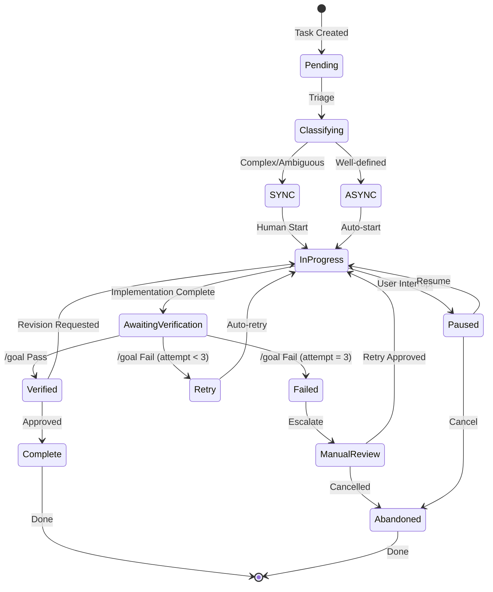
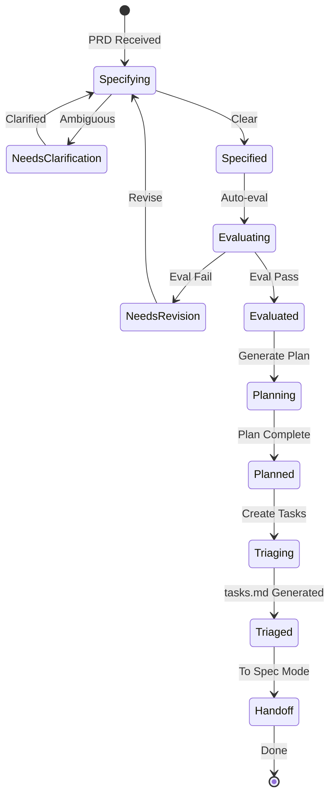
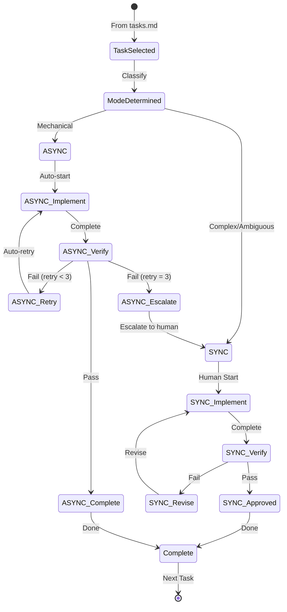
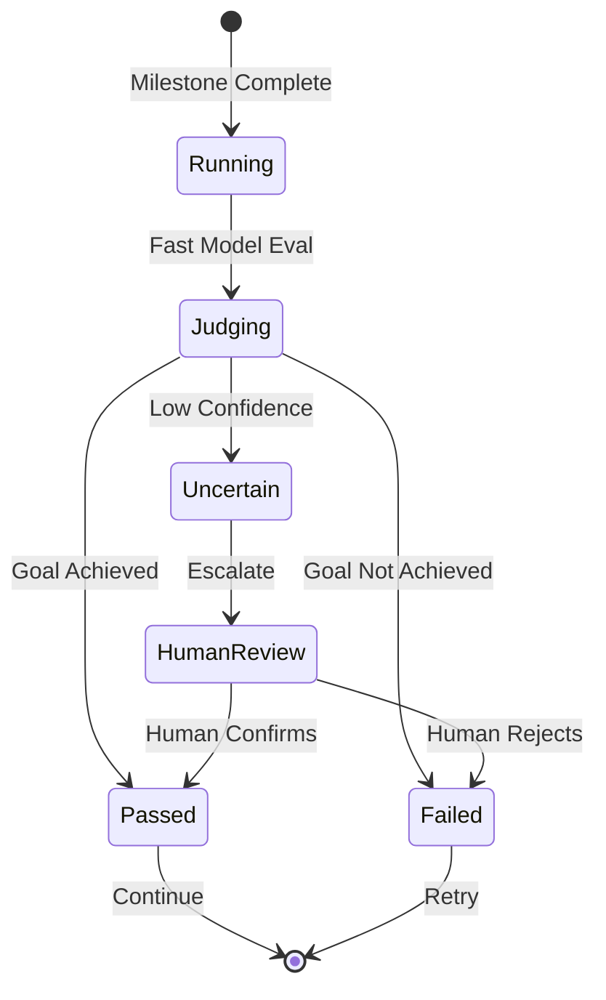

# State Machine

## Overview

This document defines the state machines governing task execution and workflow management in the Agentic SDLC Ecosystem.

## Task State Machine

### Task States

| State | Description | Transitions |
|-------|-------------|-------------|
| **Pending** | Task created, awaiting classification | → Classifying |
| **Classifying** | Triage in progress (SYNC vs ASYNC) | → SYNC, → ASYNC |
| **SYNC** | Human-gated task, waiting for start | → InProgress |
| **ASYNC** | Autonomous task, auto-start | → InProgress |
| **InProgress** | Active implementation | → AwaitingVerification, → Paused |
| **AwaitingVerification** | Complete, being verified | → Verified, → Retry, → Failed |
| **Retry** | Failed verification, will retry | → InProgress |
| **Verified** | Passed verification | → Complete, → InProgress |
| **Failed** | Failed after max retries | → ManualReview |
| **ManualReview** | Human intervention required | → InProgress, → Abandoned |
| **Paused** | User interrupted | → InProgress, → Abandoned |
| **Complete** | Successfully finished | → [*] |
| **Abandoned** | Cancelled or rejected | → [*] |

## Squad Mode State Machine (Outer Loop)

### Squad Mode States

| State | Description | Gates |
|-------|-------------|-------|
| **Specifying** | Creating specification from PRD | Human review |
| **NeedsClarification** | PRD has <3 ambiguity flags | Resolution required |
| **Specified** | Spec approved | Auto-eval triggers |
| **Evaluating** | Automated evaluation | Binary pass/fail |
| **NeedsRevision** | Spec failed evaluation | Revision required |
| **Evaluated** | Spec passed evaluation | Proceed to plan |
| **Planning** | Generating implementation plan | Human review |
| **Planned** | Plan approved | Proceed to triage |
| **Triaging** | Creating task breakdown | Auto-generation |
| **Triaged** | tasks.md generated | Handoff to Spec Mode |

## Spec Mode State Machine (Inner Loop)

## Verification State Machine

## State Transitions Summary

| From | To | Trigger | User Action Required |
|------|-----|---------|---------------------|
| Pending | Classifying | Task created | No |
| Classifying | SYNC | Complex detected | No (auto) |
| Classifying | ASYNC | Well-defined detected | No (auto) |
| SYNC | InProgress | Human starts | Yes |
| ASYNC | InProgress | Auto-start | No |
| InProgress | AwaitingVerification | Implementation done | No |
| AwaitingVerification | Verified | /goal pass | No |
| AwaitingVerification | Retry | /goal fail | No (auto if <3) |
| AwaitingVerification | Failed | /goal fail (3rd) | No |
| Verified | Complete | Approval | Yes (implicit) |
| Failed | ManualReview | Escalation | Yes |
| InProgress | Paused | Ctrl+C | Yes |

## Navigation

- [← Back to PRD](../../../../../PRD.md)
- [Feature Hierarchy ←](./feature-hierarchy.md)
- [Feature Dependencies ←](./feature-deps.md)
- [User Flows ←](./user-flows.md)

---

*Generated: 2026-05-19 | Source: PDR-082, PDR-083, PDR-085, PDR-088*
