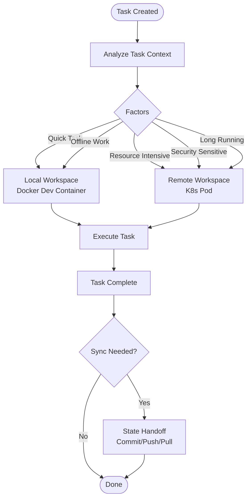

# User Flows

## Overview

This document shows the primary user flows for different personas interacting with the Agentic SDLC Ecosystem.

## Flow 1: AI Team Lead (Developer) - CLI Path

```mermaid
flowchart LR
    Start([Start]) --> Clone["git clone repository"]
    Clone --> Setup["spec init"]
    Setup --> CreateSpec["spec create feature-x"]
    CreateSpec --> Edit["Edit spec.md"]
    Edit --> Plan["spec plan"]
    Plan --> ReviewPlan["Review plan.md"]
    ReviewPlan -->{Approve?}
    ReviewPlan -->|No| Edit
    {Approve?} -->|Yes| Implement["spec implement"]
    Implement --> Verify["Auto-verification"]
    Verify -->{Pass?}
    {Pass?} -->|Yes| Commit["git commit & push"]
    {Pass?} -->|No| Debug["Debug & fix"]
    Debug --> Implement
    Commit --> PR["Create PR"]
    PR --> Done([Done])
```

**Success Metrics**:
- <30s for common tasks
- 100% spec coverage
- >90% verification pass rate

## Flow 2: Product Manager (Non-Developer) - UI Path

```mermaid
flowchart LR
    Start([Start]) --> OpenUI["Open Web UI"]
    OpenUI --> NewSpec["Create New Spec"]
    NewSpec --> Guided["Guided Wizard"]
    Guided --> Review["Review Generated Spec"]
    Review -->{Satisfied?}
    Review -->|No| Edit["Edit in UI"]
    Edit --> Review
    {Satisfied?} -->|Yes| Submit["Submit to Agent"]
    Submit --> Monitor["Monitor Progress"]
    Monitor -->{Complete?}
    Monitor -->|In Progress| Monitor
    {Complete?} -->|Yes| ReviewResult["Review Results"]
    ReviewResult -->{Approve?}
    ReviewResult -->|No| RequestChanges["Request Changes"]
    RequestChanges --> Submit
    {Approve?} -->|Yes| Done([Done])
```

**Success Metrics**:
- >80% task completion rate
- <5 minutes to create first spec
- 0 CLI knowledge required

## Flow 3: Squad Mode (Planning) - Outer Loop

```mermaid
flowchart LR
    Start([Start]) --> PRD["Input PRD"]
    PRD --> Specify["Squad: Specify"]
    Specify -->{Clarify?}
    Specify -->|Needs Clarification| Clarify["Resolve Ambiguity"]
    Clarify --> Specify
    {Clarify?} -->|Clear| Eval["Squad: Eval"]
    Eval --> Plan["Squad: Plan"]
    Plan --> Triage["Squad: Triage"]
    Triage --> Tasks["Generate tasks.md"]
    Tasks --> Handoff["Handoff to Spec Mode"]
    Handoff --> Done([Done])
```

**Success Metrics**:
- <3 NEEDS CLARIFICATION flags per PRD
- >80% planning accuracy
- 100% gate approvals

## Flow 4: Spec Mode (Execution) - Inner Loop

```mermaid
flowchart LR
    Start([Start]) --> PickTask["Pick Task from tasks.md"]
    PickTask --> Mode{Mode?}
    Mode -->|SYNC| Interactive["Interactive Execution"]
    Mode -->|ASYNC| Autonomous["Autonomous Execution"]
    
    Interactive --> Human["Human Review"]
    Human -->{Approve?}
    Human -->|No| Revise["Revise & Retry"]
    Revise --> Interactive
    {Approve?} -->|Yes| Verify["Verify Completion"]
    
    Autonomous --> Verify
    Verify -->{Pass?}
    Verify -->|No| Retry["Auto-retry (max 3)"]
    Retry --> Verify
    {Pass?} -->|Yes| Complete["Mark Complete"]
    Complete --> Next{More Tasks?}
    Next -->|Yes| PickTask
    Next -->|No| Done([Done])
```

**Success Metrics**:
- >90% first-pass verification rate
- <2 hours average for [ASYNC] tasks
- >85% autonomous completion

## Flow 5: Hybrid Workspace Selection



**Success Metrics**:
- >90% optimal selection accuracy
- <30s local provisioning
- <60s remote provisioning

## Cross-Flow Comparison

| Aspect | CLI Path | UI Path | Squad Mode | Spec Mode |
|--------|----------|---------|------------|-----------|
| **Target User** | Developer | Non-Developer | AI Team Lead | Developer |
| **Entry Point** | Terminal | Web Browser | PRD | Task |
| **Primary Output** | Code + Spec | Spec | tasks.md | Implementation |
| **Human Gates** | Per milestone | Per step | Per phase | SYNC tasks |
| **Time Expectation** | Minutes | Minutes | Hours-Days | Hours |
| **Learning Curve** | Moderate | Low | Moderate | Moderate |

## Navigation

- [← Back to PRD](../../../../../PRD.md)
- [Feature Hierarchy ←](./feature-hierarchy.md)
- [Feature Dependencies ←](./feature-deps.md)
- [State Machine →](./state-machine.md)

---

*Generated: 2026-05-19 | Source: PDR-080, PDR-088*
