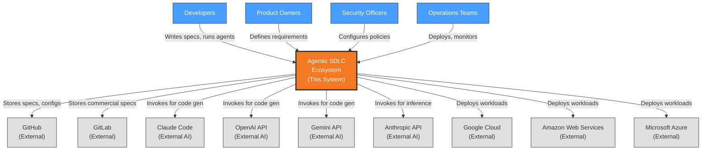
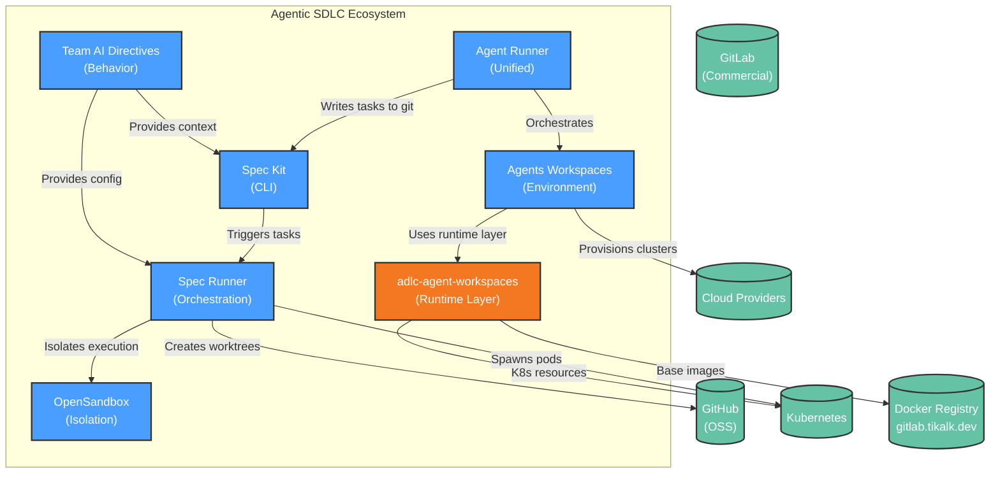
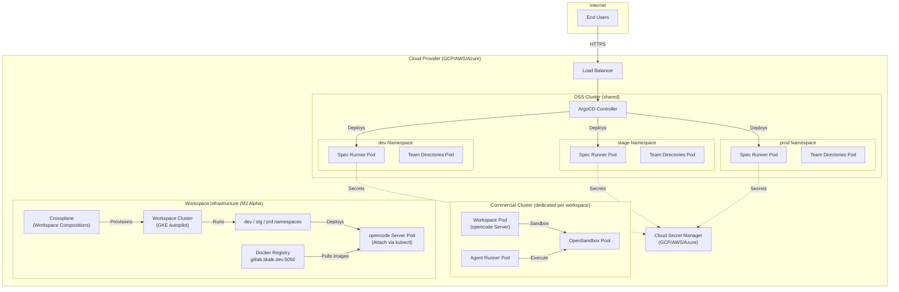

# Architecture Description: Agentic SDLC Ecosystem

**Version**: 1.4 | **Created**: 2026-03-16 | **Last Updated**: 2026-04-06  
**Architect**: User/AI | **Status**: Draft  
**ADR Reference**: [.specify/memory/adr.md](.specify/memory/adr.md) (19 system ADRs)  
**PDR Reference**: [.specify/memory/pdr.md](.specify/memory/pdr.md) (90+ PDRs: PDR-001 to PDR-088 + new eval/harness)

---

## 1. Introduction

### 1.1 Purpose

The Agentic SDLC Ecosystem is a comprehensive suite of tools, methodologies, and infrastructure for integrating AI coding agents into the software development lifecycle. Built on the Twelve-Factor Agentic SDLC methodology, the ecosystem enables teams to systematically leverage AI agents for specification, planning, implementation, and quality assurance.

### 1.2 Scope

**In Scope:**
- **Six products**: Spec Kit, Runner, Team Directives, Agents Workspaces, Agent Runner, Evals Extension
- Git-based data architecture (no databases)
- CLI and Git-based integration between services
- Kubernetes-based deployment with ArgoCD GitOps
- Multi-cloud support (GCP primary, AWS, Azure)
- Container-level isolation via OpenSandbox
- Cloud-native agent workspaces with CLI attach (M2 Alpha)
- Eval-Driven Development (EDD) with PromptFoo integration
- Harness Engineering patterns (9 new patterns: PDR-080 to PDR-088)
- open-multi-agent foundation for multi-agent orchestration (PDR-079)

**Out of Scope:**
- Custom AI model training
- IDE/editor development
- Cloud provider billing management
- General-purpose CI/CD pipelines

### 1.3 Definitions & Acronyms

| Term | Definition |
|------|------------|
| AD | Architecture Description - this document |
| ADR | Architecture Decision Record - documented architectural decisions |
| ASYNC | Autonomous task execution marker |
| SYNC | Synchronous (human-in-the-loop) task execution marker |
| ESO | External Secrets Operator |
| PDR | Product Decision Record |
| Worktree | Git feature for multiple working directories |

---

## 2. Stakeholders & Concerns

| Stakeholder | Role | Key Concerns | Priority |
|-------------|------|--------------|----------|
| Product Owners | Feature delivery | Delivery timelines, market fit | High |
| Development Teams | Implementation | Developer experience, tooling | High |
| Security Officers | Protection | Data protection, compliance | Critical |
| Operations Team | Reliability | System uptime, deployability | High |
| End Users | Usage | Performance, usability | High |
| Commercial Customers | Value | SLA, support, isolation | High |

---

## 3. Architectural Views (Rozanski & Woods)

### 3.1 Context View

**Purpose**: Define system scope and external interactions

#### 3.1.1 System Scope

The Agentic SDLC Ecosystem is a multi-service platform enabling AI-augmented software development. It consists of five sub-systems that work together to provide specification-driven development workflows with autonomous agent execution.

**Core Architectural Decisions** (referenced ADRs):
- **ADR-002**: Spec-Driven Development - Specifications are the primary artifact, living documents that evolve with code
- **ADR-003**: Dual Execution Loop (SYNC/ASYNC) - Tasks classified for human-in-the-loop or autonomous execution
- **ADR-004**: Extension-Based Architecture - Opt-in extensions keep core lean while enabling depth
- **ADR-001**: Multi-Agent Ecosystem Strategy - Unified abstraction supporting multiple AI vendors
- **ADR-013**: Multi-Repository Architecture - Products split across GitHub (OSS) and GitLab (commercial)
- **ADR-005**: Context Engineering - Treat context as finite budget with graduated compaction
- **ADR-006**: Dual-Memory Architecture - Separated episodic and working memory

#### 3.1.2 External Entities

| Entity | Type | Interaction Type | Data Exchanged | Protocols |
|--------|------|------------------|----------------|-----------|
| GitHub | External System | Repository hosting (OSS) | Specs, configs, code | HTTPS/Git |
| GitLab | External System | Repository hosting (commercial) | Specs, configs | HTTPS/Git |
| GitLab Container Registry | External System | Docker image hosting | Base images, overlays | HTTPS |
| Claude Code | External AI Agent | Code generation | Prompts, code | CLI/Stdio |
| OpenAI | External AI Agent | Code generation | API requests | HTTPS |
| Gemini | External AI Agent | Code generation | API requests | HTTPS |
| Anthropic API | External AI Provider | LLM inference | Prompts, responses | HTTPS |
| OpenAI API | External AI Provider | LLM inference | Prompts, responses | HTTPS |
| GCP/GKE | Cloud Provider | Infrastructure (primary) | Compute, storage, K8s | HTTPS |
| AWS/EKS | Cloud Provider | Infrastructure | Compute, storage | HTTPS |
| Azure/AKS | Cloud Provider | Infrastructure | Compute, storage | HTTPS |

#### 3.1.3 Context Diagram



#### 3.1.4 External Dependencies

| Dependency | Purpose | SLA Expectations | Fallback Strategy |
|------------|---------|------------------|-------------------|
| GitHub | OSS repository hosting | 99.9% | Switch to GitLab, local git |
| GitLab | Commercial repo + registry | 99.9% | Local docker builds |
| GitLab Container Registry | Docker image hosting | 99.9% | Build images locally |
| Claude Code | Primary AI agent | 99.5% | Fallback to other agents |
| OpenAI API | AI inference | 99.5% | Fallback to Anthropic/Gemini |
| GCP/GKE | Cloud infrastructure (primary) | Per SLA | AWS/EKS, Azure/AKS |
| AWS/EKS | Cloud infrastructure | Per SLA | GCP/GKE failover |
| Azure/AKS | Cloud infrastructure | Per SLA | GCP/GKE failover |

---

### 3.2 Functional View

**Purpose**: Describe functional elements, their responsibilities, and interactions

#### 3.2.1 Functional Elements

| Element | Responsibility | Interfaces Provided | Dependencies | ADR Reference |
|---------|----------------|---------------------|--------------|----------------|
| **Spec Kit** | Specification authoring | CLI commands: /spec.* | Git, AI agents | ADR-002, ADR-004 |
| **Runner** | K8s async execution | Pod spawn, worktree mgmt | Kubernetes, Git | PDR-009, PDR-010 |
| **Team Directives** | AI behavior config | Persona loading, skills | Git repositories | PDR-013 |
| **Agents Workspaces** | Cloud dev environments | K8s cluster provisioning | Cloud providers, Crossplane | PDR-043, PDR-044 |
| **Agent Runner** | Unified orchestration | Squad/Spec modes | Runner, Squad patterns | PDR-053, PDR-079 |
| **Evals Extension** | Quality assurance | PromptFoo integration, goldset mgmt | Runner hooks | PDR-050, PDR-074-078 |
| **OpenSandbox** | Container isolation | Sandbox API | Kubernetes | PDR-054, ADR-014 |
| **Harness Patterns** | Runtime safety | Pre-task validation, planning checks | Agent Runner | PDR-080-088 |

#### 3.2.2 Element Interactions



#### 3.2.3 Functional Boundaries

**What this system DOES:**
- Enable specification-driven development workflows
- Orchestrate AI agents for autonomous task execution
- Provide cloud-native development environments
- Enforce security via container isolation
- Manage AI behavior through version-controlled directives

**What this system does NOT do:**
- Train custom AI models
- Provide IDE functionality
- Manage cloud billing
- Serve as general-purpose CI/CD

#### 3.2.4 Harness Architecture

The system implements harness-based orchestration per ADR-007:

| Harness Component | Purpose | Implementation |
|------------------|---------|----------------|
| Schema-Level Restrictions | Tool filtering at schema level | Invisible vs blocked tools |
| ReAct Loop Extension | Extended reasoning with tool feedback | Per-step validation |
| AutoHarness Integration | Illegal action prevention | 78% chess loss prevention |
| Feedback Controls | Runtime validation | Error detection + recovery |

Reference: [ADR-007: Harness Runtime Orchestration](.specify/memory/adr.md#adr-007-harness-runtime-orchestration)

---

### 3.3 Information View

**Purpose**: Describe data storage, management, and flow

#### 3.3.1 Data Entities

| Entity | Storage Location | Owner Component | Lifecycle | Access Pattern |
|--------|------------------|-----------------|-----------|----------------|
| Specifications | Git repositories | Spec Kit | Create-Update-Version | Read-heavy |
| Task Definitions | Git (tasks.md) | Spec Runner | Create-Execute-Archive | Write-heavy |
| Team Directives | Git repositories | Team Directories | Create-Deploy-Version | Read-heavy |
| Execution Logs | Git + Prometheus | Spec Runner | Create-Retention-Delete | Append-only |
| Workspace Config | Git + K8s manifests | Agents Workspaces | Provision-Deprovision | Write-once |
| Secrets | Cloud Secret Managers | All services | Create-Rotate-Delete | Rare |

#### 3.3.2 Data Flow

1. **Spec Creation Flow**: User → Spec Kit (CLI) → Git repository
2. **Task Execution Flow**: Agent Runner → Git (tasks.md) → Spec Runner → K8s Pods → OpenSandbox
3. **Context Loading Flow**: Spec Kit → Git → Team Directives → AI Agent
4. **Secret Access Flow**: Services → ESO → Cloud Secret Managers → Workload Identity

#### 3.3.3 Data Quality & Integrity

- **Consistency Model**: Eventual (git-based), with strong consistency for secrets
- **Validation Rules**: Schema validation for specs, Git integrity checks
- **Retention Policy**: Specs: forever, Logs: 30 days, Execution: 90 days
- **Backup Strategy**: Git provider native features; multi-cloud replication

---

### 3.4 Concurrency View

**Purpose**: Describe runtime processes, threads, and coordination

#### 3.4.1 Process Structure

| Process | Purpose | Scaling Model | State Management |
|---------|---------|---------------|------------------|
| Spec Runner | Task orchestration | Horizontal - stateless | Git-based |
| K8s Pod (ASYNC) | Task execution | Per-task pod | Ephemeral |
| OpenSandbox Server | Sandbox lifecycle | Horizontal - pooled | Stateless |
| Agent Runner | Unified orchestration | Horizontal - stateless | Git-based |
| ArgoCD Controller | Deployment sync | Cluster-singleton | Event-driven |

#### 3.4.2 Thread Model

- **Threading Strategy**: Event-driven async (Python asyncio, Go goroutines)
- **Async Patterns**: Git-based async coordination, webhook callbacks
- **Resource Pools**: OpenSandbox BatchSandbox pool (min 5, max 20 warm sandboxes)

#### 3.4.3 Coordination Mechanisms

- **Synchronization**: Git branches for isolation, file locking for critical state
- **Communication**: CLI commands, Git protocol, Kubernetes API
- **Deadlock Prevention**: Queue-based git operations, branch-per-service pattern

---

### 3.5 Development View

**Purpose**: Constraints for developers - code organization, dependencies, CI/CD

#### 3.5.1 Code Organization

```text
agentic-sdlc/                           # Monorepo (this project)
├── PRD.md                             # Product Requirements Document
├── AD.md                              # Architecture Description
├── .specify/
│   ├── memory/
│   │   ├── pdr.md                    # Product Decision Records
│   │   ├── adr.md                    # Architecture Decision Records
│   │   └── constitution.md           # Product Constitution
│   └── extensions/                   # Spec Kit Extensions
│       └── workspaces/                # Workspaces extension
├── agentic-sdlc-spec-kit/             # Spec Kit (GitHub - OSS)
├── agentic-sdlc-agent-runner/         # Spec Runner (GitHub - OSS)
├── agentic-sdlc-team-ai-directives/  # Team Directives (GitHub - OSS)
└── agentic-sdlc-agent-runner/        # Agent Runner (GitHub - OSS)

# Separate repositories:
# GitLab: tikalk/engineering/agentic-sdlc/adlc-agent-workspaces
adlc-agent-workspaces/                 # Workspaces Infrastructure (GitLab)
```

#### 3.5.2 Module Dependencies

**Dependency Rules:**
- Services layer depends on Git (not vice versa)
- Runner depends on Kubernetes API
- All services depend on Observability module
- No circular dependencies between services

#### 3.5.3 Build & CI/CD

- **Build System**: Python (uv), TypeScript (npm), Go (mod)
- **CI Pipeline**: GitHub Actions / GitLab CI - Build → Test → Lint → Build Artifacts
- **Deployment Strategy**: ArgoCD GitOps - Git push triggers deployment
- **Environments**: dev → stage → prod (3 namespaces per cluster)

#### 3.5.4 Development Standards

- **Coding Standards**: ESLint, Ruff, golangci-lint
- **Review Requirements**: 1 approval for OSS, 2 for commercial
- **Testing Requirements**: 80% coverage for core, 60% for others
- **Security**: SAST scanning, dependency scanning, container scanning

---

### 3.6 Deployment View

**Purpose**: Physical environment - nodes, networks, storage

#### 3.6.1 Runtime Environments

| Environment | Purpose | Infrastructure | Scale |
|-------------|---------|----------------|-------|
| Production (OSS) | Live OSS users | Shared K8s (dev/stage/prod namespaces) | 10+ nodes |
| Production (Commercial) | Commercial customers | Dedicated clusters per workspace | Per-customer |
| Staging | Pre-release testing | Shared K8s | 3 nodes |
| Development | Dev testing | Docker Compose / Minikube | 1 node |
| Workspace (Alpha) | Agent workspace per user | GKE Autopilot (M2 milestone) | Per-user cluster |

#### 3.6.2 Network Topology



#### 3.6.3 Hardware Requirements

| Component | CPU | Memory | Storage |
|-----------|-----|--------|---------|
| K8s Node (OSS) | 4 cores | 16GB | 100GB SSD |
| K8s Node (Commercial) | 8 cores | 32GB | 200GB SSD |
| OpenSandbox Sandbox | 2 cores | 4GB | 20GB |
| Prometheus | 2 cores | 8GB | 100GB |

---

### 3.7 Operational View

**Purpose**: Operations, support, and maintenance in production

#### 3.7.1 Operational Responsibilities

| Activity | Owner | Frequency | Automation |
|----------|-------|-----------|------------|
| Deployment | DevOps | On-demand | Automated via ArgoCD |
| Backup | Operations | Daily | Automated via Git |
| Monitoring | SRE | Continuous | Automated via Prometheus |
| Secret Rotation | DevOps | 90 days | Automated via ESO |
| Sandbox Cleanup | Operations | On-demand | Automated |

#### 3.7.2 Monitoring & Alerting

- **Key Metrics**: Pod health, task success rate, sandbox utilization, latency
- **Alerting Rules**: 
  - Error rate > 1% → Page on-call
  - Sandbox pool exhaustion → Page on-call
  - Deployment drift → Alert channel
- **Logging Strategy**: OpenTelemetry → Prometheus → Grafana, 30-day retention

#### 3.7.3 Disaster Recovery

- **RTO**: 1 hour
- **RPO**: 15 minutes (git commits)
- **Backup Strategy**: Git native, multi-region cloud storage

#### 3.7.4 Support Model

- **Tier 1**: Help desk (business hours)
- **Tier 2**: Application support (business hours)
- **Tier 3**: Engineering (24/7 for critical)
- **On-call**: Weekly rotation for P1 issues

---

## 4. Architectural Perspectives (Cross-Cutting Concerns)

### 4.1 Security Perspective

**Applies to**: All views

#### 4.1.1 Authentication & Authorization

- **Identity Provider**: Cloud-native (GCP IAM, AWS IAM, Azure AD)
- **Authorization Model**: RBAC with Workload Identity
- **Session Management**: Token-based with automatic rotation

#### 4.1.2 Data Protection

- **Encryption at Rest**: Cloud-provider encryption (AES-256)
- **Encryption in Transit**: TLS 1.3 everywhere
- **Secrets Management**: External Secrets Operator + Cloud Secret Managers
- **PII Handling**: Minimal collection, encrypted storage

#### 4.1.3 Threat Model

| Threat | View Affected | Likelihood | Impact | Mitigation |
|--------|---------------|------------|--------|------------|
| Container Escape | Deployment | Low | Critical | gVisor isolation, PDR-054 |
| Secret Exposure | All | Medium | Critical | ESO, Workload Identity |
| Git Data Loss | Information | Low | High | Multi-cloud backup |
| Unauthorized Access | Context | Medium | Critical | RBAC, audit logs |
| Supply Chain | Development | Medium | High | SBOM, dependency scanning |
| Workspace Isolation Breach | Deployment | Low | High | Per-workspace cluster, namespace isolation |
| Orphaned Clusters | Deployment | Medium | High | Explicit destroy policy, cost alerts |

---

### 4.2 Performance & Scalability Perspective

**Applies to**: Functional, Concurrency, Deployment views

#### 4.2.1 Performance Requirements

| Metric | Target | Measurement |
|--------|--------|-------------|
| Pod spawn time | < 60s | K8s metrics |
| Sandbox creation (pooled) | < 5s | OpenSandbox metrics |
| Worktree creation | < 10s | Git metrics |
| Context compaction | < 2s | Application metrics |
| ASYNC task success rate | > 90% | Task tracking |

#### 4.2.2 Scalability Model

- **Horizontal Scaling**: K8s HPA for pods, per-workspace clusters for commercial
- **Vertical Scaling**: Node pools by workload type
- **Auto-scaling Triggers**: CPU > 70%, memory > 80%, queue depth > 10

#### 4.2.3 Capacity Planning

- **Current Capacity**: 100 concurrent ASYNC tasks
- **Growth Projections**: 20% quarterly
- **Bottlenecks**: Git operations, sandbox pool size, K8s node capacity

---

## 5. Global Constraints & Principles

### 5.1 Technical Constraints

- Must support multi-cloud (GCP, AWS, Azure)
- Must use GitOps-First deployment (ArgoCD)
- No databases - Git-based data architecture
- CLI-first interaction model
- Kubernetes-native deployment

### 5.2 Architectural Principles

- **Principle 1**: Repository as System of Record - all knowledge in version control
- **Principle 2**: Multi-Agent Ecosystem - support multiple AI agents
- **Principle 3**: Defense in Depth - five-layer security
- **Principle 4**: Safety Through Constraints - schema-level tool restrictions
- **Principle 5**: GitOps-First - Git is the source of truth for deployment
- **Principle 6**: Verification Ladder (ADR-011) - goal-backward verification with evidence enforcement
- **Principle 7**: Continue-Here (ADR-012) - interruption survival via state persistence

---

## 6. Constitution Alignment

**Constitution Reference**: [.specify/memory/constitution.md](.specify/memory/constitution.md)

### Alignment Status

| Principle | Section | Alignment | Notes |
|-----------|---------|-----------|-------|
| I. Spec-Driven Development | Context | ✅ Compliant | Core methodology - ADR-002 |
| II. Safety Through Constraints | Security | ✅ Compliant | Five-layer defense - ADR-008 |
| III. Human Veto Gates | Functional | ✅ Compliant | SYNC mode gates - ADR-003 |
| IV. Brainstorm-Before-Build | Functional | ✅ Compliant | Discuss phase - ADR-003 |
| V. Test-First Development | Quality | ✅ Compliant | Verification ladder - ADR-011 |
| VI. Session Knowledge Persistence | Context | ✅ Compliant | Dual-memory - ADR-006 |
| VII. Extension Architecture | Extensibility | ✅ Compliant | Opt-in extensions - ADR-004 |
| VIII. Git Worktree Baseline | Infrastructure | ✅ Compliant | Worktree verification - ADR-009 |
| IX. Structured Branch Completion | Workflow | ✅ Compliant | Branch-per-slice - ADR-010 |
| X. Evidence Over Claims | Quality | ✅ Compliant | Verification ladder - ADR-011 |
| XI. Rationalization Awareness | Quality | ✅ Compliant | Confidence levels - ADR-007 |
| XII. Eval Criteria | Quality | ✅ Compliant | Research-backed decisions |

### Overrides (if applicable)

None - all ADRs align with constitutional principles.

---

## 7. ADR Summary

Detailed Architecture Decision Records are maintained in [.specify/memory/adr.md](.specify/memory/adr.md).

**System ADRs:**

| ID | Decision | Status | Impact |
|----|----------|--------|--------|
| ADR-001 | Multi-Agent Ecosystem Strategy | Discovered | HIGH |
| ADR-002 | Spec-Driven Development Core | Discovered | HIGH |
| ADR-003 | Dual Execution Loop (SYNC/ASYNC) | Discovered | HIGH |
| ADR-004 | Extension-Based Architecture | Discovered | MEDIUM |
| ADR-005 | Context Engineering (Context as Budget) | Research-Backed | HIGH |
| ADR-006 | Dual-Memory Architecture | Research-Backed | HIGH |
| ADR-007 | Harness Runtime Orchestration | Research-Backed | HIGH |
| ADR-008 | Safety Through Architectural Constraints | Research-Backed | HIGH |
| ADR-009 | Git Worktree Baseline Verification | GSD-Backed | HIGH |
| ADR-010 | Branch-Per-Slice Git Strategy | GSD-Backed | HIGH |
| ADR-011 | Verification Ladder (Goal-Backward) | GSD-Backed | HIGH |
| ADR-012 | Continue-Here (Interruption Survival) | GSD-Backed | HIGH |
| ADR-013 | Multi-Repository Architecture | Discovered | HIGH |
| ADR-014 | OpenSandbox Integration | Proposed | HIGH |
| ADR-015 | Eval Metrics: Pass@k vs Pass^k Distinction | Proposed | HIGH |
| ADR-016 | Eval Completeness: Transcript + Outcome Dual Evaluation | Proposed | HIGH |
| ADR-017 | Grader Selection Framework (Code → Model → Human) | Proposed | HIGH |
| ADR-018 | ACI Tool Design Evolution (3 Generations) | Proposed | HIGH |
| ADR-019 | Explicit Task State Format (JSON Externalization) | Proposed | HIGH |

**Product ADRs (from PDRs):**

| ID | Decision | Status | Impact |
|----|----------|--------|--------|
| PDR-042 | New Product: Cloud-Native Agent Workspaces | Proposed | HIGH |
| PDR-043 | Cluster-per-Workspace with IaC Provisioning | Proposed | HIGH |
| PDR-044 | Multi-Cloud Support (GCP, AWS, Azure) | Proposed | MEDIUM |
| PDR-045 | opencode Server with CLI-to-Server Attach | Proposed | HIGH |
| PDR-053 | Agent Runner - Unified Squad + Spec Runner | Proposed | HIGH |

**Harness Engineering PDRs:**

| ID | Decision | Status | Impact |
|----|----------|--------|--------|
| PDR-074 | Eval Metrics: Pass@k vs Pass^k Distinction | Proposed | HIGH |
| PDR-075 | Eval Completeness: Transcript + Outcome Dual Evaluation | Proposed | HIGH |
| PDR-076 | Grader Selection Framework | Proposed | HIGH |
| PDR-077 | ACI Tool Design Evolution | Proposed | HIGH |
| PDR-078 | Explicit Task State Format | Proposed | HIGH |
| PDR-079 | open-multi-agent Foundation | Proposed | HIGH |
| PDR-080 | Pre-Task Context Validation | Proposed | HIGH |
| PDR-081 | Planning Attack Vector Validation | Proposed | HIGH |
| PDR-082 | Multi-Plan Selection (N=5 Pattern) | Proposed | HIGH |
| PDR-083 | Session Handoff with Context Fidelity | Proposed | HIGH |
| PDR-084 | Contract Stickiness Verification | Proposed | HIGH |
| PDR-085 | Sub-Task Decomposition for Complexity | Proposed | HIGH |
| PDR-086 | Fresh-Context Verification Agents | Proposed | HIGH |
| PDR-087 | Entropy Reduction Agent | Proposed | HIGH |
| PDR-088 | Custom Harness Workflow Patterns | Proposed | HIGH |

---

## Appendix

### A. Glossary

| Term | Definition |
|------|------------|
| ArgoCD | GitOps continuous delivery tool |
| BatchSandbox | OpenSandbox feature for pre-warmed sandbox pools |
| ESO | External Secrets Operator |
| gVisor | Google container sandbox runtime |
| OpenSandbox | Alibaba sandbox platform for AI |
| Workload Identity | Cloud-native service identity management |

### B. References

- [.specify/memory/pdr.md](.specify/memory/pdr.md) - Product Decision Records
- [.specify/memory/adr.md](.specify/memory/adr.md) - Architecture Decision Records
- [.specify/memory/constitution.md](.specify/memory/constitution.md) - Product Constitution
- PRD.md - Product Requirements Document

### C. Tech Stack Summary

**Languages**: Python 3.11+, TypeScript, Go  
**Frameworks**: FastAPI, React, Kubernetes  
**Infrastructure**: Kubernetes, ArgoCD, Terraform, Crossplane  
**Cloud Platform**: GCP (primary), AWS, Azure (multi-cloud)  
**CI/CD**: GitHub Actions, GitLab CI  
**Monitoring**: OpenTelemetry, Prometheus, Grafana  
**Sandboxing**: OpenSandbox, gVisor  
**Container Registry**: GitLab Container Registry (gitlab.tikalk.dev:5050)  
**Workspace Runtime**: agentic-sdlc-agent-runner (Docker base images, Helm charts)  
**Workspace Provisioning**: Crossplane workspace-specific compositions

---

*This Architecture Description is generated from Architecture Decision Records. For decision rationale, see `.specify/memory/adr.md`.*