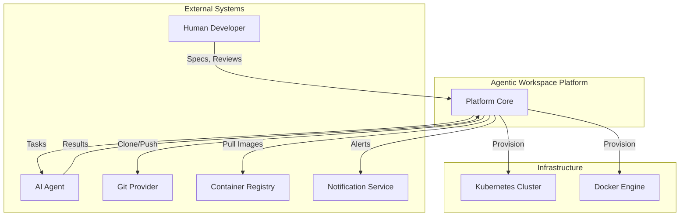
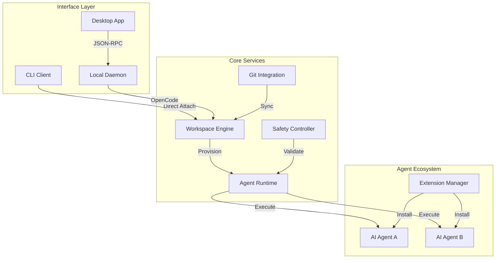
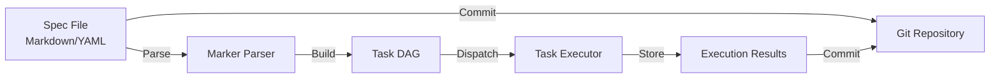
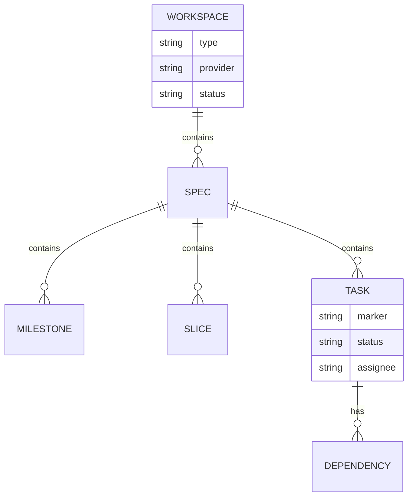
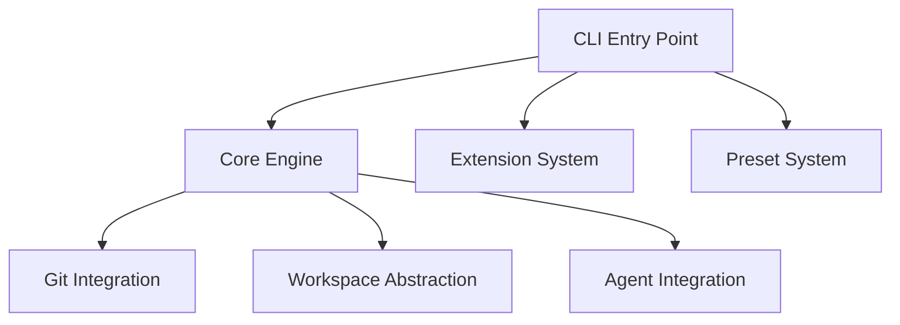
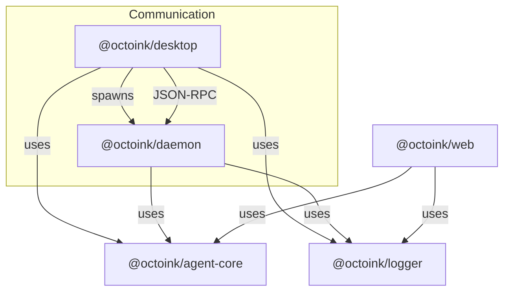
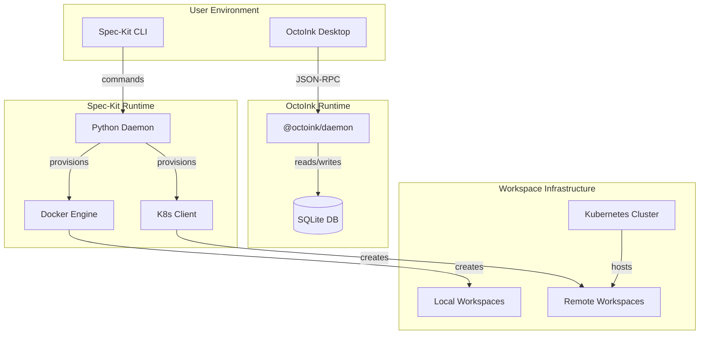
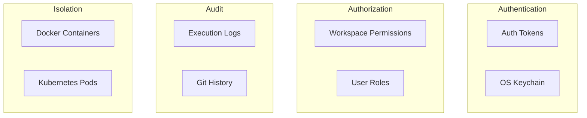

# Architecture Description: Agentic Workspace Platform

**Version**: 3.1  
**Created**: 2026-05-04  
**Last Updated**: 2026-05-07  
**Architect**: /architect.implement  
**Status**: Draft  
**ADR Reference**: [.specify/memory/adr.md](.specify/memory/adr.md)

---

## Table of Contents

1. [Introduction](#1-introduction)
2. [Stakeholders & Concerns](#2-stakeholders--concerns)
3. [Architectural Views](#3-architectural-views)
   - 3.1 [Context View](#31-context-view)
   - 3.2 [Functional View](#32-functional-view)
   - 3.3 [Information View](#33-information-view)
   - 3.4 [Development View](#34-development-view)
   - 3.5 [Deployment View](#35-deployment-view)
4. [Architectural Perspectives](#4-architectural-perspectives)
   - 4.1 [Security Perspective](#41-security-perspective)
   - 4.2 [Performance & Scalability Perspective](#42-performance--scalability-perspective)
5. [Architecture Decision Records Summary](#5-architecture-decision-records-summary)
6. [Tech Stack Summary](#6-tech-stack-summary)
7. [Cross-Cutting Concerns](#7-cross-cutting-concerns)
8. [Implementation Roadmap](#8-implementation-roadmap)

---

## 1. Introduction

### 1.1 Purpose

This Architecture Description (AD) documents the architecture of the **Agentic Workspace Platform** — a spec-driven development environment that enables AI agents to collaborate with human developers across local and remote workspaces.

### 1.2 Scope

This document covers:
- System context and external interfaces
- Functional components and their interactions
- Information architecture and data flow
- Development and deployment infrastructure
- Security and performance considerations

### 1.3 Definitions & Acronyms

| Term | Definition |
|------|------------|
| **ADLC** | Agent-Driven Lifecycle - The core methodology for AI-assisted development |
| **MST** | Milestone/Slice/Task - Three-level work decomposition |
| **PDR** | Product Decision Record - Product-level decisions |
| **ADR** | Architecture Decision Record - Technical architecture decisions |
| **DAG** | Directed Acyclic Graph - Task execution dependency graph |
| **OpenCode** | AI agent protocol for workspace interaction |
| **Spec** | Specification document (markdown/YAML) driving development |

### 1.4 References

- [Constitution](.specify/memory/constitution.md) - Project governance principles
- [ADRs](.specify/memory/adr.md) - Architecture Decision Records (17 total)
- [PRD](PRD.md) - Product Requirements Document

---

## 2. Stakeholders & Concerns

### 2.1 Stakeholder Map

| Stakeholder | Role | Key Concerns | Priority |
|-------------|------|--------------|----------|
| **AI Team Leads** | Manage agent adoption | Multi-agent flexibility, workflow efficiency | High |
| **Product Managers** | Non-technical users | Visual interface, self-service | High |
| **Platform Engineers** | Infrastructure | Scalability, resource management | Critical |
| **Security Engineers** | Governance | Isolation, auditability | Critical |
| **Extension Developers** | Build integrations | API stability, extension points | Medium |
| **End Developers** | Use the platform | Workspace performance, reliability | Critical |

### 2.2 Key Architectural Concerns

| Concern | Addressed In | ADR Reference |
|---------|-------------|---------------|
| Multi-agent support | Functional View | ADR-004 |
| Workspace isolation | Security Perspective | ADR-006, ADR-012 |
| Git-native storage | Information View | ADR-013, ADR-017 |
| Hybrid local/remote | Deployment View | ADR-016 |
| Human-in-the-loop | Functional View | ADR-019 |
| Desktop vs Web UI | Context View | ADR-018, ADR-020 |

---

## 3. Architectural Views

### 3.1 Context View

#### 3.1.1 System Scope

The Agentic Workspace Platform is a **spec-driven development environment** that enables AI agents to work alongside human developers in isolated, version-controlled workspaces. The system supports both local development (via Docker) and remote/cloud development (via Kubernetes).

**Primary Capabilities**:
- Specification-driven task decomposition (Milestone/Slice/Task)
- Multi-agent orchestration with parallel and sequential execution
- Hybrid workspace provisioning (local Docker / remote K8s)
- Git-native spec and code storage
- Desktop and CLI interfaces

#### 3.1.2 External Entities

| Entity | Type | Relationship | Interface |
|--------|------|--------------|-----------|
| **Human Developer** | User | Creates specs, reviews agent output | Desktop App, CLI |
| **AI Agent** | External System | Executes tasks in workspaces | OpenCode Protocol |
| **Git Provider** | External System | Stores specs and code | Git HTTPS/SSH |
| **Container Registry** | External System | Provides workspace images | Docker Registry API |
| **Kubernetes Cluster** | Infrastructure | Hosts remote workspaces | K8s API |
| **Local Docker Engine** | Infrastructure | Hosts local workspaces | Docker API |
| **Notification Service** | External System | Alerts for async tasks | Push/WebSocket |

#### 3.1.3 Context Diagram



#### 3.1.4 External Dependencies

| Dependency | Purpose | Impact if Unavailable |
|------------|---------|----------------------|
| AI Agent Vendors | Code generation | Platform cannot execute tasks |
| Git Hosting | Source of truth | Spec and code versioning lost |
| Kubernetes | Remote execution | Only local workspaces available |
| Container Registry | Workspace images | Cannot provision new workspaces |

---

### 3.2 Functional View

#### 3.2.1 Functional Elements

| Element | Responsibility | ADR Reference |
|---------|----------------|---------------|
| **Workspace Engine** | Provisions and manages development environments | ADR-016 |
| **Agent Runtime** | Orchestrates task execution across agents | ADR-006, ADR-019 |
| **Git Integration** | Manages spec and code lifecycle | ADR-013, ADR-017 |
| **Interface Layer** | Provides CLI and Desktop access | ADR-018, ADR-020 |
| **Extension System** | Manages agent integrations | ADR-005, ADR-011 |
| **Safety Controller** | Enforces execution constraints | ADR-009 |

#### 3.2.2 Component Interaction Diagram



#### 3.2.3 Dual Orchestration Architecture

The platform implements **two distinct orchestration layers**:

1. **Workflow Engine** (`agentic-sdlc-spec-kit/workflows/`)
   - Orchestrates commands across the SDLC lifecycle
   - Sequence: `specify` → `plan` → `implement`
   - YAML-based definitions with step types (command, gate, fan-out)

2. **DAG Orchestrator** (within `spec.implement` command)
   - Orchestrates tasks WITHIN the implement command
   - Markdown markers: `[P]`, `[ASYNC]`, `[SYNC]`
   - Runtime DAG construction from spec markers

#### 3.2.4 Interface Component Details

**CLI Interface (ADR-015)**:
- Direct workspace attachment via OpenCode protocol
- Python/Typer-based implementation
- Direct spec file editing

**Desktop Interface (ADR-020)**:
- Electron application with embedded Node.js daemon
- Bundles Web UI (`@octoink/web`) for consistent UX
- JSON-RPC over Unix domain socket to daemon
- Native OS integration (notifications, protocol handlers)

---

### 3.3 Information View

#### 3.3.1 Data Entities

| Entity | Description | Storage | ADR Reference |
|--------|-------------|---------|---------------|
| **Spec** | Development specification | Git (Markdown/YAML) | ADR-010 |
| **Task Graph** | Execution dependency DAG | In-memory (runtime) | ADR-019 |
| **Workspace State** | Environment configuration | Git + Config files | ADR-013 |
| **Agent Config** | Agent integration settings | YAML (`.specify/agents/`) | ADR-004 |
| **Execution History** | Task run logs | Log files | ADR-008 |
| **Directives** | Team AI instructions | Markdown | ADR-011 |

#### 3.3.2 Data Flow



#### 3.3.3 Storage Strategy

| Data Type | Strategy | Rationale |
|-----------|----------|-----------|
| **Specs** | Git-native | Version control, audit trail |
| **Config** | Filesystem | Simple, human-editable |
| **Runtime state** | In-memory + logs | Transient by design |
| **Secrets** | OS keychain | Security best practice |

#### 3.3.4 Entity Relationships



---

### 3.4 Development View

#### 3.4.1 Code Organization

The architecture spans **two distinct codebases**:

**Package 1: agentic-sdlc-spec-kit/ (Python CLI)**
```
agentic-sdlc-spec-kit/
├── src/
│   └── specify_cli/            # CLI implementation
│       ├── __init__.py         # Entry point (specify command)
│       ├── core_pack/          # Core bundled assets
│       │   ├── extensions/     # Bundled extensions (git, levelup)
│       │   ├── presets/        # Bundled presets (lean)
│       │   └── scripts/        # Bash/PowerShell scripts
│       └── ...                 # CLI modules
├── extensions/                 # Additional extensions (evals, levelup)
├── presets/                    # Additional presets
├── templates/                  # Spec templates
└── pyproject.toml              # Python package config
```

**Package 2: octoink/ (TypeScript Desktop - pnpm monorepo)**
```
octoink/                        # @octoink/* namespace
├── apps/
│   ├── daemon/                 # @octoink/daemon - Node.js background service
│   ├── desktop/                # @octoink/desktop - Electron application
│   └── web/                    # @octoink/web - React web UI
├── packages/
│   ├── agent-core/             # @octoink/agent-core - Shared types/utilities
│   └── logger/                 # @octoink/logger - Logging utilities
├── package.json                # pnpm workspace root
└── tsconfig.json               # TypeScript config
```

#### 3.4.2 Module Dependencies

**spec-kit Internal Dependencies:**


**octoink Monorepo Dependencies:**


#### 3.4.3 Build & CI/CD

| Package | Component | Build Tool | Technology |
|---------|-----------|-----------|------------|
| spec-kit | CLI | Python/hatchling | Python 3.x, hatch |
| octoink | Desktop | Vite + electron-builder | Electron 41, TypeScript 6.x |
| octoink | Daemon | tsup | Node.js 24+, TypeScript 6.x |
| octoink | Web | Vite | React 19, TypeScript 6.x |
| octoink | Libraries | tsup | TypeScript 6.x |

**Package Management:**
- spec-kit: pip/uv (Python)
- octoink: pnpm 10.33.0 with workspaces

#### 3.4.4 Extension Architecture (ADR-005)

Extensions follow a plugin pattern:
- **Entry point**: `speckit.json` manifest
- **Installation**: `speckit install <extension>`
- **Loading**: Dynamic import at runtime
- **API**: Standardized agent integration interface

---

### 3.5 Deployment View

#### 3.5.1 Runtime Environments

| Package | Environment | Purpose | Technology | ADR Reference |
|---------|-------------|---------|------------|---------------|
| spec-kit | **CLI** | Command-line workflows | Python 3.x | ADR-015 |
| spec-kit | **Local Dev** | Workspace provisioning | Docker Desktop | ADR-007, ADR-016 |
| spec-kit | **Remote Dev** | Cloud workspaces | Kubernetes | ADR-006, ADR-012 |
| octoink | **Desktop App** | GUI IDE experience | Electron 41 | ADR-020, ADR-104 |
| octoink | **Daemon** | Background service | Node.js 24+ | ADR-104 |

#### 3.5.2 Deployment Topology



#### 3.5.3 Hybrid Workspace Strategy (ADR-016)

| Criterion | Local (Docker) | Remote (K8s) |
|-----------|---------------|--------------|
| **Use Case** | Quick tasks, offline work | Long-running, resource-intensive |
| **Startup Time** | <5 seconds | 30-60 seconds |
| **Resources** | Limited by workstation | Scalable |
| **Network** | Minimal requirements | Requires connectivity |
| **Isolation** | Process-level | Pod-level |

#### 3.5.4 Layered Git Strategy (ADR-017)

| Layer | Strategy | Use Case |
|-------|----------|----------|
| **Worktrees** | Multiple checkouts, single clone | Local parallel development |
| **Clones** | Full repository copies | Remote isolation |
| **Hybrid** | Auto-select based on context | Seamless user experience |

---

## 4. Architectural Perspectives

### 4.1 Security Perspective

#### 4.1.1 Threat Model

| Threat | Mitigation | ADR Reference |
|--------|-----------|---------------|
| **Unauthorized agent access** | Authentication tokens, workspace isolation | ADR-006, ADR-012 |
| **Spec tampering** | Git commit signing, audit trail | ADR-013 |
| **Secret exposure** | OS keychain integration, no plaintext | ADR-020 |
| **Code injection** | Safety schema validation | ADR-009 |
| **Privilege escalation** | Least-privilege workspace permissions | ADR-016 |

#### 4.1.2 Security Controls



#### 4.1.3 Safety Through Constraints (ADR-009)

Five-layer defense:
1. **Schema-level**: Task structure validation
2. **Policy-level**: Allowed/forbidden operations
3. **Sandbox-level**: Container isolation
4. **Network-level**: Egress filtering
5. **Audit-level**: Complete operation logging

### 4.2 Performance & Scalability Perspective

#### 4.2.1 Performance Requirements

| Metric | Target | Measurement |
|--------|--------|-------------|
| **DAG build time** | <2 seconds | From spec parse to execution |
| **Workspace startup** | <5s local, <60s remote | Cold start to ready |
| **Parallel utilization** | >70% | Tasks executed in parallel |
| **Memory per workspace** | 2-8GB | Depending on workload |
| **Spec round-trip** | <500ms | Edit to visible in UI |

#### 4.2.2 Scalability Model

| Component | Scaling Strategy | Limit |
|-----------|-----------------|-------|
| **Agent Runtime** | Horizontal (parallel tasks) | Limited by K8s cluster |
| **Workspaces** | Per-workspace pods | Resource constrained |
| **Git Operations** | Async queue | Rate limit by provider |
| **Desktop App** | Single-user | Local resources |

#### 4.2.3 Resource Optimization

- **Context Engineering** (ADR-008): Graduated compaction of large contexts
- **Parallel Execution** (ADR-019): `[P]` markers maximize parallelization
- **Workspace Cleanup**: Automatic cleanup of idle workspaces
- **Image Caching**: Layered container images for fast startup

---

## 5. Architecture Decision Records Summary

### 5.1 ADR Inventory

#### Greenfield ADRs (Target Architecture)

| ID | Sub-System | Decision | Status | Date |
|----|------------|----------|--------|------|
| ADR-004 | System | Multi-Agent Abstraction Layer | **Accepted** | 2026-04-25 |
| ADR-005 | System | Extension-Based Architecture | **Accepted** | 2026-04-25 |
| ADR-006 | Runner | K8s Subagent Pattern | **Accepted** | 2026-04-25 |
| ADR-007 | Workspaces | Docker-Based OpenCode Server | **Accepted** | 2026-04-25 |
| ADR-008 | System | Context Engineering | **Accepted** | 2026-04-25 |
| ADR-009 | System | Safety Through Schema-Level Constraints | **Accepted** | 2026-04-25 |
| ADR-010 | System | Three-Level Work Decomposition | **Accepted** | 2026-04-25 |
| ADR-011 | Directives | Team AI Directives | **Accepted** | 2026-04-25 |
| ADR-012 | Workspaces | Per-Workspace Pod Deployment | **Accepted** | 2026-04-25 |
| ADR-013 | Workspaces | Git-Based Workspace Lifecycle | **Accepted** | 2026-04-25 |
| ADR-014 | Workspaces | Dev Container Spec Tool Provisioning | **Accepted** | 2026-04-25 |
| ADR-015 | Workspaces | Hybrid Client Extension | **Accepted** | 2026-04-25 |
| ADR-016 | Workspaces | Hybrid Workspace Provisioning | **Accepted** | 2026-05-07 |
| ADR-017 | Git Integration | Layered Git Strategy | **Accepted** | 2026-05-07 |
| ADR-018 | User Interface | Bimodal Interface | **Accepted** | 2026-05-07 |
| ADR-019 | Agent Runtime | Marker-Based DAG Orchestration | **Proposed** | 2026-05-07 |
| ADR-020 | User Experience | Desktop Application Architecture | **Accepted** | 2026-05-07 |

#### Brownfield ADRs (Actual Implementation)

| ID | Sub-System | Decision | Status | Date |
|----|------------|----------|--------|------|
| ADR-101 | System | pnpm Workspace Monorepo | **Accepted** | 2026-05-07 |
| ADR-102 | System | TypeScript-First Development | **Accepted** | 2026-05-07 |
| ADR-103 | System | Modular App/Package Separation | **Accepted** | 2026-05-07 |
| ADR-104 | Desktop | Electron with Embedded Daemon | **Accepted** | 2026-05-07 |
| ADR-105 | Communication | JSON-RPC over Unix Socket | **Accepted** | 2026-05-07 |
| ADR-106 | Storage | SQLite for Local Data | **Accepted** | 2026-05-07 |
| ADR-107 | Web | React 19 with Radix UI | **Accepted** | 2026-05-07 |
| ADR-108 | Integration | Model Context Protocol (MCP) | **Accepted** | 2026-05-07 |
| ADR-109 | Build | Vite + tsup Build Pipeline | **Accepted** | 2026-05-07 |
| ADR-110 | Testing | Vitest Unit Testing | **Accepted** | 2026-05-07 |

### 5.2 Decision Themes

| Theme | ADRs | Key Principle |
|-------|------|---------------|
| **Multi-Agent Support** | ADR-004, ADR-006, ADR-019 | Agent-agnostic architecture |
| **Hybrid Infrastructure** | ADR-016, ADR-017 | Seamless local/remote experience |
| **Git-Native Storage** | ADR-013, ADR-017 | Version control as source of truth |
| **Safety & Constraints** | ADR-009, ADR-012 | Defense in depth |
| **User Experience** | ADR-018, ADR-020 | CLI + Desktop interfaces |
| **Monorepo Structure** | ADR-101, ADR-103 | pnpm workspaces, clear boundaries |
| **Type Safety** | ADR-102 | TypeScript-first development |
| **Desktop Architecture** | ADR-104, ADR-105 | Electron + JSON-RPC + Daemon |
| **Local Data** | ADR-106 | SQLite for persistence |
| **Modern Web Stack** | ADR-107, ADR-109 | React 19, Vite, ESM |
| **AI Integration** | ADR-108 | Model Context Protocol |
| **Testing** | ADR-110 | Vitest for unit tests |

---

## 6. Tech Stack Summary

### 6.1 Core Technologies

#### spec-kit (Python CLI)

| Layer | Technology | Purpose | ADR |
|-------|-----------|---------|-----|
| **CLI** | Python 3.x + hatchling | Command-line interface | ADR-015 |
| **Packaging** | pip/uv | Distribution | - |
| **Local Runtime** | Docker | Container workspaces | ADR-007 |
| **Remote Runtime** | Kubernetes | Cloud workspaces | ADR-006 |

#### octoink (TypeScript Desktop)

| Layer | Technology | Purpose | ADR |
|-------|-----------|---------|-----|
| **Package Manager** | pnpm 10.33.0 | Workspace management | ADR-101 |
| **Language** | TypeScript 6.x | Type-safe development | ADR-102 |
| **Module System** | ESM | Modern JS modules | ADR-102 |
| **Desktop** | Electron 41 + Vite | Desktop application | ADR-020, ADR-104 |
| **Daemon** | Node.js 24+ | Background service | ADR-104 |
| **Web UI** | React 19 + Radix UI | User interface | ADR-107 |
| **Desktop-Daemon IPC** | JSON-RPC over Unix socket | Inter-process communication | ADR-105 |
| **Local Database** | SQLite (better-sqlite3) | Data persistence | ADR-106 |
| **AI Protocol** | MCP SDK + OpenCode SDK | Agent integration | ADR-108 |
| **Build Tools** | Vite + tsup | Bundling & compilation | ADR-109 |
| **Testing** | Vitest + Playwright | Unit & E2E testing | ADR-110 |

#### Shared/Cross-Cutting

| Layer | Technology | Purpose | ADR |
|-------|-----------|---------|-----|
| **Storage** | Git | Spec/code versioning | ADR-013, ADR-017 |
| **Protocol** | OpenCode/Agent | Agent communication | ADR-018 |
| **IPC** | JSON-RPC over Unix socket | Desktop-daemon comms | ADR-020 |

### 6.2 Dependencies

| Category | Dependencies |
|----------|-------------|
| **Build** | TypeScript, esbuild, electron-builder |
| **Testing** | Vitest, pytest |
| **Linting** | ESLint, ruff |
| **Git** | libgit2, git CLI |
| **Containers** | Docker SDK, Kubernetes client |

---

## 7. Cross-Cutting Concerns

### 7.1 Logging & Observability

- **Structured logging**: JSON format for all components
- **Log levels**: DEBUG, INFO, WARN, ERROR
- **Correlation IDs**: Trace requests across components
- **Metrics**: Workspace count, task duration, error rates

### 7.2 Error Handling

| Strategy | Application |
|----------|-------------|
| **Retry with backoff** | Transient failures (network, K8s) |
| **Circuit breaker** | External service calls |
| **Graceful degradation** | Optional features (remote workspaces) |
| **User-visible errors** | Actionable error messages |

### 7.3 Configuration Management

```
.specify/
├── config.json          # User preferences
├── workspaces.json      # Workspace definitions
├── agents.json          # Agent configurations
└── skills/              # Skill manifests
```

---

## 8. Implementation Roadmap

### 8.1 Phase 1: Foundation (Completed)

- ✅ Core workspace abstraction
- ✅ Git-native storage
- ✅ CLI interface
- ✅ Basic agent integration

### 8.2 Phase 2: Hybrid Infrastructure (In Progress)

- 🔄 Hybrid workspace provisioning (ADR-016)
- 🔄 Layered Git strategy (ADR-017)
- 🔄 Desktop application (ADR-020)
- 🔄 Marker-based DAG orchestration (ADR-019)

### 8.3 Phase 3: Scale & Polish (Planned)

- ⏳ Advanced safety controls
- ⏳ Performance optimizations
- ⏳ Additional agent integrations
- ⏳ Enterprise features

---

## Appendix A: Architecture Decision Records (Full)

See [.specify/memory/adr.md](.specify/memory/adr.md) for complete ADR documentation including:
- Decision context and rationale
- Positive and negative consequences
- Common alternatives considered
- Risk mitigations
- Constitution alignment

## Appendix B: Recent Changes

### Version 3.1 (2026-05-07)
- **Development View Updated**: Multi-package structure (spec-kit + octoink)
- **10 Brownfield ADRs Added**: ADR-101 to ADR-110 documenting actual implementation
- **ADR-019 Status**: Changed from "Accepted" to "Proposed" (planned, not implemented)
- **Module Dependencies**: Updated to show actual package relationships
- **Build Pipeline**: Documented Vite + tsup, pnpm workspaces

### Version 3.0 (2026-05-07)
- **ADR-020 Added**: Desktop Application Architecture (Electron + Embedded Daemon)
- **ADR-018 Updated**: Changed from "CLI + Web" to "CLI + Desktop" bimodal interface
- **Dual Orchestration**: Documented Workflow Engine vs DAG Orchestrator distinction
- **Quality Improvements**: All 17 ADRs now have Last Updated timestamps
- **Related ADRs**: Standardized formatting across all cross-references

### Version 2.2 (2026-05-07)
- **Dual Orchestration Clarification**: Documented distinction between Workflow Engine and DAG Orchestrator

### Version 2.1 (2026-05-07)
- **ADR-018 Updated**: Backend protocol changed from "TBD" to OpenCode/Agent serve-attach protocol
- **Architecture Pattern**: Added protocol bridge for WebSocket proxy

---

**End of Architecture Description**
