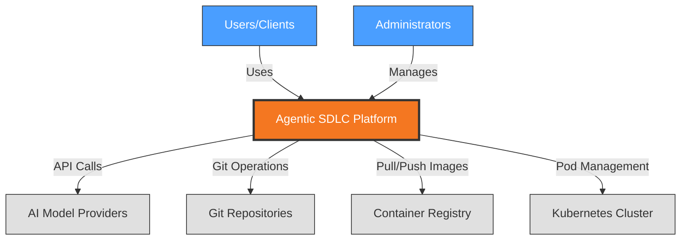
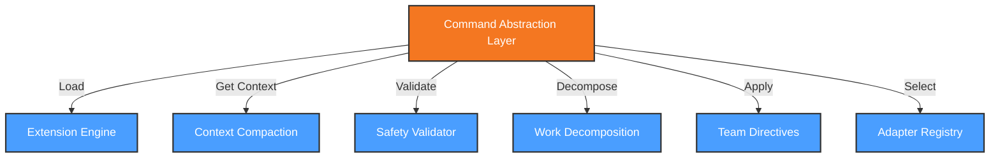
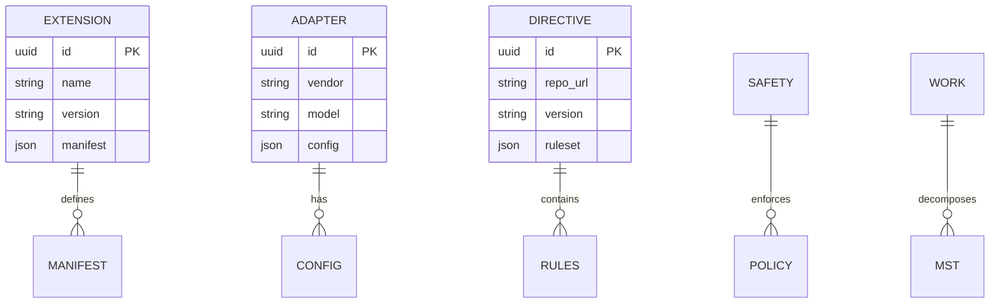
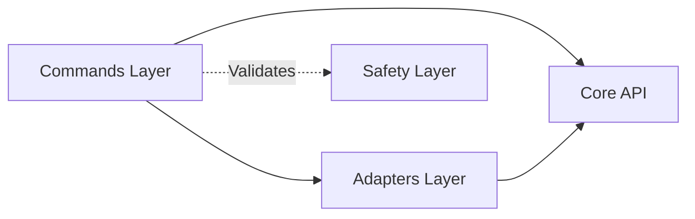
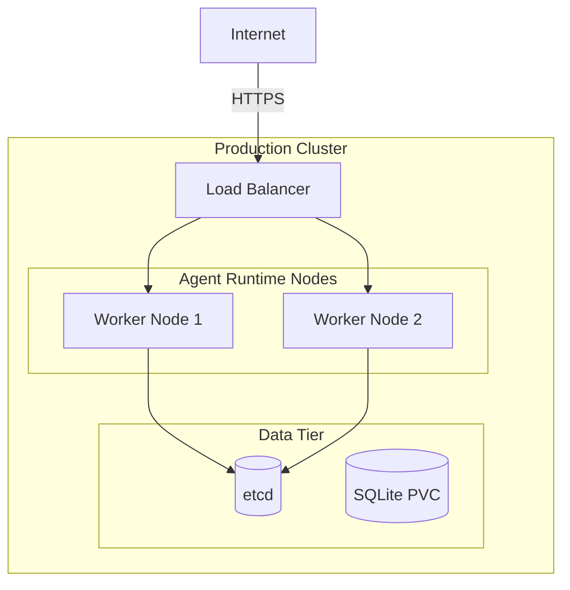

# Architecture Description: Agentic SDLC Platform

## 1. Document Information

| Property | Value |
|----------|-------|
| **Version** | 1.0.0 |
| **Date** | 2026-05-20 |
| **Status** | Accepted |
| **Authors** | Architecture Team |
| **ADRs Incorporated** | 25 Accepted ADRs |
| **Sub-systems** | 8 |
| **Views Generated** | 40 (5 views × 8 sub-systems) |

---

## 2. Architectural Goals & Constraints

### 2.1 Goals

1. **Multi-Agent Support**: Unified abstraction enabling Claude, GPT-4, Gemini, and other agents through adapter pattern
2. **Hybrid Infrastructure**: Seamless local (Docker) and remote (K8s) workspace experience with >90% feature parity
3. **Bimodal Interface**: Equal first-class support for CLI (developers) and Visual UI (non-developers)
4. **Safety Through Constraints**: Defense in depth with schema validation, policy enforcement, and audit trails
5. **Team AI Directives**: Version-controlled, forkable organizational AI knowledge

### 2.2 Constraints

- Context windows limited (32K-200K tokens) requiring graduated compaction
- Maximum 4 concurrent agents per constitution
- 3 retry attempts before human intervention
- Local workspaces <30s provisioning, remote <60s
- 100% round-trip fidelity between CLI and GUI

---

## 3. Architectural Views

### 3.1 Context View

**Purpose**: Define system scope and external interactions

The Agentic SDLC Platform provides AI-driven software development lifecycle management through a unified abstraction layer. The system integrates with AI model providers (Claude, GPT-4, Gemini), git repositories, container registries, Kubernetes clusters, and identity providers.

#### 3.1.1 System Scope

The platform implements:
- Multi-agent abstraction with vendor-specific adapters
- Extension-based architecture for customizable integrations
- Hybrid workspace provisioning (local Docker + remote K8s)
- Bimodal user interface (CLI + Visual UI)
- Context engineering for limited token windows
- Safety through schema-level constraints
- Three-level work decomposition (Milestone/Slice/Task)

#### 3.1.2 Stakeholders

| Stakeholder | Role | Key Concerns | Priority |
|-------------|------|--------------|----------|
| Software Developers | Primary Users | CLI efficiency, workflow automation | High |
| Non-Technical Users | Secondary Users | Visual UI simplicity, task visibility | High |
| Platform Architects | System Designers | Extension architecture, multi-agent support | Critical |
| Security Officers | Compliance | Data protection, audit trails | Critical |
| DevOps Engineers | Operations | Workspace provisioning, monitoring | Medium |

#### 3.1.3 External Entities

| Entity | Type | Interaction | Protocols |
|--------|------|-------------|-----------|
| AI Model Providers | External API | Code generation, analysis | REST/gRPC, HTTPS |
| Git Repositories | External System | Source control, specs | SSH/HTTPS |
| Container Registry | External System | Image distribution | HTTPS |
| Kubernetes Cluster | External System | Remote orchestration | HTTPS/TLS |
| Identity Provider | External Service | Authentication | OAuth2/OIDC |
| MCP Tool Providers | External API | Tool integration | Stdio/HTTP |

#### 3.1.4 Context Diagram



---

### 3.2 Functional View

**Purpose**: Describe functional elements, their responsibilities, and interactions

#### 3.2.1 Functional Elements

| Element | Responsibility | Interfaces | Dependencies |
|---------|----------------|------------|--------------|
| Command Abstraction Layer | Unified agent command interface | Agent commands | Adapter implementations |
| Extension Engine | Dynamic loading of extensions | Extension API | Extension registry |
| Context Compaction Service | Token optimization | Context retrieval | Storage, Cache |
| Safety Schema Validator | Multi-layer safety validation | Validation API | Policy engine |
| Work Decomposition Engine | MST hierarchy management | Task creation | Scheduler, Runner |
| Team Directives Manager | AI behavior guidance | Directive loading | Git integration |
| Adapter Registry | Vendor adapter management | Adapter registration | External AI APIs |

#### 3.2.2 Element Interactions



#### 3.2.3 Functional Boundaries

**System responsibilities:**
- Abstract multiple AI agents behind unified interface
- Load and manage extensions dynamically
- Optimize context for limited token windows
- Enforce safety through schema validation
- Decompose work into MST hierarchy with DAG dependencies
- Apply team-specific AI directives

**Out of scope:**
- Direct task execution (delegated to Runner)
- Workspace state storage (delegated to Storage)
- Git operations (delegated to Git Integration)
- UI rendering (delegated to User Interface)

---

### 3.3 Information View

**Purpose**: Describe data storage, management, and flow

#### 3.3.1 Data Entities

| Entity | Storage | Owner | Lifecycle | Access Pattern |
|--------|---------|-------|-----------|----------------|
| Extension Manifest | SQLite/JSON | Extension Engine | CRUD | Read-heavy |
| Adapter Configuration | SQLite | Adapter Registry | Update | Read-heavy |
| Directive Rules | Git + SQLite | Directives Manager | Versioned | Read-heavy |
| Safety Policy | SQLite | Safety Validator | Update | Read-heavy |
| Work Decomposition | SQLite | Work Engine | Update | Write-heavy |
| Context Cache | Memory + SQLite | Context Service | Transient | Read-heavy |

#### 3.3.2 Data Model



#### 3.3.3 Data Flow

1. **Extension Loading**: Registry → Manifest → Extension Engine → Runtime
2. **Command Processing**: CLI → Adapter Config → Command Abstraction → Context Cache
3. **Work Decomposition**: Spec → MST Hierarchy → Work Engine → Storage
4. **Safety Validation**: Input → Policy Rules → Safety Validator → Audit Log
5. **Directive Sync**: Git Repo → Ruleset → Directives Manager → SQLite Cache

---

### 3.4 Development View

**Purpose**: Constraints for developers - code organization, dependencies, CI/CD

#### 3.4.1 Code Organization

```text
packages/
├── core/                 # Core system logic
├── runner/              # K8s runner
├── workspaces/          # Workspace management
├── git/                 # Git integration
├── ui/                  # User interface
├── storage/             # Local storage
├── integration/         # MCP integration
└── desktop/             # Desktop application
```

#### 3.4.2 Technology Stack Mapping

| Functional Role | Technology | Version | ADR Reference |
|-----------------|------------|---------|---------------|
| Language | TypeScript | 6.x strict | ADR-102 |
| Database | SQLite | 3.45+ | ADR-106 |
| Node.js Driver | better-sqlite3 | v9.x | ADR-106 |
| CLI Framework | Commander.js | v12.x | ADR-018 |
| UI Framework | React | v19.x | ADR-107 |
| Desktop Shell | Electron | v33+ | ADR-104 |
| Build System | Vite + tsup | v8 / - | ADR-109 |
| Testing | Vitest | v2.x | ADR-110 |

#### 3.4.3 Module Dependencies



---

### 3.5 Deployment View

**Purpose**: Physical environment - nodes, networks, storage

#### 3.5.1 Runtime Environments

| Environment | Purpose | Infrastructure | Scale |
|-------------|---------|----------------|-------|
| Production | Live workspaces | Kubernetes (EKS/GKE) | 10-50 nodes |
| Staging | Pre-release testing | Kubernetes | 3-5 nodes |
| Development | Local development | Docker Desktop | 1 node |

#### 3.5.2 Network Topology



#### 3.5.3 Hardware Requirements

| Component | CPU | Memory | Storage |
|-----------|-----|--------|---------|
| Worker Node | 4 cores | 16GB | 100GB SSD |
| Control Plane | 2 cores | 4GB | 20GB SSD |
| Desktop App | 2 cores | 4GB | 500MB |

---

### 3.6 Sub-System Summary

| Sub-system | ADRs | Key Technologies | Deployment |
|------------|------|------------------|------------|
| System | ADR-004, 005, 008, 009, 010, 011 | TypeScript, SQLite, Zod | K8s + Desktop |
| Runner | ADR-006 | K8s client-node, BullMQ | Kubernetes |
| Workspaces | ADR-012, 013, 014, 016 | Dockerode, simple-git | Docker + K8s |
| Git Integration | ADR-017 | simple-git | Embedded |
| User Interface | ADR-018, 020 | React 19, Electron | Desktop app |
| Storage | ADR-106 | better-sqlite3 | Local SQLite |
| Integration | ADR-108 | MCP SDK | Embedded |
| Desktop | ADR-104, 105, 107 | Electron, Node.js v24 | Desktop app |

---

## 4. Architectural Perspectives

### 4.1 Security Perspective

#### 4.1.1 Authentication & Authorization

- **Identity Provider**: OAuth2/OIDC via external providers
- **Authorization Model**: RBAC for workspace access
- **Session Management**: Short-lived tokens with refresh

#### 4.1.2 Data Protection

- **Encryption at Rest**: SQLite on encrypted filesystem
- **Encryption in Transit**: TLS 1.3 for all external APIs
- **Secrets Management**: OS keychain (safeStorage)
- **PII Handling**: Data minimization, no PII in logs

#### 4.1.3 Threat Model

| Threat | Likelihood | Impact | Mitigation |
|--------|------------|--------|------------|
| AI API credential leak | Medium | High | OS keychain, no hardcoding |
| Workspace escape | Low | Critical | Container isolation, network policies |
| Extension malicious code | Medium | High | Extension sandboxing, code signing |
| Man-in-the-middle | Low | High | TLS everywhere, cert pinning |

### 4.2 Performance & Scalability Perspective

#### 4.2.1 Performance Requirements

| Metric | Target | Measurement |
|--------|--------|-------------|
| CLI Response | <100ms | Local commands |
| Workspace Provisioning | <30s local, <60s remote | Creation time |
| AI API Latency | <5s | Completion requests |
| Git Operations | <1s | Worktree operations |

#### 4.2.2 Scalability Model

- **Horizontal Scaling**: K8s HPA for runner pods
- **Caching Strategy**: Multi-tier (memory, SQLite, git)
- **Load Balancing**: ALB for API ingress
- **Resource Quotas**: Per-workspace limits enforced

### 4.3 Evolution Perspective

#### 4.3.1 Extension API Stability

- Versioned API for backward compatibility
- Deprecation notices 2 versions before removal
- Migration guides for breaking changes

#### 4.3.2 Technology Refresh

- React 19 foundation with upgrade path
- Electron LTS tracking
- Node.js v24 bundled, upgradeable

---

## 5. Architecture Decision Records Summary

### 5.1 Greenfield ADRs (Target Architecture)

| ID | Sub-System | Decision | Status |
|----|------------|----------|--------|
| ADR-004 | System | Multi-Agent Abstraction Layer | Accepted |
| ADR-005 | System | Extension-Based Architecture | Accepted |
| ADR-006 | Runner | K8s Subagent Pattern | Accepted |
| ADR-007 | Workspaces | Docker-Based OpenCode Server | Accepted |
| ADR-008 | System | Context Engineering | Accepted |
| ADR-009 | System | Safety Through Schema-Level Constraints | Accepted |
| ADR-010 | System | Three-Level Work Decomposition | Accepted |
| ADR-011 | Directives | Team AI Directives | Accepted |
| ADR-012 | Workspaces | Per-Workspace Pod Deployment | Accepted |
| ADR-013 | Workspaces | Git-Based Workspace Lifecycle | Accepted |
| ADR-014 | Workspaces | Dev Container Spec Tool Provisioning | Accepted |
| ADR-015 | Workspaces | Hybrid Client Extension | Accepted |
| ADR-016 | Workspaces | Hybrid Workspace Provisioning | Accepted |
| ADR-017 | Git Integration | Layered Git Strategy | Accepted |
| ADR-018 | User Interface | Bimodal Interface | Accepted |
| ADR-019 | Agent Runtime | Marker-Based DAG Orchestration | Proposed |
| ADR-020 | User Experience | Desktop Application Architecture | Accepted |

### 5.2 Brownfield ADRs (Actual Implementation)

| ID | Sub-System | Decision | Status |
|----|------------|----------|--------|
| ADR-101 | System | pnpm Workspace Monorepo | Accepted |
| ADR-102 | System | TypeScript-First Development | Accepted |
| ADR-103 | System | Modular App/Package Separation | Accepted |
| ADR-104 | Desktop | Electron with Embedded Daemon | Accepted |
| ADR-105 | Communication | JSON-RPC over Unix Socket | Accepted |
| ADR-106 | Storage | SQLite for Local Data | Accepted |
| ADR-107 | Web | React 19 with Radix UI | Accepted |
| ADR-108 | Integration | Model Context Protocol (MCP) | Accepted |
| ADR-109 | Build | Vite + tsup Build Pipeline | Accepted |
| ADR-110 | Testing | Vitest Unit Testing | Accepted |

---

## 6. Tech Stack Summary

### 6.1 Core Technologies

| Category | Technology | Purpose |
|----------|------------|---------|
| Language | TypeScript 6.x | Type-safe development |
| Runtime | Node.js v24 | Server-side execution |
| Database | SQLite 3.45+ | Local data persistence |
| Desktop | Electron v33+ | Cross-platform desktop app |
| UI | React 19 | Component-based UI |
| Styling | Tailwind CSS v3.4 | Utility-first CSS |
| Components | Radix UI + shadcn/ui | Accessible primitives |

### 6.2 Infrastructure Technologies

| Category | Technology | Purpose |
|----------|------------|---------|
| Containers | Docker | Local workspace isolation |
| Orchestration | Kubernetes | Remote workspace management |
| Git | git 2.40+ | Version control |
| Protocol | MCP v1.x | Tool integration standard |

### 6.3 Development Tools

| Category | Technology | Purpose |
|----------|------------|---------|
| Build | Vite 8 + tsup | Fast builds |
| Testing | Vitest 2.x | Unit testing |
| E2E | Playwright | Browser testing |
| Package Manager | pnpm | Workspace management |
| Linting | ESLint + Prettier | Code quality |

---

## Appendix A: View File Locations

All detailed views are available in:
```
.specify/architect/views/
├── system/
│   ├── context.md
│   ├── functional.md
│   ├── information.md
│   ├── development.md
│   └── deployment.md
├── runner/
│   ├── context.md
│   ├── functional.md
│   ├── information.md
│   ├── development.md
│   └── deployment.md
├── workspaces/
│   ├── context.md
│   ├── functional.md
│   ├── information.md
│   ├── development.md
│   └── deployment.md
├── git-integration/
│   ├── context.md
│   ├── functional.md
│   ├── information.md
│   ├── development.md
│   └── deployment.md
├── user-interface/
│   ├── context.md
│   ├── functional.md
│   ├── information.md
│   ├── development.md
│   └── deployment.md
├── storage/
│   ├── context.md
│   ├── functional.md
│   ├── information.md
│   ├── development.md
│   └── deployment.md
├── integration/
│   ├── context.md
│   ├── functional.md
│   ├── information.md
│   ├── development.md
│   └── deployment.md
└── desktop/
    ├── context.md
    ├── functional.md
    ├── information.md
    ├── development.md
    └── deployment.md
```

---

*This Architecture Description was generated from 25 Accepted ADRs using the Rozanski & Woods Viewpoints and Perspectives framework.*

*Generated: 2026-05-20*
