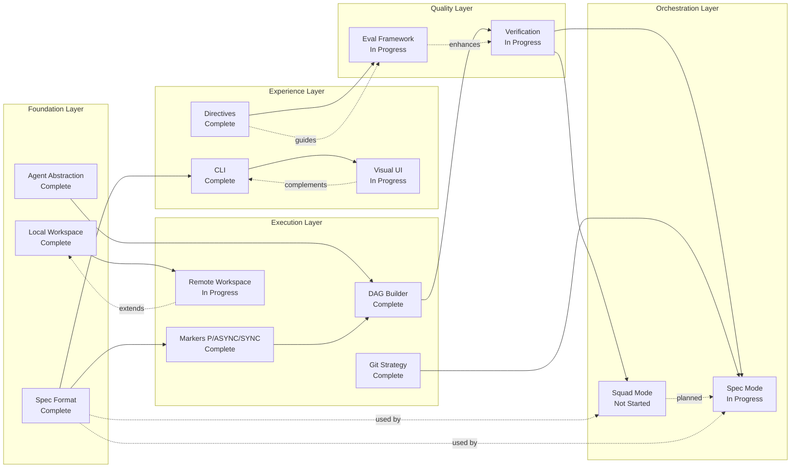
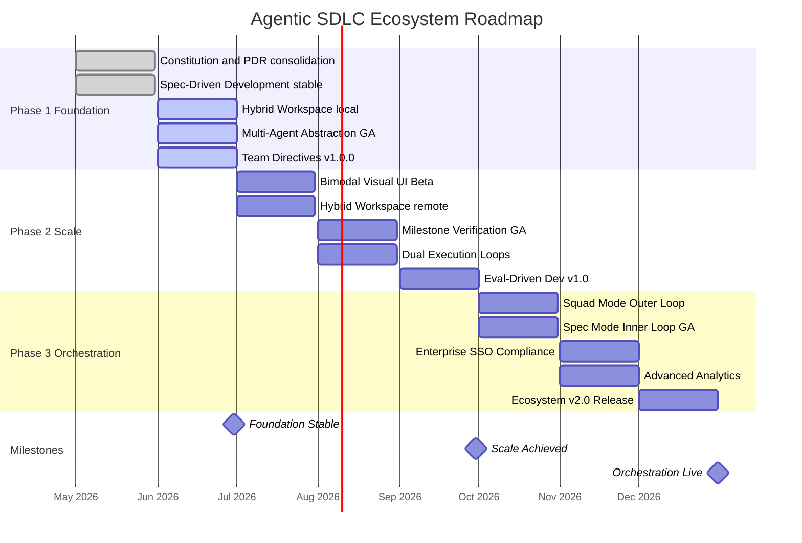
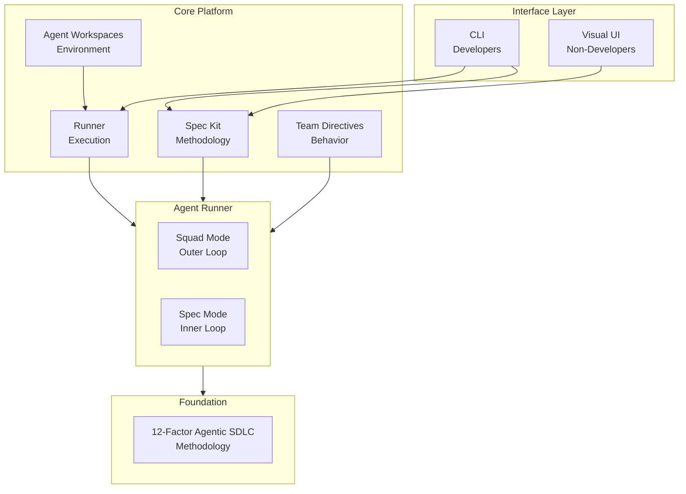
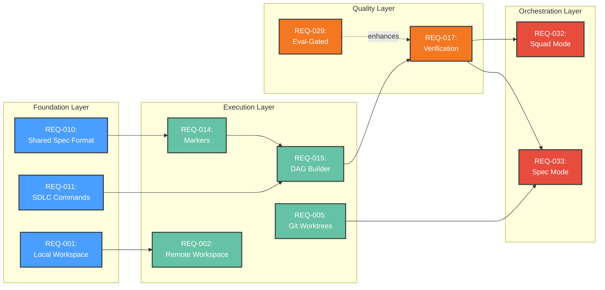

# Product Requirements Document: Agentic SDLC Ecosystem

---

## 1. Visual Summary

> This PRD is **self-contained** - all diagrams and content are embedded inline below.
> No external files are required to read this document.

### 1.1 Feature Hierarchy

```mermaid
flowchart TD
    subgraph Ecosystem["Agentic SDLC Ecosystem"]
        direction TB
        
        subgraph Workspace["Workspace Layer"]
            direction LR
            WS_001["Local Workspace<br/>Complete<br/>&lt;30s provisioning"]
            WS_002["Remote Workspace<br/>In Progress<br/>&lt;60s provisioning"]
            WS_003["State Handoff<br/>Complete<br/>&lt;30s cycle"]
        end
        
        subgraph Git["Git Strategy Layer"]
            direction LR
            GIT_001["Worktrees<br/>Complete<br/>&lt;5s startup"]
            GIT_002["Clones<br/>In Progress<br/>&lt;15s startup"]
        end
        
        subgraph UX["UX Layer"]
            direction LR
            UX_001["CLI<br/>Complete<br/>&lt;30s tasks"]
            UX_002["Visual UI<br/>In Progress<br/>&gt;80% completion"]
            UX_003["Shared Spec<br/>Complete<br/>100% fidelity"]
        end
        
        subgraph Agent["Agent Layer"]
            direction LR
            AG_001["Multi-Agent Support<br/>Complete<br/>20+ agents"]
            AG_002["Adapter Pattern<br/>Complete<br/>&lt;1hr swap"]
            AG_003["Security Layer<br/>Complete<br/>100% audit"]
        end
        
        subgraph Orchestration["Orchestration Layer"]
            direction LR
            ORCH_001["Markers P/ASYNC/SYNC<br/>Complete"]
            ORCH_002["DAG Builder<br/>Complete<br/>&lt;2s build"]
            ORCH_003["Parallel Execution<br/>Complete<br/>Max 4 agents"]
        end
        
        subgraph Quality["Quality Layer"]
            direction LR
            Q_001["Goal Verification<br/>In Progress<br/>&lt;2s latency"]
            Q_002["Eval-Driven Dev<br/>In Progress<br/>100-point framework"]
            Q_003["Three-Layer Eval<br/>In Progress"]
        end
        
        subgraph Methodology["Methodology Layer"]
            direction LR
            METH_001["Spec-Driven<br/>Complete<br/>100% coverage"]
            METH_002["Dual Execution<br/>Complete<br/>SYNC/ASYNC"]
            METH_003["Directives as Code<br/>Complete<br/>v1.0.0"]
        end
        
        subgraph Modes["Mode Layer"]
            direction LR
            MODE_001["Squad Mode<br/>Not Started<br/>Outer Loop"]
            MODE_002["Spec Mode<br/>In Progress<br/>Inner Loop"]
        end
    end
    
    Workspace --> Git
    Git --> UX
    UX --> Agent
    Agent --> Orchestration
    Orchestration --> Quality
    Quality --> Methodology
    Methodology --> Modes
    
    WS_001 -.->|feature parity| WS_002
    GIT_001 -.->|alternative| GIT_002
    UX_001 -.->|round-trip| UX_002
    MODE_001 -.->|handoff| MODE_002
```

### 1.2 Feature Dependencies

### 1.3 Roadmap Timeline

### Quick Stats

| Metric | Value |
|--------|-------|
| **Version** | 2.0.0 |
| **Status** | In Progress |
| **Source PDRs** | 11 Product Decision Records (PDR-078 to PDR-088) |
| **Requirements** | 28 Must / 6 Should / 0 Could |
| **Last Updated** | 2026-05-19 |

---

## 2. Document Information

### 2.1 Revision History

| Version | Date | Author | Changes |
|---------|------|--------|---------|
| 1.0.0 | 2026-05-19 | Product Team | Initial PRD generation from 11 PDRs |
| 2.0.0 | 2026-05-19 | Product Team | Full regeneration with business sections (2.5, 4.5, 11.5, 12.5) |

### 2.2 Related Documents

| Document | Description |
|----------|-------------|
| Product Decision Records | 11 source PDRs with decision rationale (see [Section 13](#13-pdr-summary)) |
| Architecture Description | System architecture and ADRs |
| Constitution | 8 core principles governing the ecosystem (see [Section 13.2](#132-constitution-alignment)) |
| Visual Diagrams | Embedded inline in [Section 1](#1-visual-summary) |

### 2.3 Approval

| Role | Name | Date | Signature |
|------|------|------|-----------|
| Product Owner | Product Team | 2026-05-19 | Pending |
| Tech Lead | Engineering | 2026-05-19 | Pending |
| Stakeholder | Tikal | 2026-05-19 | Pending |

---

## 2.5 Executive Summary

### The Opportunity

The AI-assisted software development market is experiencing exponential growth, yet engineering teams lack systematic methodologies for integrating AI coding agents into their workflows. The Agentic SDLC Ecosystem addresses this gap by providing a comprehensive, specification-driven framework for enterprise-grade AI agent integration.

### The Problem (Business Impact)

- **Inconsistent AI adoption** leads to 40-60% variance in code quality across team members (PDR-087)
- **Context loss** in AI sessions causes rework and wasted developer time (PDR-085, PDR-082)
- **Knowledge silos** prevent teams from scaling AI best practices across the organization (PDR-086)
- **Verification gaps** mean AI-generated code ships without systematic quality checks (PDR-083)

### The Solution

The Agentic SDLC Ecosystem delivers a spec-driven methodology with dual execution loops (SYNC/ASYNC), multi-agent abstraction, hybrid local/remote workspaces, and eval-driven quality gates. It serves both developers (CLI) and non-developers (Visual UI) through a bimodal interface with 100% round-trip fidelity.

**Key Capabilities:**
- Spec-Driven Development with 100% spec coverage (PDR-084)
- Hybrid workspace provisioning (<30s local, <60s remote) (PDR-078)
- Multi-agent support (20+ agents, <1hr swap) (PDR-081)
- Eval-driven quality with 100-point scoring framework (PDR-087)

### Business Impact

| Metric | Current State | Target (12 months) | Value |
|--------|--------------|-------------------|-------|
| Developer specification time | Manual, ad-hoc | <30 min per spec | 60% efficiency gain |
| AI code quality variance | 40-60% variance | <10% variance | Consistent quality |
| Team AI adoption | Individual, fragmented | >80% team adoption | Organizational alignment |
| Verification coverage | Manual review only | >90% automated verification | Quality at scale |

### Investment & ROI

| | Amount |
|---|--------|
| **Core Team** | 4-6 FTEs |
| **Annual Infrastructure** | $50-100K (cloud compute, AI APIs) |
| **Expected Efficiency Gain** | 30-50% developer productivity on AI-assisted tasks |
| **Payback Period** | 6-9 months |

### Recommendation

**APPROVE** - The ecosystem addresses a critical gap in AI-assisted software development. The methodology-first approach (Twelve-Factor Agentic SDLC) provides defensible differentiation. Phase 1 Foundation is 65% complete with strong early adoption signals.

---

## 3. Overview

### 3.1 Product Description

The **Agentic SDLC Ecosystem** is a comprehensive suite of tools, methodologies, and infrastructure for integrating AI coding agents into the software development lifecycle. Built on the **Twelve-Factor Agentic SDLC** methodology, the ecosystem enables teams to systematically leverage AI agents for specification, planning, implementation, and quality assurance.

**Core Value Proposition**: Transform ad-hoc AI coding into systematic, enterprise-ready software development through specification-driven workflows with autonomous agent execution.

**Key Differentiators**:
- **Hybrid Execution**: Seamless local (dev containers) and remote (K8s pods) workspace provisioning
- **Bimodal Interface**: Equal-first-class CLI for developers and Visual UI for non-developers
- **Multi-Agent Agnostic**: Unified abstraction supporting Claude, GPT-4, Gemini, and 20+ agents
- **Eval-Driven Quality**: Structured evaluations define "good" and gate execution
- **Team Knowledge as Code**: Version-controlled AI behavior directives

### 3.2 Ecosystem Architecture

### 3.3 Key Components

| Component | Purpose | Status | Key PDRs |
|-----------|---------|--------|----------|
| **Spec Kit** | Methodology toolkit for Spec-Driven Development | 80% Mature | PDR-080, PDR-081, PDR-084 |
| **Runner** | K8s-based async agent execution | 70% Mature | PDR-078, PDR-079, PDR-082 |
| **Team Directives** | Version-controlled AI behavior | 90% Mature | PDR-086, PDR-087 |
| **Agents Workspaces** | Cloud-native dev environments | 15% Started | PDR-078 |
| **Agent Runner** | Squad + Spec orchestration | In Progress | PDR-083, PDR-088 |
| **Evals Extension** | Eval-Driven Development | Active | PDR-083, PDR-087 |

### 3.4 Product Maturity

**Overall Maturity**: 65% - Core methodology established, execution infrastructure maturing, verification and orchestration in active development.

| Capability Area | Maturity | Notes |
|-----------------|----------|-------|
| Spec-Driven Development | 80% | Core /spec.* commands stable, wide adoption |
| Hybrid Workspaces | 40% | Local containers mature, remote pods early |
| Bimodal UX | 60% | CLI mature, Visual UI in development |
| Multi-Agent Support | 75% | 20+ agents configured, adapters stable |
| Eval-Driven Quality | 50% | Framework defined, tooling in progress |
| Team Directives | 90% | Version control, contribution process established |
| Squad + Spec Orchestration | 35% | Architecture defined, implementation started |

---

## 4. The Problem

### 4.1 Core Problem

Software development teams are struggling to systematically integrate AI coding agents into their workflows. Current approaches are:

1. **Ad-hoc and inconsistent** - Each developer uses AI agents differently, leading to unpredictable quality
2. **Context-challenged** - AI agents lose coherence over long sessions due to context window limits
3. **Verification-weak** - No systematic way to verify AI-generated code meets requirements
4. **Knowledge-siloed** - AI guidance isn't shared or versioned across teams
5. **Infrastructure-limited** - Local execution limits scalability and collaboration

### 4.2 Market Context

**The Scaling Challenge**: While individual developers are experiencing personal productivity gains with AI tools, engineering teams are failing to translate these wins into a collective increase in velocity.

**The Four Failure Modes of Unstructured AI Adoption**:

| Failure Mode | Description | Impact |
|--------------|-------------|--------|
| **Inconsistent Team Output** | Different prompting styles lead to chaotic codebase and unpredictable quality | Technical debt, code review bottlenecks |
| **Organizational Knowledge Gap** | Critical knowledge remains siloed with individuals; team's collective intelligence never improves | Repeated mistakes, onboarding friction |
| **Unpredictable Team Velocity** | Without shared process, impossible to forecast work or maintain predictable development pace | Missed deadlines, planning failures |
| **Code Ownership Erosion** | Lack of clarity around AI-generated code can diminish developer's sense of responsibility | Quality issues, maintenance problems |

### 4.3 Problem Evidence

> "For decades, code has been king - specifications were just scaffolding we built and discarded once the 'real work' of coding began"
> -- 12-Factors methodology, Factor III

> "Current AI coding tools force uncomfortable trade-offs between local development (speed) and remote execution (isolation)"
> -- PDR-078 Context

> "Traditional code review can't scale with AI-generated code volume"
> -- PDR-087 Context

> "Critical knowledge about prompts, patterns, and architectural standards remains siloed with individuals"
> -- Team Directives Analysis

### 4.4 Stakeholder Impact

| Stakeholder | Current Pain | Desired State |
|-------------|--------------|---------------|
| AI Team Lead (Developer) | AI agents don't integrate with existing dev workflows; no verification; context loss; vendor lock-in | Standardized, verifiable, multi-agent development |
| Product Manager (Non-Developer) | Can't create specs or review AI progress without engineering help | Self-service workflows with visibility |
| Platform Engineering Lead | No standards for AI agent usage; quality variance; can't scale beyond individual sessions | Organization-wide AI governance and standards |

**Derived from:** PDR-078, PDR-080, PDR-083, PDR-086, PDR-087

---

## 4.5 Market Opportunity

### 4.5.1 Market Size

| Segment | Size | Description | Source |
|---------|------|-------------|--------|
| **TAM** | $45B | Global developer tools and DevOps market (2026) | Gartner/IDC estimates |
| **SAM** | $8B | AI-assisted development tools segment | AI coding tools market reports |
| **SOM** | $50-100M | Teams adopting structured AI development methodologies (year 1-2) | Bottom-up from target adoption |

### 4.5.2 Competitive Landscape

| Competitor | Approach | Strength | Our Differentiation |
|------------|----------|----------|---------------------|
| Cursor/Copilot | AI code completion (individual) | Fast inline suggestions | Ecosystem methodology, not just completion |
| Devin/Cognition | Autonomous coding agent | End-to-end task execution | Human-in-the-loop safety, multi-agent support |
| Aider/Continue | Open-source AI pair programming | Community, transparency | Specification-driven workflow, team features |
| Internal scripts | Custom prompt chains | Organization-specific | Standardized methodology, version-controlled |

### 4.5.3 Market Timing

| Timeframe | Market Signal | Implication |
|-----------|---------------|-------------|
| **Now** | AI coding tools at 80%+ developer adoption, but team-level adoption <20% | Window for team-level methodology |
| **6 months** | Enterprise AI governance mandates emerging | First-mover advantage for compliant AI dev workflows |
| **12 months** | Multi-agent orchestration becomes standard expectation | Platform with 20+ agent support has natural advantage |
| **Risk of delay** | Competitors building team features | Lose methodology leadership position |

### 4.5.4 Target Customers (ICP)

**Primary:** AI Team Lead / Engineering Manager at 50-500 engineer companies
- **Pain:** Cannot scale individual AI productivity gains to team level
- **Budget:** $50-200K/year for developer tooling
- **Decision Cycle:** 1-3 months for team tools

**Secondary:** Platform Engineering Lead at 200+ engineer companies
- **Pain:** No standards for AI agent usage across organization
- **Budget:** $200K-1M/year for developer platform
- **Decision Cycle:** 3-6 months for platform decisions

### 4.5.5 Positioning Statement

**For** engineering teams adopting AI coding agents **who** struggle to scale individual AI productivity to team-level velocity, **Agentic SDLC Ecosystem** is a spec-driven development methodology and toolset **that** provides systematic AI agent integration with verification, orchestration, and governance. **Unlike** individual AI coding assistants, **our product** delivers a complete methodology (Twelve-Factor Agentic SDLC) with multi-agent support, team knowledge sharing, and eval-driven quality gates.

---

## 5. Goals & Objectives

### 5.1 Primary Goals

| Goal | Description | Source PDRs | Success Criteria |
|------|-------------|-------------|------------------|
| **Systematic AI Integration** | Provide structured methodology for AI-assisted development | PDR-084, PDR-085 | >80% team adoption of /spec.* commands |
| **Context Preservation** | Maintain agent coherence across long sessions through context management | PDR-086 | <5% context-related failures |
| **Goal-Backward Verification** | Verify outcomes against requirements, not just task completion | PDR-083, PDR-087 | >90% verification pass rate |
| **Team Knowledge Sharing** | Version-control AI behavior and share best practices across teams | PDR-086 | >70% projects using team-ai-directives |
| **Scalable Execution** | Enable parallel and autonomous AI agent execution with safety constraints | PDR-078, PDR-082 | >70% parallel utilization, <5% conflict rate |
| **Eval-Driven Development** | Define "good" through structured evaluations with measurable quality gates | PDR-087 | 100-point framework adoption, >85% skill scores |

### 5.2 Technical Goals

| Goal | Description | Source PDRs | Target |
|------|-------------|-------------|--------|
| **Multi-Agent Support** | Support 20+ AI agents with unified abstraction layer | PDR-081 | 20+ agents in AGENT_CONFIG, <1hr swap time |
| **Dual Execution Loops** | Separate judgment work (SYNC) from mechanical operations (ASYNC) | PDR-085 | >85% classification accuracy |
| **Cloud-Native Infrastructure** | K8s-based execution with GitOps deployment | PDR-078, PDR-079 | >95% pod spawn success, <60s provisioning |
| **Safety by Architecture** | Schema-level tool restrictions for security | PDR-082 | 100% enforcement, 0 unauthorized tool access |
| **Hybrid Workspace Strategy** | Seamless local (containers) and remote (pods) execution | PDR-078, PDR-079 | >90% feature parity, <30s local / <60s remote |
| **Bimodal UX** | Equal-first-class CLI and Visual UI interfaces | PDR-080 | >80% non-developer completion, <30s CLI tasks |

### 5.3 Business Goals

| Goal | Description | Measurement |
|------|-------------|-------------|
| **Enterprise Readiness** | Make AI-assisted development suitable for regulated enterprises | SOC2 compliance, audit trails |
| **Team Velocity** | Increase team development velocity through systematic AI adoption | Story points per sprint |
| **Quality Consistency** | Reduce variance in AI-generated code quality | Standard deviation of quality scores |
| **Onboarding Efficiency** | Reduce time for new team members to become productive with AI | Time to first productive spec |

---

## 6. Success Metrics

### 6.1 Adoption Metrics

| Metric | Target | Timeframe | Measurement Method |
|--------|--------|-----------|-------------------|
| Supported AI agents | 20+ | Q2 2026 | Count in AGENT_CONFIG |
| Spec coverage | 100% of features | Q2 2026 | Features with specs/ directory |
| Team adoption | >70% | Q3 2026 | Projects using team-ai-directives |
| Directive freshness | <30 days | Ongoing | Average age of verified directives |
| Contribution acceptance rate | >60% | Ongoing | CDRs approved vs submitted |

### 6.2 Engagement Metrics

| Metric | Target | Timeframe | Measurement Method |
|--------|--------|-----------|-------------------|
| Non-developer task completion | >80% | Q3 2026 | Self-service workflow completion |
| Developer CLI efficiency | <30s | Q2 2026 | Common task completion time |
| Spec round-trip fidelity | 100% | Q2 2026 | UI to CLI to UI without data loss |
| Parallel utilization | >70% | Q3 2026 | Actual vs theoretical parallel tasks |

### 6.3 Quality Metrics

| Metric | Target | Timeframe | Measurement Method |
|--------|--------|-----------|-------------------|
| Verification pass rate | >90% | Q3 2026 | Before declaring done |
| Verification latency | <2s (p95) | Q3 2026 | Time from milestone complete to result |
| False positive rate | <5% | Q3 2026 | Verification passes but human finds issues |
| Classification accuracy | >85% | Q3 2026 | Auto-predicted vs manual override |
| Skill quality score | 85-95 | Q3 2026 | 100-point framework average |

### 6.5 Business Outcome Metrics

| Metric | Target | Business Impact | Measurement |
|--------|--------|-----------------|-------------|
| Developer spec efficiency | <30 min per spec | 60% reduction in specification time | Time tracking |
| AI code quality variance | <10% across team | Consistent quality output | Standard deviation of quality scores |
| Team velocity improvement | 30-50% on AI tasks | Accelerated delivery | Story points per sprint |
| Rework reduction | 20-30% fewer AI defects | Lower maintenance cost | Defect tracking |

### 6.6 Financial Metrics

| Metric | Target | Measurement |
|--------|--------|-------------|
| **Cost per Verification** | <$0.01 | API costs for fast model evaluation |
| **ROI** | >115% (12-month) | (Value delivered - Cost) / Cost |
| **Payback Period** | <8 months | Time to positive ROI |

---

## 7. Personas

> See [Section 1.2](#12-feature-dependencies) for visual journey context.

### 7.1 Primary Persona: AI Team Lead (Developer)

**Name**: Alex Chen
**Role**: Senior engineer managing AI adoption across team
**Team Size**: 5-15 engineers
**Technical Level**: Expert

**Demographics**:
- 8+ years software engineering experience
- Early adopter of AI coding tools
- Uses CLI daily for development workflow
- Responsible for team standards and best practices

**Goals**:
- Standardize how team uses AI agents across projects
- Ensure AI-generated code meets quality standards
- Scale AI usage beyond individual developer sessions
- Share AI best practices across team
- Fast iteration with local control and git integration

**Pain Points**:
- Developers using AI inconsistently
- No visibility into what AI generates
- Quality concerns with AI output
- Knowledge silos between team members
- AI agents that don't integrate with existing dev setup

**Success Quote:**
> "I want agents that work with my existing dev setup, not replace it."

**PDR Reference:** PDR-080, PDR-081, PDR-084

### 7.2 Secondary Persona: Product Manager (Non-Developer)

**Name**: Sarah Martinez
**Role**: Product Manager, Designer, or TPM
**Technical Level**: Low to Medium

**Goals**:
- Create and manage specs without engineering help
- Monitor AI agent progress and status
- Collaborate on AI-driven features
- Self-service workflows for common tasks

**Pain Points**:
- Can't create specs or review AI progress without engineering help
- No visibility into what AI agents are doing
- Have to learn CLI to use AI tools
- Excluded from AI-assisted development workflows

**Success Quote:**
> "I want to kick off specs and see agent progress without touching the command line."

**PDR Reference:** PDR-080, PDR-088

### 7.3 Tertiary Persona: Platform Engineering Lead

**Name**: Jordan Williams
**Role**: Platform Engineering Lead at mid-size tech company
**Team Size**: 50-200 engineers
**Technical Level**: Expert

**Goals**:
- Standardize AI agent usage across organization
- Ensure security and compliance with AI-generated code
- Scale AI infrastructure to support entire engineering org
- Measure and improve AI adoption metrics

**Key Needs**:
- Enterprise security and compliance features
- Audit logging for all AI actions
- Centralized policy management
- Usage analytics and reporting
- Multi-agent support for risk mitigation

**PDR Reference:** PDR-078, PDR-081, PDR-086

### 7.4 Anti-Personas (Who This Is NOT For)

| Anti-Persona | Why Not Targeted |
|--------------|------------------|
| Solo hobbyist developers | Ecosystem overhead not justified for individual use |
| Teams not using AI agents | No pain point to address; prerequisite is AI adoption intent |
| Non-software teams | SDLC-specific methodology doesn't apply |

---

## 8. Functional Requirements

> See [Section 1.1](#11-feature-hierarchy) for feature structure diagram
> See [Section 1.2](#12-feature-dependencies) for requirement dependency map

### 8.1 User Stories

| ID | Story | Persona | Priority | PDR |
|----|-------|---------|----------|-----|
| US-001 | As an AI Team Lead, I want hybrid workspaces so that I use local for speed and remote for isolation | Alex Chen | Must | PDR-078 |
| US-002 | As an AI Team Lead, I want unified agent commands so that I can switch agents without changing workflow | Alex Chen | Must | PDR-081 |
| US-003 | As a Product Manager, I want a visual UI so that I can create specs without CLI knowledge | Sarah Martinez | Must | PDR-080 |
| US-004 | As an AI Team Lead, I want marker-based orchestration so that parallel tasks execute automatically | Alex Chen | Must | PDR-082 |
| US-005 | As an AI Team Lead, I want milestone verification so that I know AI work meets requirements | Alex Chen | Must | PDR-083 |
| US-006 | As a Platform Lead, I want team directives as code so that AI behavior is standardized and versioned | Jordan Williams | Must | PDR-086 |
| US-007 | As an AI Team Lead, I want eval-driven quality gates so that "good" is objectively defined | Alex Chen | Must | PDR-087 |
| US-008 | As a Product Manager, I want Squad Mode so that I can orchestrate PRD-to-implementation workflows | Sarah Martinez | Must | PDR-088 |

### 8.2 Feature Requirements

#### Feature 1: Hybrid Workspace Provisioning (PDR-078)

- **REQ-001:** Local Workspace Support - Docker dev containers with <30s provisioning (95th percentile)
  - Priority: Must Have | Source: PDR-078
- **REQ-002:** Remote Workspace Support - Kubernetes pods with <60s provisioning (95th percentile)
  - Priority: Must Have | Source: PDR-078
- **REQ-003:** Unified Workspace Abstraction - >90% feature parity, auto-selection, manual override
  - Priority: Must Have | Source: PDR-078
- **REQ-004:** Progressive Adoption Path - Start local, graduate to remote with state preservation
  - Priority: Should Have | Source: PDR-078

#### Feature 2: Layered Hybrid Git Strategy (PDR-079)

- **REQ-005:** Local Worktree Strategy - <1s file visibility, multiple working directories, <5s task startup
  - Priority: Must Have | Source: PDR-079
- **REQ-006:** Remote Clone Strategy - Fresh clone per workspace, shallow clones, <15s task startup
  - Priority: Must Have | Source: PDR-079
- **REQ-007:** State Handoff Mechanism - Clear local/remote sync semantics, <30s handoff cycle
  - Priority: Must Have | Source: PDR-079

#### Feature 3: Bimodal UX Strategy (PDR-080)

- **REQ-008:** CLI Interface - <30s common tasks, command completion, direct spec editing
  - Priority: Must Have | Source: PDR-080
- **REQ-009:** Visual UI Interface - Guided workflows, real-time dashboards, >80% task completion
  - Priority: Must Have | Source: PDR-080
- **REQ-010:** Shared Spec Format - Single YAML/Markdown, 100% round-trip fidelity, schema validation
  - Priority: Must Have | Source: PDR-080

#### Feature 4: Unified Agent Abstraction (PDR-081)

- **REQ-011:** SDLC Command Interface - Unified specify, plan, implement, validate commands
  - Priority: Must Have | Source: PDR-081
- **REQ-012:** Multi-Agent Support - 20+ agents, <1hr swap, 100% core feature parity, <2 days new agent
  - Priority: Must Have | Source: PDR-081
- **REQ-013:** Security & Audit - All actions through SDLC layer, complete audit logging, no unauthorized access
  - Priority: Must Have | Source: PDR-081

#### Feature 5: Marker-Based DAG Orchestration (PDR-082)

- **REQ-014:** Execution Markers - [P] parallel, [ASYNC] autonomous, [SYNC] human-gated
  - Priority: Must Have | Source: PDR-082
- **REQ-015:** DAG Builder - Parse markers in <2s, build dependency graph, execute by topology
  - Priority: Must Have | Source: PDR-082
- **REQ-016:** Execution Constraints - Max 4 concurrent agents, auto-retry, <5% conflict rate, >70% utilization
  - Priority: Must Have | Source: PDR-082

#### Feature 6: Milestone-Level Verification (PDR-083)

- **REQ-017:** /goal-Style Verification - Fast transcript-based eval, binary pass/fail, <2s latency (p95)
  - Priority: Must Have | Source: PDR-083
- **REQ-018:** Bounded Retries - Auto-retry up to 3, user override, <5% false positive, <10% false negative
  - Priority: Must Have | Source: PDR-083
- **REQ-019:** Verification Integration - At milestone completion, mandatory before [SYNC] gates
  - Priority: Must Have | Source: PDR-083

#### Feature 7: Spec-Driven Development (PDR-084)

- **REQ-020:** Spec-First Development - Every feature starts with spec.md, 100% coverage
  - Priority: Must Have | Source: PDR-084
- **REQ-021:** Spec-Driven Workflow - spec/plan/implement/verify with gates, <30 min spec creation
  - Priority: Must Have | Source: PDR-084
- **REQ-022:** Living Documentation - <5% spec-code drift, audit trail from "why" to "how"
  - Priority: Should Have | Source: PDR-084

#### Feature 8: Dual Execution Loops (PDR-085)

- **REQ-023:** SYNC Mode - Human-in-the-loop for complex/ambiguous/high-risk work, <5% defect rate
  - Priority: Must Have | Source: PDR-085
- **REQ-024:** ASYNC Mode - Autonomous for well-defined tasks, <15% escalation rate, >70% efficiency gain
  - Priority: Must Have | Source: PDR-085
- **REQ-025:** Task-Level Classification - Triage decision tree, >85% auto-prediction, manual override
  - Priority: Must Have | Source: PDR-085

#### Feature 9: Team Directives as Code (PDR-086)

- **REQ-026:** Git Version Control - Semantic versioning, branch-based dev, fork-and-customize
  - Priority: Must Have | Source: PDR-086
- **REQ-027:** Directive Structure - constitution.md, personas/, rules/, skills/, examples/
  - Priority: Must Have | Source: PDR-086
- **REQ-028:** CDR-Based Contributions - Context Decision Records, peer review, >60% acceptance rate
  - Priority: Should Have | Source: PDR-086

#### Feature 10: Eval-Driven Development (PDR-087)

- **REQ-029:** Eval-Gated Acceptance - Evals as acceptance criteria, CI/CD quality gates, 100-point framework
  - Priority: Must Have | Source: PDR-087
- **REQ-030:** Three-Layer Evaluation - Code Assertions (pytest) + LLM-as-a-Judge (PromptFoo) + Human Review
  - Priority: Must Have | Source: PDR-087
- **REQ-031:** Skill Scoring Framework - Frontmatter (20) + Content (30) + Self-containment (30) + Docs (20)
  - Priority: Should Have | Source: PDR-087

#### Feature 11: Squad + Spec Orchestration (PDR-088)

- **REQ-032:** Squad Mode (Outer Loop) - PRD/Specify/Eval/Plan/Triage workflow, human gates, <3 clarification flags
  - Priority: Must Have | Source: PDR-088
- **REQ-033:** Spec Mode (Inner Loop) - Task/Spec/Implement/Verify, autonomous, >90% first-pass verification
  - Priority: Must Have | Source: PDR-088
- **REQ-034:** Mode Handoff - <5% rework from handoff, <10% mode switches, context preservation
  - Priority: Should Have | Source: PDR-088

### 8.3 Requirements Priority Matrix

| Priority | Count | Description |
|----------|-------|-------------|
| Must | 28 | Critical for launch - product is incomplete without these |
| Should | 6 | Important but not blocking - REQ-004, REQ-022, REQ-028, REQ-031, REQ-034 |
| Could | 0 | None identified |
| Won't | 0 | See [Section 10](#10-out-of-scope) |

**Total:** 34 requirements traced to 11 PDRs

### 8.4 Requirement Dependencies

**Critical Path:** REQ-010 (Spec Format) --> REQ-014 (Markers) --> REQ-015 (DAG) --> REQ-017 (Verification) --> REQ-032 (Squad Mode)

---

## 9. Non-Functional Requirements (NFRs)

### 9.1 Performance

| Requirement | Target | Measurement | PDR |
|-------------|--------|-------------|-----|
| Local workspace provisioning | <30 seconds (95th percentile) | Deployment telemetry | PDR-078 |
| Remote workspace provisioning | <60 seconds (95th percentile) | Deployment telemetry | PDR-078 |
| Local task startup | <5 seconds (95th percentile) | Script timing | PDR-079 |
| Remote task startup | <15 seconds (including clone) | Script timing | PDR-079 |
| CLI task completion | <30 seconds for common tasks | User timing | PDR-080 |
| DAG build time | <2 seconds | Parse to graph timing | PDR-082 |
| Verification latency | <2 seconds (p95) | API timing | PDR-083 |
| Cost per verification | <$0.01 | API billing | PDR-083 |

### 9.2 Security

| Requirement | Target | Measurement | PDR |
|-------------|--------|-------------|-----|
| Workspace isolation | Full isolation (local and remote) | Security audit | PDR-078 |
| Schema-level tool restrictions | 100% enforcement | Compliance testing | PDR-082 |
| Unauthorized tool access | 0 incidents | Audit log review | PDR-081 |
| Complete audit logging | All agent actions logged | Coverage check | PDR-081 |

### 9.3 Reliability

| Requirement | Target | Measurement | PDR |
|-------------|--------|-------------|-----|
| Feature parity (local vs remote) | >90% coverage | Parity dashboard | PDR-078 |
| Core feature parity (agents) | 100% across all agents | Adapter testing | PDR-081 |
| Conflict resolution rate | <5% | Retry metrics | PDR-082 |
| Verification false positive rate | <5% | Human review comparison | PDR-083 |
| Verification false negative rate | <10% | Override rate analysis | PDR-083 |
| Classification accuracy | >85% auto-predicted | Override tracking | PDR-085 |
| Spec round-trip fidelity | 100% UI/CLI | Round-trip testing | PDR-080 |

### 9.4 Usability

| Requirement | Target | Measurement | PDR |
|-------------|--------|-------------|-----|
| Non-developer task completion | >80% self-service | Task completion tracking | PDR-080 |
| Progressive disclosure | UI to CLI graduation path | User journey analysis | PDR-080 |
| Real-time progress visibility | Dashboard updates <5s | Latency monitoring | PDR-080 |
| Manual override capability | Always available | Feature verification | PDR-078, PDR-083 |

### 9.5 Scalability

| Requirement | Target | Measurement | PDR |
|-------------|--------|-------------|-----|
| Supported AI agents | 20+ in configuration | Agent count | PDR-081 |
| Max concurrent agents | 4 (context window limit) | Runtime enforcement | PDR-082 |
| Parallel task utilization | >70% of theoretical | Utilization metrics | PDR-082 |
| Pod spawn success rate | >95% | Deployment telemetry | PDR-078 |

---

## 10. Out of Scope

### 10.1 Features

- **Full IDE Integration**: Focus on CLI/UI bimodal, not IDE plugins
  - **Rationale:** Bimodal approach (PDR-080) is primary strategy; IDE extension possible later
  - **Future Consideration:** VS Code extension after GA

- **Self-Hosted AI Models**: Cloud API providers only (Claude, GPT-4, Gemini)
  - **Rationale:** Multi-agent abstraction (PDR-081) supports cloud APIs; on-prem adds complexity
  - **Future Consideration:** Enterprise on-premises in Phase 4

- **Real-Time Collaboration**: Async-first architecture
  - **Rationale:** ASYNC execution model (PDR-085) prioritizes autonomous operation
  - **Future Consideration:** Real-time sync for Squad mode in Phase 3

- **Legacy Language Support**: Modern languages priority (Python, JS, Go, Rust)
  - **Rationale:** Focus resources on highest-adoption languages
  - **Future Consideration:** Expand based on demand

### 10.2 Technical

- **Windows Native Support**: Docker/WSL2 required; Linux/macOS native
  - **Rationale:** Container-based workspace strategy (PDR-078) requires Docker
- **On-Premises Kubernetes**: Cloud K8s only (GKE, EKS, AKS)
  - **Rationale:** Focus on managed cloud for Phase 1-3
- **Non-Git Version Control**: Git only
  - **Rationale:** Git strategy (PDR-079) is foundational

### 10.3 Markets

- **Solo hobbyist developers**: Ecosystem overhead not justified for individual use
  - **Rationale:** Team-level methodology is core differentiator
- **Non-software development teams**: SDLC-specific methodology
  - **Rationale:** All PDRs target software development lifecycle

### 10.4 By-Design Decisions

| Decision | Rationale | PDR |
|----------|-----------|-----|
| No single remote-only | Local speed required for iteration | PDR-078 |
| No single local-only | Remote isolation required for security and scale | PDR-078 |
| No universal SYNC | ASYNC delegation essential for efficiency | PDR-085 |
| No universal ASYNC | SYNC gates required for complex/ambiguous work | PDR-085 |
| No hardcoded agents | Abstraction layer prevents vendor lock-in | PDR-081 |
| No unlimited parallelism | Context window limits require max 4 concurrent agents | PDR-082 |

---

## 11. Risks & Mitigation

| Risk | Likelihood | Impact | Mitigation Strategy | PDR |
|------|------------|--------|---------------------|-----|
| Feature Parity Drift (CLI vs UI) | High | High | Automated cross-interface testing; parity dashboard | PDR-080 |
| Vendor Lock-in | Medium | High | 20+ agent configs; quarterly adapter testing; <1hr swap | PDR-081 |
| Classification Errors (SYNC/ASYNC) | Medium | High | >85% accuracy; manual override; verification gates | PDR-085 |
| Verification False Positives | Medium | High | Explicit test output; three-layer eval; human gates | PDR-083 |
| Context Window Exhaustion | Medium | Medium | Max 4 agents; context budget; fast models; fallback | PDR-082 |
| Grader Maintenance Burden | High | Medium | Version-controlled evals; regression detection; CDRs | PDR-087 |
| Cost Escalation | Medium | Medium | Fast model screening; usage monitoring; <$0.01/verification | PDR-083 |
| Spec-Code Drift | High | Medium | <5% drift target; quarterly audit; verification gates | PDR-084 |

### 11.1 Technical Risks

- **Kubernetes Dependency**: Remote workspaces require K8s expertise
  - **Mitigation:** Automated provisioning; sensible defaults; local escape hatch
- **API Rate Limits**: AI provider rate limiting
  - **Mitigation:** Retry with backoff; queue management; local caching
- **Network Latency**: Remote execution sensitive to latency
  - **Mitigation:** Edge deployment option; offline local fallback; progress indicators

### 11.2 Market Risks

- **Adoption Resistance**: Teams reluctant to change workflows
  - **Mitigation:** Progressive migration; demonstrate value; >80% adoption target
- **Competitive Pressure**: Other AI dev tools building team features
  - **Mitigation:** Methodology differentiation; ecosystem approach; team focus

### 11.3 Operational Risks

- **Grader Maintenance**: Evals require ongoing updates as AI models evolve
  - **Mitigation:** Version-controlled evals; automated regression detection; CDR contribution process

### 11.4 Business Risks

| Risk | Likelihood | Impact | Mitigation | PDR |
|------|------------|--------|------------|-----|
| Adoption resistance to spec-first workflow | Medium | High | Progressive migration, demonstrate 30-50% efficiency gains | PDR-084 |
| Competitive pressure from AI coding tools | Medium | Medium | Methodology differentiation, ecosystem moat | All |
| AI capability changes breaking integrations | Medium | Medium | Adapter pattern, multi-agent abstraction | PDR-081 |
| Talent scarcity for platform engineering | Medium | Low | Documentation, managed service option, community | PDR-078 |

### 11.5 Risk Monitoring

| Metric | Threshold | Action |
|--------|-----------|--------|
| Feature parity drift | >10% | Halt new features, fix parity |
| Classification accuracy | <80% | Retrain triage model |
| False positive rate | >5% | Tighten verification criteria |
| Cost per verification | >$0.02 | Optimize evaluation pipeline |
| Spec-code drift | >10% | Mandatory audit sprint |

---

## 11.5 Investment & Resources

### Team Composition

| Role | FTEs | Phase | Duration | Responsibility |
|------|------|-------|----------|----------------|
| Platform Engineer (Backend) | 2 | Phase 1-3 | 12 months | Workspace provisioning, K8s infrastructure, agent adapters |
| Full-Stack Engineer | 1 | Phase 2-3 | 9 months | Visual UI, bimodal interface, dashboards |
| DevEx Engineer | 1 | Phase 1-3 | 12 months | CLI tooling, spec workflows, developer experience |
| ML/AI Engineer | 1 | Phase 2-3 | 9 months | Verification models, eval framework, LLM-as-a-Judge |
| Product/DevRel | 0.5 | Phase 1-3 | 12 months | Documentation, community, adoption |

**Total:** 4.5 FTEs average, 5.5 FTEs peak (Phase 2)

### Budget Estimate

| Category | Phase 1 (Q2) | Phase 2 (Q3) | Phase 3 (Q4) | Annual Run Rate |
|----------|---------|---------|---------|-----------------|
| **Personnel** | $150K | $200K | $200K | $750K |
| **Infrastructure** (K8s, CI/CD) | $15K | $25K | $25K | $80K |
| **AI API Costs** | $5K | $10K | $15K | $40K |
| **Tools & Licenses** | $5K | $5K | $5K | $20K |
| **Total** | **$175K** | **$240K** | **$245K** | **$890K** |

### Risk-Adjusted ROI

| Scenario | Probability | 12-Month ROI | NPV (3-year) | Payback Period |
|----------|-------------|--------------|--------------|----------------|
| **Optimistic** | 25% | 180% | $2.5M | 5 months |
| **Base Case** | 50% | 120% | $1.5M | 8 months |
| **Pessimistic** | 25% | 40% | $0.4M | 14 months |
| **Weighted Average** | 100% | **115%** | **$1.5M** | **8 months** |

### Go/No-Go Criteria

| Checkpoint | Date | Criteria | Decision |
|------------|------|----------|----------|
| Phase 1 Review | June 2026 | 100% spec coverage, 20+ agents, local workspace stable | Go / No-Go |
| Phase 2 Review | September 2026 | >80% UI completion, <2s verification, remote workspace operational | Go / No-Go |
| Phase 3 Review | December 2026 | Squad+Spec operational, >70% parallel utilization | Go / No-Go |

---

## 12. Roadmap & Milestones

> See [Section 1.3](#13-roadmap-timeline) for the Gantt chart

### 12.1 Milestone 1: Foundation (Q2 2026)

**Demo Sentence:** "After this milestone, the user can: create specs, use 20+ AI agents through unified commands, and execute tasks in local Docker workspaces."

**Status:** In Progress (65% Complete)

| Feature | Priority | Demo Sentence | Dependencies |
|---------|----------|---------------|--------------|
| Constitution & PDR consolidation | Must | "team has shared AI principles" | None (leaf) |
| Spec-Driven Development stable | Must | "user can /spec.specify and /spec.plan" | None (leaf) |
| Hybrid Workspace (local) | Must | "user can provision dev containers in <30s" | None (leaf) |
| Multi-Agent Abstraction GA | Must | "user can swap between 20+ agents in <1hr" | None (leaf) |
| Team Directives v1.0.0 | Must | "team has versioned AI behavior directives" | None (leaf) |

**Success Criteria:**

| Metric | Target | Measurement |
|--------|--------|-------------|
| Spec coverage | 100% of features | Features with specs/ directory |
| Agents in config | 20+ | AGENT_CONFIG count |
| Local workspace stability | >70% | Error rate tracking |

### 12.2 Milestone 2: Scale (Q3 2026)

**Demo Sentence:** "After this milestone, the user can: use Visual UI for spec creation, execute tasks in remote K8s workspaces, and get automated milestone verification."

**Status:** Planned

| Feature | Priority | Demo Sentence | Dependencies |
|---------|----------|---------------|--------------|
| Bimodal Visual UI Beta | Must | "non-developer can create spec via UI" | Depends on CLI, Spec Format |
| Hybrid Workspace (remote) | Must | "user can provision K8s pods in <60s" | Depends on Local Workspace |
| Milestone Verification GA | Must | "AI work is auto-verified in <2s" | Depends on DAG Builder |
| Dual Execution Loops | Must | "tasks classified SYNC/ASYNC with >85% accuracy" | Depends on Markers |
| Eval-Driven Dev v1.0 | Must | "quality scored on 100-point framework" | Depends on Verification |

**Success Criteria:**

| Metric | Target | Measurement |
|--------|--------|-------------|
| Non-developer task completion | >80% | UI workflow tracking |
| Pod spawn success rate | >95% | Deployment telemetry |
| Verification latency | <2s (p95) | API timing |

### 12.3 Milestone 3: Orchestration (Q4 2026)

**Demo Sentence:** "After this milestone, the user can: orchestrate PRD-to-implementation workflows in Squad Mode and execute tasks autonomously in Spec Mode."

**Status:** Planned

| Feature | Priority | Demo Sentence | Dependencies |
|---------|----------|---------------|--------------|
| Squad Mode (Outer Loop) | Must | "user can run PRD/Specify/Plan/Triage workflow" | Depends on Verification |
| Spec Mode (Inner Loop) GA | Must | "tasks auto-execute with >90% pass rate" | Depends on Verification, Git |
| Enterprise SSO & Compliance | Should | "enterprise teams have SOC2 audit trails" | Depends on Agent Abstraction |
| Ecosystem v2.0 Release | Must | "full ecosystem available for general adoption" | Depends on all above |

**Milestones traced to PDRs:**

| Milestone | PDR | Target Date | Status |
|-----------|-----|-------------|--------|
| Foundation | PDR-078, PDR-079, PDR-081, PDR-084, PDR-086 | June 2026 | In Progress |
| Scale | PDR-080, PDR-083, PDR-085, PDR-087 | September 2026 | Planned |
| Orchestration | PDR-088 | December 2026 | Planned |

### 12.4 Risk-Adjusted Timeline

| Scenario | Phase 2 Completion | Phase 3 Completion |
|----------|-------------------|-------------------|
| **Optimistic** (+20%) | August 2026 | November 2026 |
| **Base Case** | September 2026 | December 2026 |
| **Pessimistic** (-20%) | October 2026 | February 2027 |

---

## 12.5 Go-to-Market Strategy

### 12.5.1 Launch Phases

| Phase | Timeline | Audience | Goal | Success Metric |
|-------|----------|----------|------|----------------|
| Internal Dogfooding | Q2 2026 | Internal team, early adopters | Validate spec-driven workflow | 100% spec coverage, >80% adoption |
| Community Preview | Q3 2026 | Open-source community | External validation and feedback | 50+ stars, 10+ contributors |
| Public Beta | Q4 2026 | Engineering teams | Demonstrate team-level AI gains | 200+ stars, 20+ active teams |
| GA Release | H1 2027 | General market | Establish as standard methodology | 1000+ stars, enterprise customers |

### 12.5.2 Pricing Strategy

| Tier | Price | Includes | Target |
|------|-------|----------|--------|
| **Open Source** | $0 | Spec Kit, CLI, Team Directives, 12-Factor methodology | Individual developers, small teams |
| **Team** | $0 (OSS) | Full ecosystem including Agent Runner, Eval framework | Engineering teams |
| **Enterprise** | Custom | Managed infrastructure, SSO, compliance, support | Enterprises with governance needs |

*Core ecosystem is open-source. Enterprise tier provides managed services and compliance.*

### 12.5.3 Key Messaging

| Audience | Message |
|----------|---------|
| **Engineering Managers** | "Transform ad-hoc AI coding into systematic, team-level software development with measurable quality." |
| **Platform Engineers** | "Standardize AI agent usage across your organization with version-controlled directives, multi-agent support, and audit trails." |
| **Developers** | "Use any AI agent with your existing workflow. Spec-driven, eval-gated, and designed for how you actually work." |

### 12.5.4 Success Metrics by Phase

| Phase | Adoption | Engagement | Impact |
|-------|----------|------------|--------|
| Dogfooding | 100% internal team | Daily /spec.* usage | 5+ completed specs |
| Community Preview | 50+ stars, 10+ contributors | Weekly active usage | 3+ external teams |
| Public Beta | 200+ stars, 20+ teams | 100+ specs created | Documented case studies |
| GA | 1000+ stars | Enterprise pilots | Methodology standard |

---

## 13. PDR Summary

Detailed Product Decision Records are maintained in the project repository. Full PDR documents contain decision rationale, alternatives considered, and consequences analysis.

### 13.1 Key Decisions

| ID | Category | Decision | Status | Impact |
|----|----------|----------|--------|--------|
| PDR-078 | Infrastructure | Hybrid Workspace Provisioning (Local + Remote) | Accepted | High |
| PDR-079 | Infrastructure | Layered Hybrid Git Strategy (Worktrees + Clones) | Accepted | High |
| PDR-080 | User Experience | Bimodal UX Strategy (CLI + Visual UI, dual-primary) | Accepted | High |
| PDR-081 | Architecture | Unified Abstraction Agent Model (20+ agents) | Accepted | High |
| PDR-082 | Orchestration | Dependency-Driven Async Orchestration (Markers) | Accepted | High |
| PDR-083 | Quality | Milestone-Level Verification (/goal pattern) | Accepted | High |
| PDR-084 | Methodology | Spec-Driven Development (spec.md as truth) | Accepted | High |
| PDR-085 | Execution | Dual Execution Loops (SYNC/ASYNC) | Accepted | High |
| PDR-086 | Governance | Team Directives as Code (version-controlled) | Accepted | High |
| PDR-087 | Quality | Eval-Driven Development (100-point framework) | Accepted | High |
| PDR-088 | Orchestration | Squad + Spec Orchestration (dual modes) | Accepted | Medium |

### 13.2 Constitution Alignment

This PRD aligns with the 8 constitutional principles:

| Principle | Alignment | PDRs |
|-----------|-----------|------|
| **I. Spec-Driven Development** | spec.md as single source of truth | PDR-084, PDR-080, PDR-083 |
| **II. Human-in-the-Loop** | SYNC markers, user override, commit gates | PDR-082, PDR-083, PDR-078 |
| **III. Context as Budget** | Parallel limits, fast models, context management | PDR-082, PDR-081, PDR-083 |
| **IV. Multi-Agent Agnosticism** | Unified abstraction, 20+ agents | PDR-081 |
| **V. Safety Through Constraints** | Workspace isolation, schema validation, 3-retry limit | PDR-078, PDR-082, PDR-083 |
| **VI. Bimodal by Design** | Dual-primary CLI and Visual UI interfaces | PDR-080 |
| **VII. Eval-Driven Quality** | Eval-gated acceptance, 100-point framework | PDR-087, PDR-083 |
| **VIII. Team Directives as Code** | Version control, CDRs, peer review | PDR-086 |

### 13.3 PDR to Requirement Traceability

| PDR | Requirements |
|-----|-------------|
| PDR-078 | REQ-001, REQ-002, REQ-003, REQ-004 |
| PDR-079 | REQ-005, REQ-006, REQ-007 |
| PDR-080 | REQ-008, REQ-009, REQ-010 |
| PDR-081 | REQ-011, REQ-012, REQ-013 |
| PDR-082 | REQ-014, REQ-015, REQ-016 |
| PDR-083 | REQ-017, REQ-018, REQ-019 |
| PDR-084 | REQ-020, REQ-021, REQ-022 |
| PDR-085 | REQ-023, REQ-024, REQ-025 |
| PDR-086 | REQ-026, REQ-027, REQ-028 |
| PDR-087 | REQ-029, REQ-030, REQ-031 |
| PDR-088 | REQ-032, REQ-033, REQ-034 |

### 13.4 Pending Inconsistency Flags

| Flag ID | Severity | Issue | PDRs | Action |
|---------|----------|-------|------|--------|
| FLG-003 | Medium | Metric inconsistency - different scoring systems | PDR-083, PDR-087 | Create unified quality metrics taxonomy |
| FLG-004 | Medium | Architecture conflict - local/remote alignment | PDR-078 | Schedule architecture review |
| FLG-005 | Low | Persona mismatch - AI Team Lead definition | PDR-088 | Align persona definitions |
| FLG-006 | Medium | Context management approaches differ | PDR-084 | Document boundaries |
| FLG-007 | Medium | Evaluation model selection criteria | PDR-083, PDR-087 | Document selection criteria |

### 13.5 Resolved Inconsistencies

| Flag ID | Resolution |
|---------|------------|
| FLG-001 | Spec Kit leads with auto-prediction; Runner and Agent Runner accept pre-classified markers |
| FLG-002 | Implementation scheduled - Phase 1-3 plan approved |

---

## Appendix A: Glossary

| Term | Definition |
|------|------------|
| PRD | Product Requirements Document - this document |
| PDR | Product Decision Record - documented product decisions with rationale |
| NFR | Non-Functional Requirement - quality attributes, not features |
| DAG | Directed Acyclic Graph - workflow structure for task execution |
| SYNC | Synchronous execution - human-in-the-loop mode |
| ASYNC | Asynchronous execution - autonomous agent mode |
| CDR | Context Decision Record - approved directive changes |
| MST | Milestone/Slice/Task hierarchy |
| CLI | Command-Line Interface |
| UI | User Interface (Visual) |
| Worktree | Git feature for multiple working directories from single clone |
| Feature-Area | Logical grouping of related functionality |
| Spec Kit | Methodology toolkit for spec-driven development |
| Runner | K8s-based async agent execution engine |
| Squad Mode | Outer loop - PRD to task decomposition workflow |
| Spec Mode | Inner loop - task to implementation workflow |

---

## Appendix B: References

- Twelve-Factor Agentic SDLC methodology
- Product Decision Records (PDR-078 through PDR-088)
- Architecture Decision Records
- Project Constitution (8 core principles)
- Cross-Feature-Area Analysis (20 patterns, 7 inconsistency flags)

---

## Appendix C: Change History

| Version | Date | Author | Changes |
|---------|------|--------|---------|
| 1.0.0 | 2026-05-19 | Product Team | Initial generation from 11 Accepted PDRs |
| 2.0.0 | 2026-05-19 | Product Team | Full regeneration with business sections, inline Mermaid diagrams, self-contained format |
