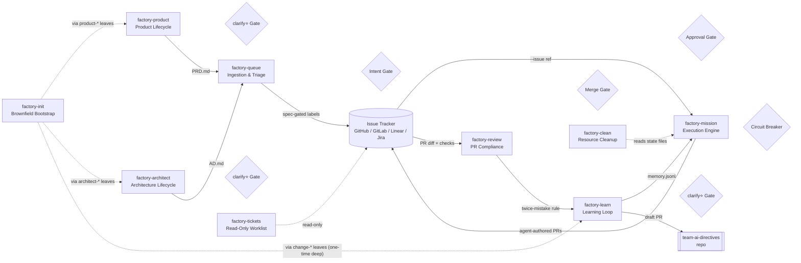

# adlc-team-skills

Agent skills that give coding agents your team's context at session start,
so they stop working like strangers.

## Table of contents

- [How it works](#how-it-works)
- [The problems these skills solve](#the-problems-these-skills-solve)
- [Install](#install)
- [The basic workflow](#the-basic-workflow)
- [The software factory](#the-software-factory)
- [Universal orchestration](#universal-orchestration)
- [What's inside](#whats-inside)
- [Philosophy](#philosophy)
- [When something goes wrong](#when-something-goes-wrong)
- [Security](#security)
- [Contributing](#contributing)
- [Reference details](#reference-details)
- [Release process](#release-process)
- [License](#license)

## How it works

It starts the moment you open a session. `team-boot` fires via the
`session_start` event hook and injects a lean index of your team's rules —
roughly a hundred tokens of names and one-line descriptors. Not the rules
themselves. When the active task matches a rule, the agent pulls that
rule's full text on demand. A task touching SQL loads the SQL rule;
nothing else does.

The index lives in a git repo — your [team-ai-directives](https://github.com/tikalk/agentic-sdlc-team-ai-directives) —
versioned, reviewed by PR, shared by the whole team. No more personal
CLAUDE.md files that live on one machine, drift out of date, and don't
transfer between teammates or tools.

When you ask the agent to build something, it doesn't jump to code.
`mission-brief` forces a contract first — goal, constraints, non-goals,
success criteria — then walks `specify → plan → implement ↔ converge`, with
gates, a circuit breaker, resume, and an audit trail. When a session
surfaces a hard-won fix, `team-learn` extracts it as a Context
Directive Record (CDR), scores it by confidence, and publishes accepted
CDRs back to the team repo. Usage data and confidence scores live in
the `adlc` orphan branch — the next session starts smarter and CDRs
rank by real usage.

Verification, history, and tech selection have loops of their own.
When a rule or skill's behavior needs proof, the `evals-*` skills build
executable graders — binary checks where code can verify, LLM judges only
for what static checks can't — validated with holdout splits and TPR/TNR.
When you touch old code and wonder why it looks like this, `change-init`
mines git history for issue-linked commits and recovers the past-change
rationale as ChDRs. And when a tech choice comes up, `tech-radar-boot`
injects the Tikal Tech Radar's opinion — adoption ring, quadrant — before
the selection is captured as an ADR.

That session loop sits inside a bigger one: **the software factory**.
`factory-queue` triages incoming work, `factory-mission` executes it as
spec-gated missions in isolated worktrees, `factory-review` grades the
resulting PRs against policy-as-code, and `factory-learn` feeds what the
runs taught back into team-ai-directives — with human gates (⭐) at every
decision point. One platform: intake → mission → review → learning.

And because the skills trigger automatically from the index, you don't do
anything special once they're installed. Your coding agent just has your
team's context.

## The problems these skills solve

| # | Problem | Fixed by |
|--|--|--|
| 1 | The agent doesn't know how your team works | **`team-*`** — session-start index + on-demand rules |
| 2 | The agent guesses instead of asking | **`mission-brief`** — spec contract before code |
| 3 | The maker grades its own work | **`evals-*`** — binary graders, holdout splits, nothing auto-merges |
| 4 | Session learnings evaporate | **`team-learn`** — extract fixes as CDRs, publish to the team repo |
| 5 | Product and architecture decisions are invisible | **`product-*`** / **`architect-*`** — PDR→PRD, ADR→AD traceability |
| 6 | "Why was this changed?" is archaeology — rationale lives in nobody's head | **`change-*`** — ChDRs mined from git history's issue-linked commits |
| 7 | The agent picks tech by vibes, not team opinion | **`tech-radar-boot`** — radar context (adoption ring, quadrant) before the ADR |
| 8 | Rules pile up and rot | **`team-repair --build-to-delete`** — rules should shrink over time, not grow; mechanical rules promoted to deterministic CI checks (EVAL-010) |
| 9 | Accepted decisions linger in drafts, not memory | **Clarify-side promotion** — Accepted PDRs/ADRs move to memory on approval (atomic); `sweep_duplicates` catches leftovers; analyze flags duplicates as HIGH |

## Install

```bash
# One command: install skills + configure team-ai-directives (runs /team-setup interactively)
npx adlc-cli team setup tikalk/adlc-team-skills -a opencode

# Or just install skills (no team-setup)
npx adlc-cli skills add tikalk/adlc-team-skills -a opencode

# Or plain skills (no commands/events)
npx skills add tikalk/adlc-team-skills -a claude -g
```

Works with any agent supporting the [Agent Skills standard](https://agentskills.io) —
Claude Code, Codex, OpenCode, Cursor, Copilot, and others.

[`adlc-cli`](https://github.com/tikalk/adlc-cli) wraps `npx skills add`
and additionally generates `/name` slash commands and wires `session_start` event
hooks (via `.events.json`) for 9 coding agents. `team setup` also runs the
`/team-setup` skill via `agent run` to clone, link, or scaffold your
team-ai-directives repo. Skills repos without `.events.json`
get commands only.

**First run:** `team-boot` fires at session start. On an unconfigured project
it points you to `/team-setup`, which clones, links, or scaffolds your
team-ai-directives repo. `/team-constitution` fills in your principles.

**Using `agentic-sdlc-spec-kit` alongside this repo?** See
[Coexistence with Spec Kit](docs/spec-kit-integration.md) for the
conflict-free install flow.

## The basic workflow

1. **team-boot** — auto-runs at session start; injects the directives
   index. Full rules pulled on demand when the task matches.
2. **mission-brief** — before code, forces a spec contract, then walks
   `specify → plan → implement ↔ converge` with gates, circuit breaker,
   resume, audit trail.
3. **team-learn** — at session end, extracts hard-won fixes as CDRs +
   paired eval CDRs, scores confidence, batch-reviews them, and publishes
   accepted CDRs as a draft PR to team-ai-directives. Drafts and usage
   reports live in the `adlc` orphan branch (`drafts/cdr/` + `reports/`).
4. **team-repair --build-to-delete** — re-runs evals without a rule; if the
   model passes anyway, the rule is proposed for deletion.
   **team-repair --update-confidence** — aggregates usage data from the
   `adlc` branch into confidence scores and updates OKF frontmatter.

Product and architecture lifecycles run the same loop per record class:

```
Product:     product-specify|init → product-clarify (accept + promote to memory) → product-implement → product-analyze
Architecture: architect-specify|init → architect-clarify (accept + promote to memory) → architect-implement → architect-analyze
Team:        team-init → team-learn (extract + review + publish) → team-repair (--update-confidence)
Evals:       evals-init → evals-specify → evals-clarify → evals-implement → evals-validate
```

**Accepted PDRs/ADRs are promoted to memory on approval** — no gap between "Accepted in drafts" and "moved to memory". `sweep_duplicates` in implement catches leftovers from manual copy. `analyze` flags duplicates as HIGH severity.

**The agent checks the directives index before any task.** Skills trigger
automatically when the active task matches — mandatory lifecycle, not
suggestions.

Running the whole lifecycle unattended — intake, execution, review,
learning? The factory takes over from queue to PR: see
[The software factory](#the-software-factory).

## The software factory

The factory skills are the full outer loop of an agentic SDLC: they take a
brownfield repo from bootstrap all the way to merged, reviewed PRs — and
turn what each run learned into team memory. Every automated stage is
advisory; humans hold the gates (⭐).

```
 brownfield repo
        │
        ▼
┌─────────────────┐  unified bootstrap: product → architect → change
│  factory-init   │  tracks + PDR↔ADR↔ChDR↔code coverage matrix
└────────┬────────┘  (--refresh = recurring alignment sweep)
         │ PRD.md · AD.md · .adlc/memory/
         ▼
┌──────────────────────────┐  PDRs → PRD.md  ·  ADRs → AD.md
│ factory-product /        │  (clarify⭐ human gates)
│ factory-architect        │
└────────┬─────────────────┘
         │ Mission Brief (goal + constraints + success criteria)
         ▼
  Intent Gate ⭐  (human approves the brief; AI triage scores are advisory)
         │
         ▼
┌─────────────────┐  spec-gated into the tracker (the Q, single source of truth)
│  factory-queue  │
└────────┬────────┘
         │ --issue ref
         ▼
┌─────────────────┐  inner loop: specify → plan → implement ↔ converge
│ factory-mission │  (comment bus · worktrees · TDD test/code split · circuit breaker)
└────────┬────────┘
         │ agent-authored PR
         ▼
┌─────────────────┐
│ factory-review  │──▶ Merge Gate ⭐ (human code-owner approval)
└────────┬────────┘
         ▼
┌─────────────────┐  CDRs/ChDRs → team-ai-directives PR
│  factory-learn  │  workflow memories → memory.jsonl
└─────────────────┘
         │
         └─▶ back to factory-mission (memories)
             + team-boot (CDR index — closes the context loop)
```

What each station adds:

- **`factory-init`** — one command onboards an existing repo onto ADLC and
  emits the PDR↔ADR↔ChDR↔code coverage matrix (`--refresh` for the
  recurring alignment sweep).
- **`factory-queue`** — mission brief intake: AI-assisted advisory triage
  scoring, intent gate, gating label stamping, milestones/epics generation.
- **`factory-mission`** — the execution engine: spec-gated inner loop
  (specify → plan → implement ↔ converge) with tracker-agnostic integration,
  an inter-agent comment bus, worktree isolation, lease-based liveness,
  stall detection, and a mandated TDD test/code split (RED gate + GREEN gate,
  enforced at the skill level, not just the prompt level).
- **`factory-review`** — severity-ranked PR compliance against REVIEW.md
  policy-as-code; babysits agent PRs to merge, never auto-merges past the
  human gate. `--self-heal` runs a three-sub-agent converge loop
  (Review→Fix→Converge) with maker-checker separation and circuit breaker.
- **`factory-learn`** — retrospectives into team-ai-directives:
  build-to-delete pruning, promote-to-check for mechanical rules.
- **`factory-product` / `factory-architect`** — lifecycle coordinators
  maintaining PRD.md and AD.md with clarify⭐ gates.
- **`factory-tickets`** — read-only worklist across trackers, classified by
  next actionable move.
- **`factory-clean`** — resource inventory and reclamation, approval-gated.

<details>
<summary><strong>Detailed wiring</strong></summary>



</details>

## Universal orchestration

`mission-brief` doesn't force a proprietary ecosystem. At mission start it
scans installed skills directories, reads each `SKILL.md` frontmatter, and
hands the inventory to the subagent — the model picks the skill that fits
each step. Works alongside:

| Source | Examples |
|---|---|
| [mattpocock/skills](https://github.com/mattpocock/skills) | `/tdd`, `/grill-me`, `/code-review` |
| [addyosmani/agent-skills](https://github.com/addyosmani/agent-skills) | Exit-criteria checklists |
| [superpowers](https://github.com/obra/superpowers) | Workflow skills |
| spec-kit / [agentic-sdlc-spec-kit](https://github.com/tikalk/agentic-sdlc-spec-kit) / OpenSpec | SDD command frameworks |
| This repo | `product-specify`, `architect-specify`, `evals-validate`, `team-learn` |
| Your own | Anything following the `SKILL.md` standard |

## What's inside

### Team directives — every session, every user

- **`team-boot`** — session-start bootstrap; injects the always-relevant layer (constitution titles, CDR index ranked by confidence, Class Boots catalog, skills registry) and dispatches to per-class boots on demand. Auto-triggered; re-declared for `session_compact` so the index survives harness compaction. Also fires the session-end friction trigger for CDR capture.
- **`team-setup`** — clone, link, or scaffold a team-ai-directives repo.
- **`team-constitution`** — define or amend team principles interactively.
- **`team-discover`** — manual re-scan; structured match table (`/team-discover`).
- **`team-repair`** — re-index, conflict scan, freshness, `--build-to-delete`, deterministic-enforcement coverage check.
- **`team-skills`** — browse/install team skills from the directives repo.
- **`diagnosing-team-skills`** — evidence-first diagnosis when team context doesn't appear: walks the chain (init-options → jq → boot.sh → artifact sync) and routes injection-side bugs to adlc-cli.

### The software factory — the outer loop

- **`factory-init`** — unified brownfield bootstrap + PDR↔ADR↔ChDR↔code coverage matrix (`--refresh`).
- **`factory-queue`** — queue intake, AI advisory triage scoring, intent gate, milestone generation.
- **`factory-mission`** — execution engine: tracker-agnostic, comment bus, worktree isolation, mandated TDD RED/GREEN gates (Test Agent writes failing tests first, Implement Agent writes code to pass them), circuit breaker.
- **`factory-review`** — severity-ranked PR policy compliance against `REVIEW.md`; babysits agent PRs to merge.
- **`factory-product`** / **`factory-architect`** — product/architecture lifecycle coordinators.
- **`factory-learn`** — continuous improvement loops targeting team-ai-directives: build-to-delete pruning, promote-to-check (EVAL-010) for mechanical rules.
- **`factory-tickets`** — read-only personal worklist across trackers.
- **`factory-clean`** — resource inventory and reclamation (approval-gated).

### Mission-driven development

- **`mission-brief`** — spec-contract pipeline with converge loop, circuit breaker, resume (`mission-brief "feature"`, `--resume`).

### Learning loop (CDR lifecycle)

- **`team-learn`** — session-end CDR lifecycle: extract patterns, score confidence, batch review (A/B/C/D/P), and publish accepted CDRs as a draft PR. Auto-triggers on `session_end` event. Drafts live in the `adlc` orphan branch of team-ai-directives (`drafts/cdr/` + `reports/` for usage data).
- **`team-init`** — brownfield CDR discovery from an existing codebase. Writes to the `adlc` branch; handoff to `team-learn` for review/publish.
- **`team-repair --update-confidence`** — aggregate usage data from the `adlc` branch into confidence scores, update OKF frontmatter, rebuild CDR.md with confidence column. `team-boot` ranks CDRs by confidence in the injected index.

### Evals — verification over vibes

- **`evals-init`** — scaffold `evals/{system}/` with security baseline.
- **`evals-specify`** — extract criteria from specs / failure traces.
- **`evals-clarify`** — cluster, isolate holdout, publish goldset.
- **`evals-implement`** — generate graders + unit tests.
- **`evals-validate`** — run evaluation pyramid, TPR/TNR + SLA headroom.
- **`evals-analyze`** — route failures to deterministic checks, context rules, or evaluator backlog.

### Product & architecture lifecycles

- **`product-boot`** / **`product-init`** / **`product-specify`** — PDR index, brownfield discovery, greenfield creation.
- **`product-clarify`** — refine and approve. **`product-implement`** — generate `PRD.md`.
- **`product-analyze`** — PDR↔PRD consistency. **`product-roadmap`** — milestone progress across decision, execution, evidence, and gate layers.
- **`architect-boot`** / **`architect-init`** / **`architect-specify`** — ADR index, reverse-engineering, creation (routes tech selection through `tech-radar-boot`).
- **`architect-clarify`** — refine. **`architect-implement`** — generate `AD.md`. **`architect-analyze`** — ADR↔AD consistency.

### Change history (ChDRs)

- **`change-boot`** — class boot: injects the `chdr.md` index when past-change rationale matters + ChDR mining capture.
- **`change-init`** — mine git history for Change Decision Records via issue-linked commits.
- **`change-clarify`** — review mined ChDRs (provenance gate on Decision claims).
- **`change-publish`** — promote accepted ChDRs to `.adlc/memory/chdr/`.

### Tech selection

- **`tech-radar-boot`** — class boot: injects Tikal Tech Radar context (adoption ring, quadrant, opinion) for tech selection + ADR capture pairing. Auto-triggered.

### Workspace

- **`workspace`** — multi-repo workspace: `--init` creates `.adlc/` structure, discover/link/audit child repos (`--link`, `--status`).

### Skill authoring — contributors

- **`writing-skills`** — TDD-for-skills: baseline the failure without the skill (RED), write the minimal skill (GREEN), close rationalization loopholes (REFACTOR). Iron Law: no skill without a failing baseline first (EVAL-011). Includes the `SKILL.md` template and the testing methodology.
- **`diagnosing-team-skills`** — evidence-first diagnosis when team context doesn't appear: walks the session-start chain (init-options → jq → boot.sh → artifact sync → injection) and routes injection-side bugs to adlc-cli (EVAL-013).

## Philosophy

- **Index, not injection.** Long contexts measurably degrade LLM performance —
  even with perfect retrieval
  ([arXiv:2510.05381](https://arxiv.org/abs/2510.05381), 13.9%–85% degradation
  by length alone). Agents get an index by default and pull full rules only
  when relevant. If your instinct is "more rules in context don't work" —
  we agree. That's the design.
- **Rules should shrink over time, not grow.** Base models improve;
  yesterday's scaffolding becomes today's context noise. `--build-to-delete`
  re-runs evals without a rule and proposes deletion when the model passes
  anyway. Mechanical rules that survive are flagged for promotion to
  deterministic checks.
- **Evidence over vibes.** Anything code can check gets a binary grader —
  plain assertions, Tier 1. LLM judges are Tier 2, reserved for what
  static checks can't verify. Nothing auto-merges; pipelines end at a PR a
  human reviews.
- **Decisions as code.** Every decision class — product (PDR), architecture
  (ADR), change (ChDR), context (CDR) — lives in version-controlled repos
  with a draft → clarify → accept → promote → publish → analyze lifecycle,
  and traces from record to document to code. Accepted records are promoted
  to memory atomically with approval — never left in drafts.

## When something goes wrong

- **Team context didn't appear at session start** — check `.adlc/init-options.json`
  points at an existing team-ai-directives checkout; on an unconfigured
  project run `/team-setup`. The `session_start` hook (`.events.json` →
  dispatcher → `team-boot`'s `scripts/boot.sh`) needs `jq` available. Full
  chain contract: [docs/event-hook-contract.md](docs/event-hook-contract.md);
  run `scripts/acceptance-test.sh` to verify the whole loop from scratch.
  For evidence-first diagnosis of injection failures, run `/diagnosing-team-skills`
  (traces init-options → jq → boot.sh → artifact sync → injection; EVAL-013).
- **Team context vanished mid-session after compaction** — re-injection
  after compaction is a declared contract (`session_compact` in
  `.events.json`); the injection side is implemented by
  [adlc-cli](https://github.com/tikalk/adlc-cli) — if your
  agent's adapter doesn't map the event yet, file it there.
- **Skill descriptions or commands look stale** — the install layer is
  CLI-generated (`.agents/skills/`, `.opencode/commands/`, `skills-lock.json`).
  Regenerate: `npx adlc-cli skills add tikalk/adlc-team-skills -a <agent> -y`.
  `tests/unit/test_generated_artifacts_sync.py` catches drift locally.
- **Index is inconsistent or rules conflict** — run `/team-repair`
  (re-index, conflict scan, freshness check, orphan detection).
- **Something else** — [open an issue](https://github.com/tikalk/adlc-team-skills/issues).
  To verify a suspected skill-behavior bug yourself, follow the
  [manual testing protocol](CONTRIBUTING.md#manual-testing) (scratch project,
  real agent, report table).

## Security

On 2026-07-27 a supply-chain worm briefly injected a malicious payload into
this repo's `.claude/` and `.vscode/` directories via a stolen maintainer
token (exposure window ~11:06–18:30 UTC). The payload only executed if you
cloned the repo and opened it in VS Code or started a Claude Code session
inside it; the `npx skills` install path never shipped or ran those files.

History was rewritten to strip the payload from all commits and tags, tokens
and secrets were rotated, and branch protection now blocks the vector used.
Details and remediation steps: [issue #1](https://github.com/tikalk/adlc-team-skills/issues/1).

Lesson for any repo: treat `.vscode/tasks.json` and `.claude/settings.json`
in a clone as executable code, and disable editor auto-run tasks.

## Contributing

See [CONTRIBUTING.md](CONTRIBUTING.md). New skills must be agreed in an
issue first, ship with eval coverage, and follow the `writing-skills`
methodology — no skill without a failing baseline first.

## Reference details

<details>
<summary><strong>Repository layout</strong></summary>

Skills are organized into category subdirectories under `skills/`, ordered
by the pull each family has on a typical session (team first):

```
skills/
├── team/                  # team-* (7) + workspace + diagnosing-team-skills (team-helpers live per-skill)
├── mission/               # mission-brief (1 skill) — core SDD orchestrator
├── evals/                 # evals-* (6 skills) + evals-templates/
├── product/               # product-* (7 skills) + product-templates/
├── architect/             # architect-* (6 skills) + architect-templates/
├── change/                # change-* (4 skills) + change-templates/ — ChDRs from git history
├── tech-radar/            # tech-radar-* (1 skill) + resources/radar.json
├── authoring/             # writing-skills (1 skill) + templates/
└── factory/               # factory-* (9 skills) — platform orchestration
```

This places every single skill exactly 2 levels deep, fully resolving the
default depth limit of the `skills` CLI and ensuring all skills install
out of the box. (Enforced by `tests/unit/test_playbook_integrity.py`.)

**Template consolidation (v0.29.0):** Each skill family now shares a single
`{family}/templates/` directory instead of duplicating templates per-skill.
This eliminated ~12,000 lines of duplicate template files across
architect, product, change, evals, and team families.

</details>

<details>
<summary><strong>Output File Layout</strong></summary>

All skills write to `.adlc/` (project root) and the team AI directives repo.

**Team Directives** (inside the team AI directives repository):

- `AGENTS.md` — agent instructions (loading order, rules, skills)
- `CDR.md` — index of approved context contributions
- `.skills.json` — skills manifest (schema v2.0.0)
- `.mcp.json.example` — MCP servers config example
- `context_modules/constitution.md` — team constitution (OKF frontmatter)
- `context_modules/{rules,personas,examples}/**/*.md` — context modules
- `context_modules/{type}/index.md` — progressive disclosure per concept type
- `context_modules/{type}/log.md` — chronological change log per concept type
- `skills/{name}/SKILL.md` + `.skills-entry.json` — published team skills
- `evals/{directive-id}/goldset.md` + `goldset.json` — directive compliance goldensets

**team-learn** (inside `.adlc/` of the target project):

- `adlc branch drafts/cdr/CDR-{NNN}.md` — proposed/discovered CDRs (including eval CDRs)
- `adlc branch drafts/cdr/cdr.md` — auto-generated CDR index
- `.adlc/init-options.json` — team AI directives path config

**Product** (inside `.adlc/` and repo root):

- `.adlc/drafts/pdr/PDR-{NNN}.md` — proposed/discovered PDRs
- `.adlc/drafts/pdr/pdr.md` — auto-generated PDR index
- `.adlc/memory/pdr/PDR-{NNN}.md` — accepted/completed PDRs
- `.adlc/memory/pdr/pdr.md` — accepted PDR index
- `.adlc/product/sections/{feature-area}/{section}.md` — PRD section build artifacts
- `.adlc/product/state.json` — DAG execution state
- `PRD.md` — Product Requirements Document (repo root)

**Architecture** (inside `.adlc/` and repo root):

- `.adlc/drafts/adr/ADR-{NNN}.md` — proposed/discovered ADRs
- `.adlc/drafts/adr/adr.md` — auto-generated ADR index
- `.adlc/memory/adr/ADR-{NNN}.md` — accepted ADRs
- `.adlc/memory/adr/adr.md` — accepted ADR index
- `AD.md` — Architecture Description (repo root)
- `.adlc/architect/` — per-view DAG artifacts

**Missions** (inside `.adlc/` of the target project):

- `.adlc/workflow/workflow-config.yml` — mission execution/supervision/budgets config
- `.adlc/workflow/.mission-state.json` — step list, completed steps, brief, discovery results
- `.adlc/workflow/runs/<feature>/mission-log.json` — final audit trail
- `.adlc/workflow/runs/<feature>/iterations.md` — per-implement audit entries

**Governance** (inside target project and repo root):

- `.adlc/drafts/evals/EVAL-{NNN}.md` — proposed/discovered eval criteria drafts
- `.adlc/drafts/evals/evals.md` — draft evals index
- `.adlc/memory/evals/EVAL-{NNN}.md` — accepted/completed eval criteria
- `.adlc/memory/evals/evals.md` — accepted evals index
- `.adlc/memory/evals/holdout.json` — isolated/reserved holdout test dataset
- `evals/{system}/goldset.md` — published goldset (human-readable)
- `evals/{system}/goldset.json` — published goldset (machine-readable)
- `evals/{system}/config.yml` — evaluation framework configuration
- `evals/{system}/config.{js,py}` — framework test config
- `evals/{system}/graders/check_*.py` — generated binary Python graders / metrics
- `evals/{system}/tests/test_check_*.py` — generated unit tests verifying grader correctness
- `evals/results/validation_report.md` — statistical validation results report

**Workspace** (inside parent repo root):

- `.gitmodules` — Git submodule registrations for child repos (created by `--link`)
- `.adlc/` — shared team context (PDRs, ADRs, CDRs); parent is the single source of truth
- Child repos discovered at depth 1; each child's `.adlc/` presence is reported (informational)

</details>

<details>
<summary><strong>OKF Compliance</strong></summary>

Generated context modules include [Open Knowledge Format (OKF) v0.2](https://blog.agentics.org/open-knowledge-format/) compliant frontmatter alongside custom fields.

| OKF field | Status | Source |
|-----------|--------|--------|
| `type` | ✅ | CDR context type (Constitution/Persona/Rule/Example/Skill) |
| `title` | ✅ | CDR title |
| `description` | ✅ | CDR descriptor |
| `tags` | ✅ | Context type tag |
| `generated` | ✅ | ISO 8601 datetime + author |
| `verified` | ✅ | ISO 8601 datetime + verifier |
| `status` | ✅ | stable / draft / deprecated |
| `stale_after` | ✅ | e.g., `180d` — freshness window for team-repair |

Custom fields co-exist with OKF frontmatter: `id`, `cdr_ref`, `created`, `modified`, `verified`, `age_days`, `evidence`.

Directory structure: `context_modules/{type}/index.md` (progressive disclosure), `context_modules/{type}/log.md` (change history), cross-links between related concepts.

</details>

<details>
<summary><strong>Workflows</strong></summary>

**Team Directives setup:**
```
team-setup → team-constitution → team-boot (auto at session start)
```

**Product lifecycle:**
```
Brownfield: product-init → product-clarify → product-implement → product-analyze
Greenfield: product-specify → product-clarify → product-implement → product-analyze
Roadmap:    product-roadmap (anytime)
```

**Architecture lifecycle:**
```
Brownfield: architect-init → architect-clarify → architect-implement → architect-analyze
Greenfield: architect-specify → architect-clarify → architect-implement → architect-analyze
```

**CDR lifecycle:**
```
Brownfield: team-init → team-learn (extract + review + publish) → team-repair
Session:    team-learn (extract + review + publish) → team-repair
History:    change-init → change-clarify → change-publish (change-boot injects chdr.md)
Build to Delete: team-repair --build-to-delete → team-learn (review deletion CDRs)
Confidence:   team-repair --update-confidence → team-boot (ranks CDRs by confidence)
```

**Mission:**
```
mission-brief "feature" → review brief → execute steps → converge → mission-log.json
```

**Multi-repo workspace:**
```
workspace --init → create .adlc/ structure + configure .gitignore
product-specify / architect-specify → create shared PDRs/ADRs in parent .adlc/
workspace --link → register child repos as submodules
workspace --status → audit branch, dirty, unpushed, SHA drift
```

**Application Evaluation lifecycle:**
```
Greenfield (Spec-Driven): evals-init → evals-specify (from spec) → evals-clarify → evals-implement → evals-validate
Brownfield (Error-Driven): evals-init → evals-specify (from failures) → evals-clarify → evals-implement → evals-validate → evals-analyze
```

**Full product → architecture → team:**
```
Product:     product-specify → product-clarify → product-implement → product-analyze
Architecture: architect-specify → architect-clarify → architect-implement → architect-analyze
Team:        team-learn (extract + review + publish) → team-repair
```

</details>

<details>
<summary><strong>12-Factor Alignment</strong></summary>

This repo implements the [Twelve-Factor Agentic SDLC](https://github.com/tikalk/agentic-sdlc-12-factors).

| Factor | Skills | How |
|--------|--------|-----|
| **III — Mission Definition** | Product skills | PRD/PDR lifecycle ensures product decisions are documented, reviewed, and traceable before execution |
| **IV — Structured Planning** | Architecture skills | ADRs and AD.md provide structured planning artifacts using Rozanski & Woods viewpoints |
| **VII — Verification-First Evals** | team-learn + Evals skills | team-learn creates directive-compliance eval CDRs; evals skills build and run application-level evaluation suites (PromptFoo/DeepEval) with binary graders, holdout splits, and statistical validation |
| **VIII — Ratchet Effect** | team-learn + Evals skills | Each session extracts eval CDRs alongside directive CDRs; each goldset publication adds criteria that monotonically increase quality — `evals-clarify` publishes, `evals-validate` enforces |
| **IX — Traceability** | Product + Architecture | Every decision traces from PDR → PRD → feature and from ADR → AD → code |
| **X — Context Engineering** | Team Directives | `team-boot` assembles constitution, CDR index (ranked by confidence), and the Class Boots catalog into the system prompt at session start; the class boots load ADR/PDR/ChDR/CDR/radar context on demand, each paired with decision capture; `team-discover` provides manual re-scan |
| **XI — Directives as Code** | Team + team-learn + Product + Architecture | All directive lifecycles (CDR, PDR, ADR) live in version-controlled repos; CDR drafts and usage reports live in the `adlc` orphan branch of team-ai-directives (`drafts/cdr/` + `reports/`); each lifecycle has extract → review → publish → analyze stages |
| **XII — Build to Delete** | team-repair + evals-analyze | `--build-to-delete` runs evals without directives via LLM calls; if model passes, proposes deletion (Harness Decay); `--update-confidence` aggregates usage data into OKF frontmatter confidence scores; `evals-analyze` routes spec failures to `team-learn` (rules) and generalization failures to the evaluator backlog — the feedback loop that makes build-to-delete verifiable |

</details>

## Release process

See [RELEASE.md](./RELEASE.md) for the release runbook, tag naming conventions, security design, and recovery procedures.

## License

MIT — see [LICENSE](./LICENSE).
