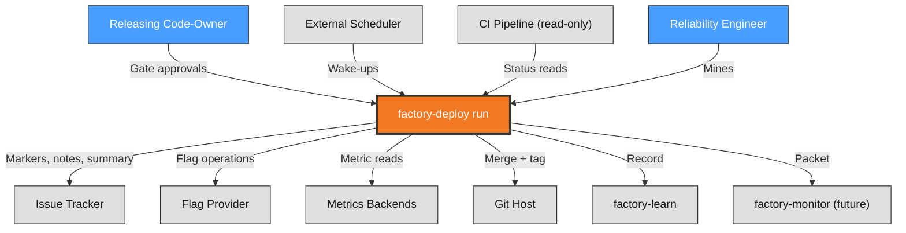
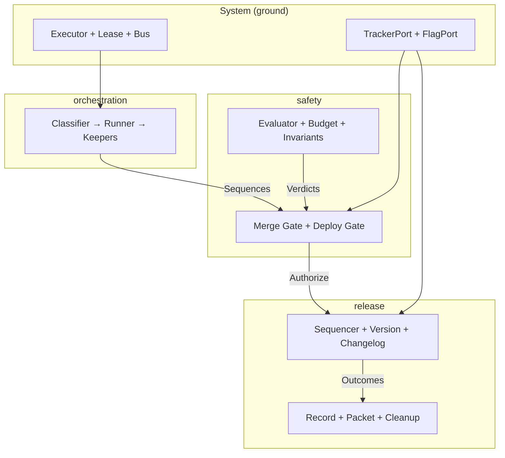
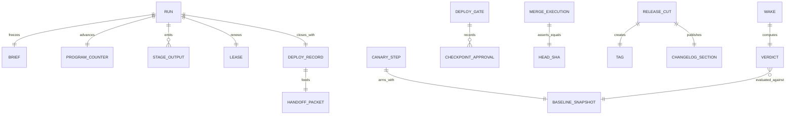
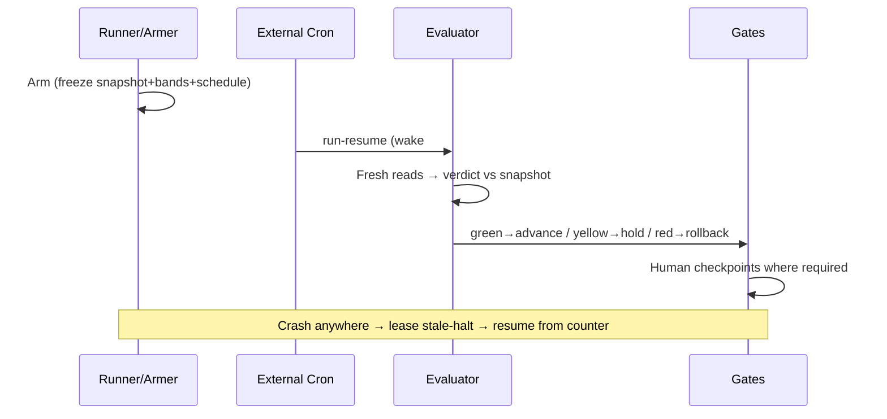
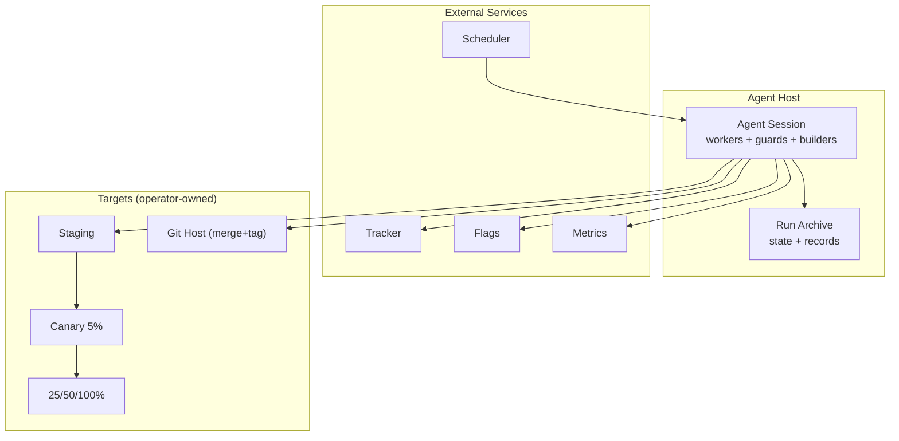
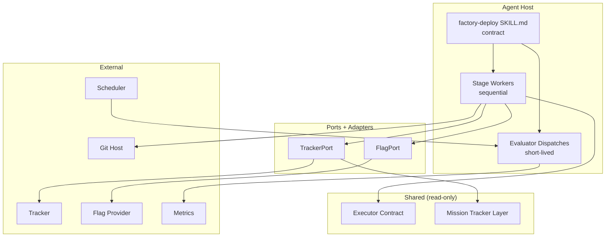

# Architecture Description: factory-deploy

**Version**: 1.0 | **Created**: 2026-10-04 | **Last Updated**: 2026-10-04
**Architect**: User / AI collaboration | **Status**: Draft
**ADR Reference**: memory ADR index (6 Accepted records: ADR-001…ADR-006)

---

## 1. Introduction

### 1.1 Purpose

`factory-deploy` is the release orchestrator of the adlc software factory: a Kind-A DAG skill carrying merged artifacts through staging → canary → gradual expansion → full rollout, with human gates, threshold verdicts, rollback readiness, SemVer release cuts, and evidence feeds. This document describes *what the system looks like* as a result of ADR-001…ADR-006; the ADRs capture *why*.

### 1.2 Scope

**In Scope:**

- 8-stage release pipeline on the verbatim shared executor (+ env locks, external-cron wakes)
- Two-gate authorization, threshold verdict engine, idempotent release cut, versioned evidence
- Provider-agnostic tracker/flag seams with reused tracker core

**Out of Scope:**

- Infra provisioning, continuous on-call, CI gate execution, telemetry instrumentation (see PRD §9)

### 1.3 Definitions & Acronyms

| Term | Definition |
|------|------------|
| AD | Architecture Description - this document |
| ADR | Architecture Decision Record - documented architectural decisions |
| Deploy Gate | Deploy-owned authorization gate (any human; checkpoints at promote / canary-expand / merge-execution) |
| Merge Gate | Review-owned readiness gate (review rules: approval or deploy-ready label) |
| Armed evaluator | Verdict computation dispatched by schedule against a frozen baseline snapshot |
| deploy-record/1 | Versioned JSON evidence schema for deployment records |

---

## 2. Stakeholders & Concerns

| Stakeholder | Role | Key Concerns | Priority |
|-------------|------|--------------|----------|
| Releasing Code-Owner | Approves Deploy Gate checkpoints, owns releases | 3 cheap approvals; exact-head guarantee; proof per step | High |
| Reliability Engineer | Mines records, reviews overrides | Complete evidence; reproducible verdicts | High |
| Skill Maintainer | Owns thresholds, invariants, schema | Config-not-code tuning; additive evolution | High |
| Future factory-monitor | Consumes handoff packets | Stable packet contract | Medium |

---

## 3. Architectural Views (Rozanski & Woods)

### 3.1 Context View

**Purpose**: Unified system scope and external interactions.

The factory-deploy run sits between review (upstream readiness) and learn/monitor (downstream consumers), actuating against five external systems: issue tracker (approvals, labels, markers, notes), flag provider (percentages, cleanup), external scheduler (evaluator wake-ups), metrics backends (stage + burn reads), and git host (merge + tags). CI is read-only; humans approve natively in the tracker.



> **Subsystem Details**: [System](views/system/context.md) | [orchestration](views/orchestration/context.md) | [safety](views/safety/context.md) | [release](views/release/context.md)

---

### 3.2 Functional View

**Purpose**: Merged functional elements across all sub-systems (cornerstone — approved at checkpoint).

| Element | Sub-System | Responsibility |
|---------|-----------|----------------|
| Executor Engine, Lease Manager, Comment Bus, Worktrees | System | Shared runtime verbatim |
| Environment Lock, Wake Scheduler Binding | System | Two additive primitives (prove before promote) |
| TrackerPort, FlagPort (+ default adapters, fakes) | System | Vendor-free stage contracts |
| Route Classifier, Stage Runner, Brief/State Keepers, Marker Projector, Correction Loop | orchestration | Classify once; execute in order; remember dually; resume without re-execution |
| Merge Gate Observer, Deploy Gate Keeper, Merge Executor Guard, Forgery Responder | safety | Authorize: readiness + authorization, SHA-bound, halt on mismatch |
| Armed Evaluator, Budget Reader, Invariant Enforcer | safety | Evaluate: band verdicts over frozen baselines, unified burn, 8 mechanical invariants |
| Cut Sequencer, Version Enforcer, Changelog Builder, Preview Renderer | release | Cut merge→tag→notes→cleanup idempotently with previews |
| Record Writer, Packet Builder, Cleanup Enforcer | release | Leave schema-versioned evidence + monitor packet; enforce flag lifecycle |



> **Subsystem Details**: [System](views/system/functional.md) | [orchestration](views/orchestration/functional.md) | [safety](views/safety/functional.md) | [release](views/release/functional.md)

---

### 3.3 Information View

**Purpose**: Consolidated data model — run state, evaluation inputs, artifacts, evidence.



**Entities**: brief (frozen, incl. route), program counter (monotonic, authoritative), stage outputs (typed), lease record, baseline snapshot (immutable per arm), verdict (keyed step+wake#), gate approvals (identity+SHA+timestamp), idempotency keys, tag (immutable), changelog (preview-approved), deploy-record/1 JSON, handoff packet, flag lifecycle state. Consistency: counter authoritative over markers; frozen inputs per verdict; tag/version/notes triple-checked at close.

> **Subsystem Details**: [orchestration](views/orchestration/information.md) | [safety](views/safety/information.md) | [release](views/release/information.md)

---

### 3.4 Concurrency View

**Purpose**: Runtime coordination across windows, crashes, and concurrent runs.

No threads are held: canary windows are data (schedule + snapshot), not processes. Sequential stage workers + short-lived evaluator dispatches + heartbeat renewal + env locks + external-cron wakes cover all coordination. Verdict keying (step+wake#) makes duplicate wakes converge; the DAG order (gates around evaluation windows) is the deadlock-freedom argument; single-lock-per-run plus expiry backstops the lock design.



> **Subsystem Details**: [orchestration](views/orchestration/concurrency.md) | [safety](views/safety/concurrency.md)

---

### 3.5 Development View

**Purpose**: Unified code organization — skill layout, dependency rules, CI gates.

```text
skills/factory/factory-deploy/
├── SKILL.md                      # Orchestrator contract
├── references/
│   ├── executor.md               # Pointer (DO NOT FORK)
│   ├── tracker-integration.md    # Pointer (conventions)
│   ├── ports.md                  # TrackerPort + FlagPort (NEW)
│   ├── thresholds.md             # Band tables (NEW, config-not-code)
│   └── deploy-record-schema.md   # deploy-record/1 (NEW)
└── (adapters in provider bindings; fakes beside tests)
```

**Dependency rules**: stages → ports (never SDKs); default TrackerPort adapter → mission layer (wrap, don't fork); correction/evaluator/gate elements → ports + state (never each other's jobs); schema additive-only without ADR. **CI**: playbook integrity + artifacts sync (green); gate drill matrix + verdict drill + crash drill as future automation. **Standards**: contract files read-only in review; bright-line rule (evaluation never authorizes, gates never compute); halt-first for new failure modes.

> **Subsystem Details**: [System](views/system/development.md) | [orchestration](views/orchestration/development.md) | [safety](views/safety/development.md) | [release](views/release/development.md)

---

### 3.6 Deployment View

**Purpose**: Consolidated runtime topology — sessions, external services, target environments, cut order.



No dedicated servers; nothing to provision (explicit non-goal). Dormant windows cost KBs of state; live work is one sequential worker plus short evaluator dispatches.

### 3.5.2 Technology Stack Mapping

N:1 mappings allowed — multiple functional elements share one technology.

| Functional Element (§3.2) | Technology | Notes |
|---------------------------|-----------|-------|
| Executor Engine, Stage Runner, Correction Loop | Shared factory executor contract (steps, program counter, circuit breaker) | Read-only reuse (ADR-001) |
| Lease Manager, Lock Guard, Wake Scheduler Binding | Lease store + shared lock table + external cron | Two additive primitives (ADR-001, ADR-005) |
| Comment Bus, Marker Projector, Brief/State Keepers | Tracker markers + run-archive files | Dual-channel state (ADR-003) |
| Merge/Deploy Gate observers & keepers, Merge Executor Guard, Forgery Responder | TrackerPort reads + checkpoint markers + git host state | ADR-004 |
| Armed Evaluator, Budget Reader, Invariant Enforcer | Metrics port reads + frozen snapshots + run-config bands | ADR-005; bands are config |
| Cut Sequencer, Version Enforcer, Preview Renderer | Git host + SemVer rules + archive previews | ADR-006 |
| Changelog Builder, Record/Packet Writers, Cleanup Enforcer | TrackerPort writes + JSON schema + FlagPort cleanup | deploy-record/1 (ADR-006) |

### 3.5.3 Technology Architecture



> **Subsystem Details**: [System](views/system/deployment.md) | [orchestration](views/orchestration/deployment.md) | [safety](views/safety/deployment.md) | [release](views/release/deployment.md)

---

### 3.7 Operational View

**Purpose**: Operating posture — first-hour verification, verdict operations, handoff, and whose job everything is.

| Activity | Owner | Frequency |
|----------|-------|-----------|
| First-hour verification (health/errors/latency/flow/logs/rollback-ready) | Deploy run (`full`) | Per release |
| Verdict + override + wake-schedule review | Team / team lead / operator | Per occurrence + periodic retro |
| Flag-expiry follow-through (≤2 weeks) | Code-owner | Per rollout |
| Packet delivery + record mining | Deploy run → factory-learn | Per release / periodic |
| Production on-call | Future factory-monitor | Continuous (not this skill) |

Rollback targets: flag <1min, redeploy <5min, DB <15min — plan pre-stage or no run. Disaster posture: RTO = immediate resume from counter; RPO = last completed stage; dual-channel state (archive authoritative, markers projective).

> **Subsystem Details**: [safety](views/safety/operational.md) | [release](views/release/operational.md)

---

## 4. Architectural Perspectives

### 4.1 Security Perspective

**Applies to**: All views. Tracker-native approver identity (anonymous rejected); no self-approval; message-is-data (bodies never authorize); no secrets in archives/comments/changelog; adapter credentials via vault; gate integrity drill matrix (both-green merges / either-red refuses / forgery halts / outage halts); tag signing where supported.

**Threat Model:**

| Threat | View Affected | Likelihood | Impact | Mitigation |
|--------|---------------|------------|--------|------------|
| Forged approval marker | Functional, Deployment | L | H | Halt-on-mismatch, resuable investigation |
| Label removed after read (race) | Functional | L | H | Execution-time re-read + SHA assert |
| Prompt injection via issue text | All | M | H | Message-is-data invariant; bodies are data |
| Secret leak into record/changelog | Information | L | H | Secret scan on run outputs; allowlist fields |

### 4.2 Performance & Scalability Perspective

**Applies to**: Functional, Concurrency, Deployment. Approval-to-action <5min mechanical; verdicts inside windows (no held workers); dormant state KBs; one sequential worker + short dispatches scale to fleets; env locks bound concurrency by environment count. Bottleneck watch: human approval latency on the 3 checkpoints (tracked, not gated).

### 4.3 Availability & Resilience Perspective

Lease live/stale/completed discipline; stale-halt never blind-resume; dual-channel recovery (archive rebuilds state, markers rebuild narrative); missed-wake detection; metrics-outage-as-hold; crash drill (kill mid-cut → skip-by-key resume).

### 4.4 Evolution Perspective

Two additive executor primitives prove-in-pilot before contract promotion; bands are config (tuning ≠ release); schema lenient-additive (`1.x` + note) with breaking-major + ADR rule; short-path rule changes are ADR amendments; PDR-008 metrics revisit and autonomy-pressure revisit are pre-registered triggers.

---

## 5. Global Constraints & Principles

### 5.1 Technical Constraints

- Shared executor contract is read-only; diffs rejected in review.
- No pinned tracker/flag vendors; integer-percent flags.
- Strict SemVer `X.Y.Z`; no tag = no release.
- Stages import no provider SDKs (grep-verifiable).
- Cut order fixed (merge → tag → changelog → cleanup).

### 5.2 Architectural Principles

- Gates halt, never degrade; absence of data never reads as green.
- Evaluation never authorizes; gates never compute.
- Verbatim reuse over forks; additive-only contract evolution.
- Evidence over vibes: every advance reproducible against recorded inputs.
- Runs close: bounded scope, handoff packet, no on-call accretion.

---

## 6. Constitution Alignment

No constitution file exists (both lookup paths checked 2026-10-04). Nothing to align against; nothing violated. If a constitution is later adopted, re-run architect-analyze for the alignment sweep.

| Principle | Section | Alignment | Notes |
|-----------|---------|-----------|-------|
| (none — no constitution) | — | N/A | Revisit on constitution adoption |

---

## 7. ADR Summary

Detailed records (post-promotion): memory ADR index.

**Key Decisions:**

| ID | Decision | Status | Impact |
|----|----------|--------|--------|
| ADR-001 | Shared executor verbatim + env locks | Accepted | High |
| ADR-002 | Independent TrackerPort/FlagPort, reused tracker core | Accepted | High |
| ADR-003 | Up-front routing + dual-channel + program-counter resume | Accepted | High |
| ADR-004 | Tracker-native gates + SHA-bound execution + halt-on-mismatch | Accepted | High |
| ADR-005 | Armed evaluator + wake-ups + frozen baselines + unified budget | Accepted | High |
| ADR-006 | Idempotent cut + versioned evidence schema | Accepted | High |

---

## Appendix

### A. Glossary

| Term | Definition |
|------|------------|
| Deploy Gate | Deploy-owned authorization (any human; checkpoints promote/canary-expand/merge-execution) |
| Merge Gate | Review-owned readiness (review rules) |
| Armed evaluator | Schedule-dispatched verdict computation over frozen baselines |
| Wake | External-cron run-resume invocation for one evaluation |
| deploy-record/1 | Versioned JSON deployment evidence schema |

### B. References

- PRD: factory-deploy product PRD (15 sections, 15 REQs, self-contained)
- ADRs: memory ADR index + drafts index (pre-promotion)
- Upstream: agent-skills ship phase; spec-kit RELEASE.md (SemVer)
- Skill: `skills/factory/factory-deploy/SKILL.md`

### C. Tech Stack Summary

**Languages**: Markdown (skill) + Python (suites/scripts)\
**Frameworks**: Shared factory executor contract (steps, leases, comment bus)\
**Databases**: Run archive (files); tracker host (markers); no dedicated DB\
**Infrastructure**: Zero provisioned (agent host + operator scheduler + existing providers)\
**Cloud Platform**: Provider-agnostic by design\
**CI/CD**: pytest integrity + sync suites; kill/resume + gate/verdict/crash drills (future automation)\
**Monitoring**: Metrics backends read-only; first-hour verification per release; future factory-monitor consumer
