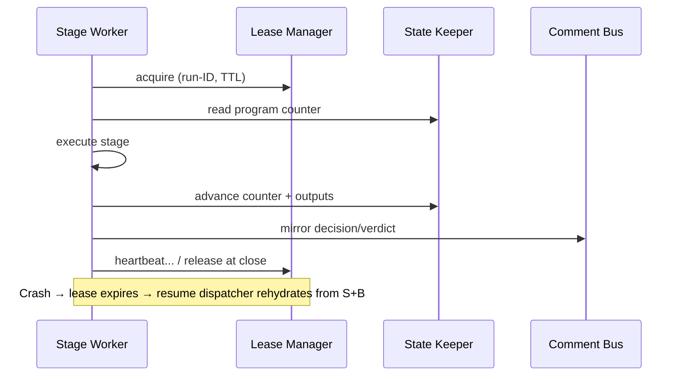

# Concurrency View: orchestration

**Sub-System**: orchestration
**ADRs**: ADR-001, ADR-003
**Generated**: 2026-10-04
**Dependencies**: Functional, Information (orchestration/)

---

## Concurrency (orchestration)

**Purpose**: Run liveness and resume coordination across sessions, crashes, and concurrent runs.

### Process Structure

| Process | Purpose | Scaling Model | State Management |
|---------|---------|---------------|------------------|
| Stage worker | Execute one stage to typed output, then exit | One at a time per run (sequential DAG) | Stateless; all state in archive + lease |
| Lease heartbeater | Renew liveness during active work | Per active run | Heartbeat timestamps; sibling-standard TTL |
| Resume dispatcher | Rehydrate a run from program counter after crash/compaction | On demand (crash, wake, human resume) | Reads state + markers; never mutates history |
| Lock guard | Serialize same-environment runs | One lock per environment | Acquire pre-`stage`, release at close/abort |

### Thread Model

- **Threading Strategy**: No threads — sequential stage workers; concurrency exists only *between* runs (different envs) and *across* time (wake-ups).
- **Async Patterns**: Arm-and-release for windows (safety owns evaluation); program-counter resume for crashes.
- **Resource Pools**: Environment locks (bounded by env count); worktrees (bounded by active runs).

### Coordination Mechanisms

- **Synchronization**: Env locks (acquire with TTL + owner run-ID; deadlock watch: ordered acquisition, timeout → halt, never wait forever).
- **Communication**: Comment bus for cross-session memory; run files for bulk state.
- **Deadlock Prevention**: Single-lock-per-run rule (a run holds at most one env lock); lock ordering by env name where multiple needed (never in v1); expiry backstop on every lock.

